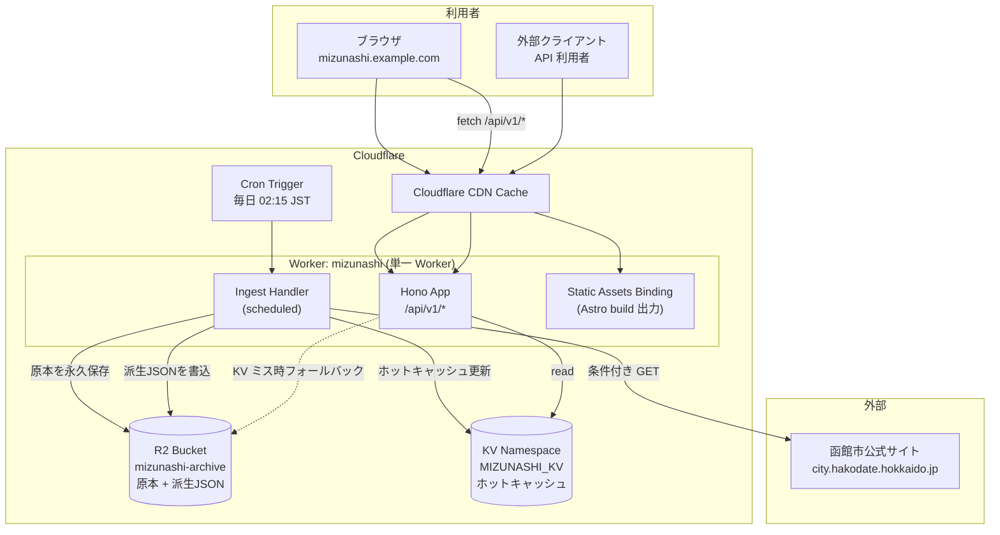

# 水無海浜温泉 入浴可能時間 API / Web 詳細設計書

> **プロジェクト名**: mizunashi-scheduler
> **版**: 1.0
> **最終更新**: 2026-07-26
> **ステータス**: Draft（実装前レビュー待ち）

---

## 目次

1. [背景と目的](#1-背景と目的)
2. [用語定義](#2-用語定義)
3. [要件](#3-要件)
4. [データソース調査結果](#4-データソース調査結果)
5. [システムアーキテクチャ](#5-システムアーキテクチャ)
6. [リポジトリ構成](#6-リポジトリ構成)
7. [データ取得パイプライン](#7-データ取得パイプライン)
8. [パーサ設計（フォーマット変動への対応）](#8-パーサ設計フォーマット変動への対応)
9. [正規化データスキーマ](#9-正規化データスキーマ)
10. [ドメインロジック（状態判定）](#10-ドメインロジック状態判定)
11. [API 設計](#11-api-設計)
12. [フロントエンド設計](#12-フロントエンド設計)
13. [デザインシステム（shadcn/ui ベース）](#13-デザインシステムshadcnui-ベース)
14. [インフラ / デプロイ](#14-インフラ--デプロイ)
15. [運用・監視](#15-運用監視)
16. [テスト戦略](#16-テスト戦略)
17. [コード品質（Lint / Format / 型）](#17-コード品質lint--format--型)
18. [セキュリティ / コンプライアンス](#18-セキュリティ--コンプライアンス)
19. [実装ロードマップ](#19-実装ロードマップ)
20. [付録A: VPS + nginx 構成（代替案）](#付録a-vps--nginx-構成代替案)
21. [付録B: ADR（設計上の意思決定記録）](#付録b-adr設計上の意思決定記録)

---

## 1. 背景と目的

### 1.1 背景

北海道函館市椴法華地区にある **水無海浜温泉** は、海中に湧く天然の露天風呂であり、**潮の干満によって入浴可能な時間帯が日ごとに変化する**。函館市公式サイトが年に一度、翌年1年分の「入浴可能時間表」を Excel / PDF で公開している。

しかしこの一次資料には以下の問題がある。

| 問題 | 内容 |
| --- | --- |
| 可読性が低い | 12シート × 印刷用レイアウトの Excel。「今入れるのか」を知るのに、ファイルをダウンロード → 該当月シート → 該当日行、と辿る必要がある |
| モバイル体験が悪い | 現地（電波が良好とは限らない）でスマホから xlsx を開くのは非現実的 |
| **過去年版が消える** | 実測の結果、`mizunashi2025.xlsx` / `mizunashi2024.xlsx` はいずれも **404**。年度更新時に旧ファイルは削除されている |
| 機械可読でない | 他サービスからの再利用（カレンダー連携等）ができない |

### 1.2 目的

1. **「今入れるか」「いつまで入れるか」「次はいつから入れるか」** を 1 秒で答える Web サイトを提供する。
2. 同じ情報を **公開 Web API** として提供し、再利用可能にする。
3. 公式サイトの更新（2027年度版の公開）を **自動検知・自動取り込み** する。
4. 取得した原本ファイルを **恒久的にアーカイブ** し、公式サイトから消えても失われないようにする。

### 1.3 スコープ外

- 実際の潮位計算・気象データからの動的推定（あくまで公式の時間表を機械可読化するのみ）
- 高波・荒天による当日クローズのリアルタイム判定（公式が提供していないため。警告文の掲出のみ行う）
- **ユーザー登録・アカウント機能**（実施しない）
- **通知機能全般**（メール / Web Push / LINE 等。実施しない）
- **過去年の時間表の閲覧機能**（原本ファイルはアーカイブとして保持するが、API / サイトで提供する時間表データは常に「今年」と「来年（公開済みの場合）」のみ。[§3.4](#34-データ保持方針) 参照）

---

## 2. 用語定義

| 用語 | 定義 |
| --- | --- |
| **セッション (Session)** | 1日のうちの連続した入浴可能時間帯。**1日あたり 1〜3 回存在し、2 回以上ある日が半数前後を占める**（2026年版で 188/365 日、2021年版で 253/365 日）。複数回あることを例外扱いしない |
| **谷 (gap)** | 同一日のセッションとセッションの間の、入浴できない時間帯 |
| **アダプタ (SourceAdapter)** | 特定のファイルフォーマット（格子状 xlsx / フラット CSV 等）を読むための実装単位。年ごとのフォーマット変動に追随するための拡張点 |
| **Diagnostics** | パース時に収集する警告・エラーの集合。件数が閾値を超えると取り込みを却下する |
| **年次データ (YearSchedule)** | ある1年分（1/1〜12/31）の全日程を正規化したデータ |
| **原本 (Raw Artifact)** | 公式サイトから取得した xlsx ファイルそのもの。改変せず永久保存する |
| **派生データ (Derived)** | 原本をパースして生成した JSON |
| **リビジョン (revision)** | 同一年に対して原本が差し替えられた場合に増加する整数 |
| **JST** | Asia/Tokyo (UTC+09:00 固定。日本にサマータイムは無い) |
| **ステータス (Status)** | ある時刻における `open` / `closed` の状態と、関連する時刻情報 |

---

## 3. 要件

### 3.1 機能要件

| ID | 要件 | 優先度 |
| --- | --- | --- |
#### 状態表示

| ID | 要件 | 優先度 |
| --- | --- | --- |
| FR-01 | 現在時刻（JST）における入浴可否を判定して表示する | Must |
| FR-02 | 入浴可能中の場合、終了時刻と残り時間を表示する | Must |
| FR-03 | 入浴不可の場合、次に入浴可能になる日時と、それまでの時間を表示する | Must |
| FR-03a | **1日に複数回ある場合、「今日この後まだ入れるか」と「翌日以降になるか」を区別して表示する** | Must |
| FR-03b | **進行中のセッションが「その日の何回目 / 全何回中」かを表示する** | Should |

#### 期間別ビュー

| ID | 要件 | 優先度 |
| --- | --- | --- |
| FR-04 | **day**: 指定日の全セッション。加えて「いつまで入浴可能か」「いつから入浴可能か」を出す | Must |
| FR-05 | **week**: 指定日を起点とする 7 日間の予定 | Must |
| FR-06 | **month**: 指定年月の 1 日から最終日までの予定（カレンダー形式） | Must |
| FR-07 | **year**: 指定年の 1/1〜12/31 の全予定 | Must |
| FR-08 | サイトの既定表示は **今日と明日**。そこから週間 / 月間へ切り替えられる | Must |
| FR-09 | 月をカレンダー UI 上で前後に切り替えられる | Must |
| FR-10 | 翌年の時間表が公開された時点で、**今年 / 来年**を切り替えて閲覧できる（未公開のうちは切替 UI を出さない） | Must |

#### 共通

| ID | 要件 | 優先度 |
| --- | --- | --- |
| FR-11 | 当日の全セッションをタイムラインで可視化する | Must |
| FR-12 | 「高波時は入浴不可」の公式注意書きを常時掲出する | Must |
| FR-13 | 祝日名（日本語 / 英語）を表示する | Should |
| FR-14 | 日本語 / 英語の 2 言語対応（原本が日英併記のため） | Should |
| FR-15 | 上記すべてを JSON API として公開する | Must |
| FR-16 | iCalendar (.ics) フィードを提供する | Could |
| FR-17 | データの出典・取得日時を明示する | Must |

#### データ取得・保持

| ID | 要件 | 優先度 |
| --- | --- | --- |
| FR-18 | 公式サイトを定期巡回し、翌年度版ファイルの公開を検知して自動取り込みする | Must |
| FR-19 | 取得済みの**原本ファイル**は削除せず永久保存する。既にあれば取得フェーズをスキップして既存を使う | Must |
| FR-20 | 取得から 2 週間経過したら、念のため再取得を試みる（差分があれば新リビジョンとして保存） | Must |
| FR-21 | **提供する時間表データは常に「今年」と「来年（公開済みの場合）」のみを保持する。**それ以外の年の派生データは自動的に破棄する | Must |
| FR-22 | **年ごとにファイル形式・レイアウト・命名規則が変わりうることを前提とし、変動に追随できる構造にする**（[§4.4](#44-過去ファイルの調査internet-archive) で 12 年分の実変動を確認済み） | Must |
| FR-23 | フォーマットを解釈できない場合、既存データを壊さずに停止し、運用者へ通知する | Must |

### 3.2 非機能要件

| ID | 要件 | 目標値 |
| --- | --- | --- |
| NFR-01 | API レスポンスタイム (p95) | < 100ms（エッジキャッシュヒット時 < 20ms） |
| NFR-02 | サイト初期表示 (LCP) | < 1.5s (Fast 3G) |
| NFR-03 | 可用性 | 99.9%（Cloudflare のSLAに準拠） |
| NFR-04 | 公式サイトへの負荷 | 1日あたり最大 2 リクエスト（条件付き GET を使用） |
| NFR-05 | ランニングコスト | Cloudflare Workers Free / Paid ($5/mo) 内に収める |
| NFR-06 | アクセシビリティ | WCAG 2.1 AA 相当 |
| NFR-07 | データ保持 | 原本 xlsx は無期限保存（削除禁止）。派生データは今年+来年のみ |

### 3.3 制約

- **タイムゾーンは JST 固定**。Cloudflare Workers の実行環境は UTC なので、日付計算は必ず明示的に `+09:00` を扱うこと。
- 原本の時刻は **時単位（分は常に 00）**。将来分単位になっても壊れないパーサにする。
- 年をまたぐ「次のセッション」の問い合わせは、翌年データが未公開の場合に回答不能になる。この場合は `null` + 理由コードを返す。

### 3.4 データ保持方針

FR-19（原本は永久保存）と FR-21（今年+来年のみ保持）は**対象が異なる**ため矛盾しない。両者を明確に分離する。

| 層 | 対象 | 保持ポリシー | 理由 |
| --- | --- | --- | --- |
| **原本層** (`raw/`) | 公式サイトから取得した xlsx / PDF のバイト列 | **無期限保存・削除禁止** | 公式サイトから旧年版が消えることが実測済み（[§4.2](#42-xlsx-ファイル)）。失われると二度と手に入らない |
| **派生層** (`derived/`) | パース済み `YearSchedule` JSON | **今年 + 来年のみ**。それ以外は自動削除 | 提供対象外の年を持つ意味がない。原本が残っているので**いつでも再生成可能**（＝この削除は可逆） |
| **キャッシュ層** (KV) | ホットキャッシュ | 派生層に追従 | |

```
        取得                 パース                提供
公式サイト ──→ raw/ ──────→ derived/ ──────→ API / Web
             永久保存        今年+来年のみ      今年+来年のみ
             (削除禁止)      (可逆・再生成可)
```

**アクティブ年の定義**: `activeYears = [JST における現在の年, その翌年]`。ただし翌年は派生データが存在する場合のみ。

**プルーニングのタイミング**: 日次 Cron の ingest 処理の最後に実行する（[§7.8](#78-プルーニング今年来年のみ保持)）。年が変わった翌日の実行で、前年の派生データが自動的に消える。

---

## 4. データソース調査結果

> 本節は 2026-07-26 時点で実際にファイルを取得・解析して確認した事実である。パーサ実装の根拠となる。

### 4.1 公式ページ

- URL: `https://www.city.hakodate.hokkaido.jp/docs/2014041800107/`
- サーバ: nginx / **Imperva CDN 配下**（`X-CDN: Imperva`, `visid_incap_*` Cookie 発行）
- `Last-Modified` ヘッダあり（例: `Thu, 23 Jul 2026 06:49:03 GMT`）、`ETag` は Weak (`W/"..."`)
- 該当リンクの HTML 構造:

```html
<h3>入浴可能時間表【令和8年(2026年) 1月～12月】</h3>
<p><a href="file_contents/mizunashi2026.pdf">【日英併記】 2026年 水無海浜温泉入浴可能時間表／MIZUNASHI KAIHIN ONSEN Time Schedule for Bathing</a></p>
<p><a href="file_contents/mizunashi2026.xlsx">【日英併記】 2026年 水無海浜温泉入浴可能時間表／MIZUNASHI KAIHIN ONSEN Time Schedule for Bathing</a></p>
```

- 施設情報: 泉温 49.0℃ / ナトリウム－塩化物・硫酸塩温泉（低張性中性高温泉）/ 入湯料 無料 / 駐車場 20台無料
- 問い合わせ: 椴法華支所産業建設課 TEL 0138-86-2111

### 4.2 xlsx ファイル

| 項目 | 値 |
| --- | --- |
| URL | `.../file_contents/mizunashi2026.xlsx` |
| サイズ | 157,084 bytes |
| `Content-Type` | `application/vnd.openxmlformats-officedocument.spreadsheetml.sheet` |
| `ETag` | `"6a60513a-2659c"`（Strong ETag。**条件付き GET が使える**） |
| `Last-Modified` | `Wed, 22 Jul 2026 05:12:26 GMT` |

**年別ファイルの存在確認（重要）**

| URL | 結果 |
| --- | --- |
| `mizunashi2024.xlsx` | **404** |
| `mizunashi2025.xlsx` | **404** |
| `mizunashi2026.xlsx` | 200 |
| `mizunashi2027.xlsx` | 404（本設計時点では未公開） |

→ **旧年度ファイルは削除される**ことが確認された。FR-19（永久アーカイブ）の妥当性が裏付けられた。

なお 2014〜2023 年分は Internet Archive に残存しており、そこから取得できた（[§4.4](#44-過去ファイルの調査internet-archive)）。

### 4.3 xlsx 内部構造

```
[Content_Types].xml
xl/workbook.xml            ← <sheet name="1月" .../> × 12
xl/_rels/workbook.xml.rels ← rId → worksheets/sheetN.xml のマッピング
xl/sharedStrings.xml       ← 455 uniqueStrings（ルビ <rPh> を含む）
xl/worksheets/sheet1..12.xml
xl/styles.xml, theme, calcChain, printerSettings
```

#### シート

- 12 シート = 1月〜12月。`workbook.xml` の順序は 1月→12月で並んでいる。
- **シート名に全角数字が混在する**: `1月`, `2月`, ..., `7月`, **`８月`**, **`９月`**, `10月`, `11月`, `12月`
  → **NFKC 正規化が必須**。
- `sheetId` 属性は順序と無関係（`8月` の sheetId は 1）。**必ず `workbook.xml` の出現順 + `r:id` → rels でファイルを解決すること**。ファイル名 `sheetN.xml` の `N` が月番号と一致する保証はない（今回はたまたま一致していた）。

#### セルレイアウト

1日 = **2行1組**。`A5` から始まり、2行ずつ進む。

```
行 5 (奇数行): A=日付シリアル値  D=曜日(和)  F/H/I=1回目  K/M/N=2回目  P/R/S=3回目  U=祝日名(和)
行 6 (偶数行): A="JAN.1"(英語日付)  D=曜日(英)   U=祝日名(英)
```

| 列 | 内容 | 例 |
| --- | --- | --- |
| `A`（奇数行） | 日付シリアル値。先頭日のみリテラル、以降は `=A5+1` の数式（**キャッシュ値 `<v>` あり**） | `46023` → 2026-01-01 |
| `A`（偶数行） | 英語日付文字列。**表記ゆれあり**（1月は `JAN.1`、8月は `AUG,1`）→ **使用しない**（シリアル値から導出） |
| `D` | 曜日。`=TEXT(A5,"aaa")` / `"ddd"` の数式 → **使用しない**（日付から導出） |
| `F` / `I` | 1回目の開始 / 終了（`H` は区切り文字 `～`） | `1700` / `1900` |
| `K` / `N` | 2回目の開始 / 終了（`M` は `～`） | `2000` / `2100` |
| `P` / `S` | 3回目の開始 / 終了（`R` は `～`） | |
| `U` | 祝日名（奇数行=和名 / 偶数行=英名） | `元日` / `New Year\`s Day` |

- 最終日の 2 行後（例: 1月は 67, 68 行）に注意書きが `A` 列マージセルで入る:
  - JA: `　※　入浴可能時間であっても，波の高い日は入浴できませんのでご注意ください。`
  - EN: `　※　Please do not bathe in this hot spring when waves are high.`

#### 検証結果（2026年版・全12シート走査）

| 検証項目 | 結果 |
| --- | --- |
| 日数 | **365日**（2026-01-01 〜 2026-12-31、欠損・重複ゼロ） |
| セッション0件の日 | **0日**（毎日必ず1回以上入浴可能時間がある） |
| セッション数分布 | 1回=177日, 2回=169日, 3回=19日 |
| 時刻の値域 | `400` 〜 `2200` の **100 の倍数のみ**（= 4:00〜22:00 の毎正時） |
| 開始 ≧ 終了 のケース | **0件**（日跨ぎセッションは存在しない） |
| 開始のみ / 終了のみの片欠け | **0件** |
| 想定外の列にデータ | **0件**（4回目以降は存在しない） |
| 祝日 | 18件（振替休日含む） |
| `date1904` | **未設定**（= 1900 日付システム） |

#### ルビ（`<rPh>`）の罠 ★重要

`sharedStrings.xml` はルビ（ふりがな）を `<rPh>` 要素で保持している。

```xml
<si>
  <t>元日</t>
  <rPh sb="0" eb="2"><t>ガンジツ</t></rPh>
  <phoneticPr fontId="1"/>
</si>
```

**単純に `<si>` 配下の全 `<t>` を連結すると `"元日ガンジツ"` になる。**
実際、素朴なパーサでは以下のような文字列が得られてしまう:

| 素朴なパース結果 | 正しい値 |
| --- | --- |
| `水無海浜温泉ミズナシカイヒンオンセン` | `水無海浜温泉` |
| `元日ガンジツ` | `元日` |
| `建国記念の日ケンコクキネンヒ` | `建国記念の日` |
| `振替休日フリカエキュウジツ` | `振替休日` |
| `スポーツの日ヒ` | `スポーツの日` |

→ **`<rPh>` 配下の `<t>` を除外する**のが正しい実装。詳細は [§8](#8-パーサ設計フォーマット変動への対応)。

#### 英語表記のゆれ

- `New Year\`s Day` … アポストロフィがバッククォート `` ` `` (U+0060)
- `Children’s Day` … 右シングルクォート `’` (U+2019)

→ 正規化して `'` (U+2019 に統一) するが、`raw` も保持する。

### 4.4 過去ファイルの調査（Internet Archive）

> 本節は Wayback Machine の CDX API で過去ファイルを列挙し、**実際に 6 ファイル（CSV 2件・XLSX 4件）を取得して解析した結果**である。フォーマット変動への設計方針（[§8](#8-パーサ設計フォーマット変動への対応)）の根拠となる。

#### 4.4.1 発見されたファイル

`https://web.archive.org/cdx/search/cdx?url=www.city.hakodate.hokkaido.jp/docs/2014041800107/&matchType=prefix`

| 年度 | ファイル名 | 形式 | 備考 |
| --- | --- | --- | --- |
| H26 (2014) | `files/H26mizunasi.pdf` | PDF | **`mizunasi`**（`h` 無し） |
| H27 (2015) | `files/h27mizunashi.pdf` | PDF | |
| H28 (2016) | `files/h28mizunashi.pdf` / **`.csv`** | PDF + CSV | |
| H29 (2017) | `files/h29mizunashi.pdf` / **`.csv`** | PDF + CSV | |
| H30 (2018) | `files/h30mizunashi.pdf` | PDF | |
| H31 (2019) | `files/h31mizunashi.pdf` | PDF | |
| R02 (2020) | `files/r02mizunashi.pdf` / **`.xlsx`** | PDF + XLSX | 4月〜12月のみ |
| R02 (2020) | `files/R2mizunashi.pdf` / **`R2.xlsx`** | PDF + XLSX | **中身は 2021 年** |
| R03 (2021) | `files/r3mizunashi.pdf` | PDF | |
| 2022 | `files/2022mizunasionsen.pdf` / **`.xlsx`** | PDF + XLSX | **`mizunasionsen`** |
| 2023 | `files/2023Mizunashionsen.pdf` | PDF | **`Mizunashionsen`**（大文字始まり） |
| 2026 | `file_contents/mizunashi2026.pdf` / `.xlsx` | PDF + XLSX | 現行 |

#### 4.4.2 命名規則は当てにならない

12 年分で**すべて命名パターンが異なる**。

| 変動軸 | 実例 |
| --- | --- |
| 年の表現 | 元号（`h28`, `r02`, `R2`, `r3`）→ 西暦（`2022`, `2023`）→ 西暦後置（`mizunashi2026`） |
| 年の位置 | 前置（`h28mizunashi`）↔ 後置（`mizunashi2026`） |
| ローマ字表記 | `mizunasi` / `mizunashi` / `mizunasionsen` / `Mizunashionsen` |
| 大文字小文字 | `H26` ↔ `h27`、`R2` ↔ `r02` ↔ `r3` |
| ゼロ埋め | `r02` ↔ `r3` |
| ディレクトリ | `files/` → `file_contents/` |
| 形式 | PDF のみ → PDF+CSV → PDF のみ → PDF+XLSX → XLSX |

**★決定的な事実**: `R2.xlsx` の中身は **2021 年**のデータである。**ファイル名から対象年を推定してはならない。年は必ずファイルの中身から読み取る。**

→ [§7.4](#74-url-発見ロジックdiscoverts) の「命名規則によるフォールバック」は補助手段に過ぎず、**公式ページ HTML の走査が唯一信頼できる発見手段**である。

#### 4.4.3 CSV 形式（H28 / H29）

```
文字コード: Shift_JIS (CP932) ・ 改行 CRLF ・ BOM なし
```

```csv
"水無海浜温泉　　MIZUNASHI KAIHIN ONSEN (Hot Spring in the Sea)
平成29年4月～平成30年3月入浴時間表　　Time Schedule for Bathing (APRIL, 2017～MARCH, 2018)",,,,,,,,,,,
,,,,,,,,,,,
"日付
Date",,"1回目
1st",,,"2回目
2nd",,,"３回目
3rd",,,"備考
Note"
"4月1日
APR, 1","土
SAT",9:00,～,17:00,21:00,～,23:00,,,,
"4月10日
APR, 10","日
SUN",8:00,～,10:00,12:00,～,15:00,21:00,～,23:00
...
"※入浴可能時間であっても、波の高い日は入浴できませんので注意して下さい。
* Please do not bathe in this hot spring when waves are high.",,,,,,,,,,,
```

| 特徴 | 内容 |
| --- | --- |
| **会計年度** | **4月〜翌年3月**。暦年ではない（現行の 1月〜12月 と異なる） |
| セル内改行 | 日英併記が 1 セル内の 2 行（RFC 4180 の引用フィールド内改行） |
| 日付 | `4月1日` の日本語文字列。シリアル値ではない |
| 時刻 | `9:00` の `H:MM` 文字列 |
| 時刻の値域 | 4:00〜**23:00**（現行の 22:00 より広い） |
| セッション | 最大 3 回。1回目=3列、2回目=3列、3回目=3列 |
| 最終列 | `備考 / Note`（現行の `祝日 / National Holidays` と異なる） |
| 末尾 | 注意書き行 + 大量の空行 |

#### 4.4.4 XLSX 形式の年ごとの差異

取得した 4 ファイルを同一スクリプトで解析した結果。

| | **2020**(`r02mizunashi`) | **2021**(`R2.xlsx`) | **2022** | **2026**(現行) |
| --- | --- | --- | --- | --- |
| シート数 | **9**（4月〜12月） | 12 | 12 | 12 |
| シート名の全角 | `８月 ９月 １０月 １１月 １２月` | `８月 ９月` | `８月 ９月` | `８月 ９月` |
| 対象期間 | **2020-04-01〜12-31（275日）** | 2021 通年 | 2022 通年 | 2026 通年 |
| **時刻の表現** | **Excel 時刻小数**（`0.375`） | Excel 時刻小数 | Excel 時刻小数 | **整数 HHMM**（`1700`） |
| 時刻の上限 | **23:00** | 22:00 | 22:00 | 22:00 |
| A列シリアル値 | 正しい | **2020年のまま（誤り）** | **2020年のまま（誤り）** | 正しい |
| 曜日列(D) | 正しい | **正しい（2021基準）** | **正しい（2022基準）** | 正しい |
| U列ヘッダ | `備考 / Note` | `備考 / Note` | `備考 / Note` | **`祝日 / National Holidays`** |
| U列の値 | なし | なし | なし | **祝日 17 種** |
| ルビ`<rPh>` | 61箇所 | 73箇所 | 73箇所 | 98箇所 |
| セッション数分布 | 1:109 / 2:140 / 3:26 | 1:112 / 2:246 / 3:7 | 1:147 / 2:203 / 3:15 | 1:177 / 2:169 / 3:19 |
| 孤立した`～` | 0 | **106** | **400** | 0 |
| 長さ0のセッション | **1**（2020-06-24 22:00〜22:00） | 0 | 0 | 0 |
| 時刻の入力ミス | 0 | 0 | **2**（`19;00` `22;00`） | 0 |

#### ★A列シリアル値が壊れている問題

`R2.xlsx`（2021年版）と `2022mizunasionsen.xlsx`（2022年版）は、**前年のブックを再利用してタイトルと時刻だけ更新したため、A列の日付シリアル値が 2020 年のまま**になっている。

```
R2.xlsx  1月シート 5行目:  A=43831 (=2020-01-01)  D="金"
                            ↑シリアルは2020年       ↑金曜は2021-01-01（正しい）
```

- シリアル値から日付を導出すると **1 年ずれる**。
- **曜日列（D）は正しい**。2021-01-01 は金曜、2022-01-01 は土曜で一致する。
- 結果として、うるう年の 2020 を基準にすると 2/29 の行が存在せず、`2020-02-28 → 2020-03-01` という不正な日付ギャップが生じる。

→ **日付の決定方法**: 年はタイトル文字列から、月はシート名から、日は行順から導出し、**曜日列で交差検証する**（[§8.4](#84-日付解決アルゴリズム)）。シリアル値は候補の 1 つに過ぎない。

#### ★タイトル文字列も揺れる

```
２０２２年１月入浴時間     ← 全角のみ
２０２2年２月入浴時間     ← 「２０２」が全角＋「2」が半角（混在）
２０２2年10月入浴時間     ← 月が半角
２０２０年１０月入浴時間   ← 月が全角
```

英語タイトル `Time Schedule for Bathing　(JANUARY,2022)` は比較的安定しており、**年の第二の情報源**として使える。

→ NFKC 正規化を必須とし、日本語タイトル・英語タイトル・シート名の 3 つから年月を推定して多数決を取る。

#### 4.4.5 データ品質の問題（実在）

| 問題 | 実例 | 対応 |
| --- | --- | --- |
| 孤立した区切り記号 | `～` だけがあり開始・終了が空（2022年版に 400 箇所） | 開始と終了が**両方揃っている場合のみ**セッションとして採用 |
| 時刻の入力ミス | `19;00`（コロンがセミコロン） | 寛容なパース（`[:;：；.]` を区切りとして許容）+ 警告ログ |
| 長さ 0 のセッション | 2020-06-24 `22:00〜22:00` | `end <= start` は破棄し、警告ログ |
| 全角・半角の混在 | `２０２2年` | NFKC 正規化 |
| 対象期間が通年でない | 2020年版は 4月〜12月 | 通年を前提にしない。`coverage` を実データから算出 |

**設計への含意**: 「破棄して警告」を原則とする。1 セルの異常でファイル全体を落とさない。ただし異常の**件数**を集計し、閾値（例: 日数の 5%）を超えたらバリデーションゲート（[§7.7](#77-検証バリデーションゲート)）で全体を却下する。

---

## 5. システムアーキテクチャ

### 5.1 方式決定

**Cloudflare のみで完結させる。VPS は不要。**

理由:

- 必要な構成要素（HTTP API / Cron / オブジェクトストレージ / KV / 静的配信 / CDN / 独自ドメイン / TLS）がすべて Cloudflare 上に揃っている。
- Hono は Cloudflare Workers をファーストクラスにサポートしており、そのまま動く。
- 常時稼働のプロセスが不要（Cron Trigger で十分）なので、VPS の運用コスト（OS 更新、nginx 設定、証明書更新、監視）を丸ごと削減できる。
- ランニングコストは Workers Paid $5/mo（Cron + R2 + KV 込み）で収まる。無料枠でもほぼ足りる。

VPS 構成は[付録A](#付録a-vps--nginx-構成代替案)に代替案として記載する（設計は共通パッケージに寄せてあるため、後から乗り換え可能）。

### 5.2 全体構成図



### 5.3 レイヤ構成

```
┌──────────────────────────────────────────────────┐
│ Presentation: apps/web (Astro + React Islands)   │
├──────────────────────────────────────────────────┤
│ Interface:    apps/api (Hono routes / handlers)  │
├──────────────────────────────────────────────────┤
│ Application:  packages/core                      │
│   - ingest    (取得判定・保存・派生生成)          │
│   - status    (状態判定ドメインロジック)          │
├──────────────────────────────────────────────────┤
│ Domain:       packages/schema (Zod + 型定義)     │
│               packages/parser (形式判別+アダプタ)     │
├──────────────────────────────────────────────────┤
│ Infrastructure: R2 / KV アダプタ (interface 化)  │
└──────────────────────────────────────────────────┘
```

**`packages/core` はプラットフォーム非依存**（Web 標準 API のみ使用、`node:` インポートなし）にする。ストレージは `Storage` インターフェース越しに触るため、R2 実装 / ローカルFS実装 / S3実装を差し替えられる。これが VPS への移行可能性を担保する。

---

## 6. リポジトリ構成

pnpm workspace のモノレポとする。

```
mizunashi-scheduler/
├── docs/
│   ├── DESIGN.md                  # 本書
│   ├── API.md                     # API リファレンス（OpenAPI から生成）
│   └── OPERATIONS.md              # 運用手順書
├── apps/
│   ├── api/                       # Cloudflare Worker (Hono + Cron + Assets)
│   │   ├── src/
│   │   │   ├── index.ts           # fetch / scheduled エントリポイント
│   │   │   ├── app.ts             # Hono アプリ定義
│   │   │   ├── routes/
│   │   │   │   ├── status.ts
│   │   │   │   ├── days.ts
│   │   │   │   ├── years.ts
│   │   │   │   ├── meta.ts
│   │   │   │   ├── calendar.ts    # .ics
│   │   │   │   └── admin.ts
│   │   │   ├── middleware/
│   │   │   │   ├── cors.ts
│   │   │   │   ├── cache.ts
│   │   │   │   ├── error.ts       # RFC 9457 problem+json
│   │   │   │   └── ratelimit.ts
│   │   │   ├── storage/
│   │   │   │   ├── r2.ts          # Storage 実装
│   │   │   │   └── kv.ts          # Cache 実装
│   │   │   └── env.d.ts
│   │   ├── test/
│   │   ├── wrangler.toml
│   │   └── package.json
│   └── web/                       # Astro
│       ├── src/
│       │   ├── pages/
│       │   │   ├── index.astro            # ja トップ
│       │   │   ├── calendar/[year].astro
│       │   │   ├── about.astro
│       │   │   ├── archive.astro          # 過去年アーカイブ一覧
│       │   │   └── en/
│       │   │       ├── index.astro
│       │   │       └── ...
│       │   ├── layouts/
│       │   │   └── BaseLayout.astro
│       │   ├── components/
│       │   │   ├── ui/                    # shadcn/ui 生成物
│       │   │   ├── astro/                 # 非インタラクティブ (.astro)
│       │   │   └── react/                 # アイランド (.tsx)
│       │   ├── lib/
│       │   │   ├── api-client.ts
│       │   │   ├── i18n/
│       │   │   └── utils.ts               # cn() ほか
│       │   └── styles/
│       │       └── global.css             # Tailwind v4 + design tokens
│       ├── astro.config.mjs
│       └── package.json
├── packages/
│   ├── schema/                    # Zod スキーマ + 型（唯一の真実）
│   ├── parser/                    # 形式判別 + アダプタ + 正規化（§8）
│   │   └── src/
│   │       ├── sniff.ts
│   │       ├── readers/{xlsx,csv}.ts
│   │       ├── adapters/{grid-monthly,flat-csv,registry}.ts
│   │       └── normalize/{time,date,text,document}.ts
│   └── core/                      # ingest / status / period / ics
│       ├── src/
│       │   ├── ingest/
│       │   │   ├── discover.ts    # 公式ページから対象URLを発見
│       │   │   ├── fetcher.ts     # 条件付きGET・鮮度判定
│       │   │   ├── archive.ts     # 原本保存（不変）
│       │   │   ├── transform.ts   # parser 出力 → YearSchedule（暦年分割・マージ）
│       │   │   ├── prune.ts       # 今年+来年のみ保持
│       │   │   └── pipeline.ts    # オーケストレーション
│       │   ├── status/
│       │   │   ├── compute.ts     # 状態判定（複数セッション対応）
│       │   │   └── jst.ts         # JST 時刻ユーティリティ
│       │   ├── period/            # day / week / month / year の範囲・集計
│       │   ├── ics.ts
│       │   └── storage.ts         # Storage / Cache インターフェース
│       └── test/
│           └── fixtures/          # 実データ本体は追跡しない（再配布回避）
│               ├── README.md                 # 取得元と各ファイルの位置づけ
│               └── CHECKSUMS.txt             # sha256。取得時と CI で照合する
├── scripts/
│   ├── check-invariants.mjs       # プロジェクト固有の不変条件チェック（§17.5）
│   └── fetch-fixtures.mjs         # テストフィクスチャの取得と検証（§16.2）
├── .github/workflows/
│   ├── ci.yml                     # lint / format / typecheck / test / invariants
│   ├── deploy.yml
│   └── weekly.yml                 # knip / pnpm audit
├── .vscode/
│   ├── extensions.json
│   └── settings.json
├── eslint.config.js               # Lint（Flat Config）
├── .prettierrc.json               # .astro のみ
├── .prettierignore
├── .editorconfig
├── lefthook.yml                   # pre-commit / pre-push フック
├── knip.json
├── tsconfig.base.json             # strict + noUncheckedIndexedAccess
├── pnpm-workspace.yaml            # packages + catalog（バージョン一元管理）
├── turbo.json
└── package.json                   # pnpm check がすべての入口
```

### 6.1 主要依存関係

| パッケージ | 用途 | 備考 |
| --- | --- | --- |
| `hono` ^4 | API フレームワーク | Workers ネイティブ |
| `@hono/zod-validator` | リクエスト検証 | |
| `zod` ^3 | スキーマ定義 | `packages/schema` の中核 |
| `fflate` ^0.8 | zip 展開（xlsx は zip） | ~30KB、Workers で動作 |
| `fast-xml-parser` ^4 | OOXML パース | 依存なし・Workers 互換 |
| （組込 `TextDecoder`） | Shift_JIS デコード（CSV 形式） | Workers 標準。追加依存なし |
| `astro` ^5 | 静的サイト生成 | |
| `@astrojs/react` | React アイランド | |
| `tailwindcss` ^4 | スタイル | `@tailwindcss/vite` |
| `shadcn/ui` | UI コンポーネント | CLI で生成、コードは自リポジトリ管理 |
| `lucide-react` | アイコン | |
| `vitest` + `@cloudflare/vitest-pool-workers` | テスト | Workers ランタイム上でテスト |
| `wrangler` ^4 | デプロイ | |
| slint ^9 + 	ypescript-eslint ^8 | Lint | Flat Config。型情報を使う（[§17](#17-コード品質lint--format--型)） |
| slint-plugin-astro / -jsx-a11y / -react-hooks | Lint | Astro / a11y / React Hooks |
| slint-config-prettier | 整形系ルールの無効化 | 設定の最後に置く |
| `prettier` ^3 + `prettier-plugin-astro` | Format | `.md` 以外の全ファイル（唯一のフォーマッタ） |
| `prettier-plugin-tailwindcss` | クラス順の整列 | `.tsx` / `.astro` を横断して同一ルールで整列 |
| `lefthook` | Git フック | 単一バイナリ。pre-commit / pre-push |
| `knip` | 未使用コード・依存の検出 | 週次 CI |
| `turbo` | タスクオーケストレーション | typecheck / test / build のキャッシュ |

> **`exceljs` を採用しない理由**: Node.js の `stream` / `Buffer` 依存が深く、Workers 環境では `nodejs_compat` を有効にしても不安定。バンドルサイズも大きい（1MB 超）。さらに前述の `<rPh>`（ルビ）の扱いが我々の要件に合わない。今回のファイルは構造が固定的かつ単純なので、`fflate` + `fast-xml-parser` による専用パーサ（実質 200 行程度）のほうが小さく・速く・テストしやすく・壊れたときに原因が明確になる。詳細は [ADR-003](#付録b-adr設計上の意思決定記録)。

---

## 7. データ取得パイプライン

### 7.1 全体フロー

```mermaid
flowchart TD
    START([Cron Trigger 起動]) --> PLAN[plan(): やるべきタスクを決定]
    PLAN --> LOOP{対象年ごとに}

    LOOP --> HAVE{その年の派生データが<br/>既に存在する?}
    HAVE -->|No| DISCOVER
    HAVE -->|Yes| FRESH{最終取得から<br/>14日以内?}
    FRESH -->|Yes| SKIP[スキップ<br/>既存データを使用]
    FRESH -->|No| DISCOVER

    DISCOVER[公式ページ HTML を取得<br/>対象 xlsx の URL を発見] --> FOUND{URL 発見?}
    FOUND -->|No| NOTFOUND[not_published として記録<br/>次回に持ち越し]
    FOUND -->|Yes| COND[条件付き GET<br/>If-None-Match / If-Modified-Since]

    COND --> C304{304?}
    C304 -->|Yes| TOUCH[fetchedAt のみ更新<br/>原本は再保存しない]
    C304 -->|No| DL[ボディ取得 → SHA-256 算出]

    DL --> SAME{既存の sha256 と<br/>同一?}
    SAME -->|Yes| TOUCH
    SAME -->|No| STORE[R2 に原本を新規キーで保存<br/>削除・上書きは一切しない]

    STORE --> PARSE[XLSX パース]
    PARSE --> VALIDATE{妥当性検証を通過?}
    VALIDATE -->|No| REJECT[原本は保持したまま<br/>派生データは更新せず<br/>アラート発報]
    VALIDATE -->|Yes| DERIVE[YearSchedule JSON 生成<br/>revision++]
    DERIVE --> WRITE[R2: derived 書込<br/>KV: ホットキャッシュ更新<br/>index.json 更新]
    WRITE --> PURGE[CDN キャッシュパージ]

    SKIP --> LOOP
    TOUCH --> LOOP
    NOTFOUND --> LOOP
    REJECT --> LOOP
    PURGE --> LOOP
    LOOP -->|完了| PRUNE[prune(): activeYears 以外の<br/>派生データ / KV を削除<br/>★raw は触らない]
    PRUNE --> END([終了・実行ログを記録])
```

### 7.2 Cron スケジュール

```toml
# wrangler.toml
[triggers]
crons = ["15 17 * * *"]   # UTC 17:15 = JST 翌 02:15（毎日）
```

**毎日起動するが、実際に外部へリクエストするかは `plan()` が判断する。** これにより「頻度の調整」をコード側（テスト可能な場所）に置ける。

### 7.3 `plan()` の判断ロジック

```ts
type IngestTask =
  | { kind: 'refresh'; year: number; reason: 'stale' | 'missing' }
  | { kind: 'discover'; year: number };   // 未公開の年を探しに行く

function plan(now: Date, index: ArchiveIndex): IngestTask[] {
  const jst = toJst(now);
  const y = jst.year;
  const tasks: IngestTask[] = [];

  // (1) 当年データ: 無ければ必ず取得。あれば 14 日経過で再取得。
  const cur = index.years[y];
  if (!cur) {
    tasks.push({ kind: 'refresh', year: y, reason: 'missing' });
  } else if (now.getTime() - Date.parse(cur.fetchedAt) > FRESH_TTL_MS) {
    tasks.push({ kind: 'refresh', year: y, reason: 'stale' });
  }

  // (2) 翌年データ: 未取得なら探索する。
  //     公開は例年 12 月頃と想定されるため、10 月〜2 月は毎日、
  //     それ以外の時期は週 1 回（月曜のみ）に抑える。
  const next = index.years[y + 1];
  if (!next) {
    const m = jst.month;                       // 1-12
    const inSeason = m >= 10 || m <= 2;
    const isWeeklySlot = jst.weekday === 1;    // 月曜
    if (inSeason || isWeeklySlot) {
      tasks.push({ kind: 'discover', year: y + 1 });
    }
  } else if (now.getTime() - Date.parse(next.fetchedAt) > FRESH_TTL_MS) {
    tasks.push({ kind: 'refresh', year: y + 1, reason: 'stale' });
  }

  return tasks;
}

const FRESH_TTL_MS = 14 * 24 * 60 * 60 * 1000;  // 2 週間（FR-20）
```

**`plan()` が扱う年は `y` と `y+1` のみ**であり、これは `activeYears`（[§3.4](#34-データ保持方針)）と一致する。過去年を取得対象にしないため、プルーニングで消したデータを再取得してしまうループは構造的に起こらない。

**外部リクエスト数の見積もり**: 定常時は 0〜1 リクエスト/日（ページ HTML の取得のみ、しかも探索が必要な時期だけ）。14 日ごとに xlsx の条件付き GET が 1 回。NFR-04 を満たす。

### 7.4 URL 発見ロジック（`discover.ts`）

[§4.4.2](#442-命名規則は当てにならない) で実証したとおり、**12 年で命名規則が毎回変わっており、`R2.xlsx` の中身が 2021 年であるなど名前と内容が一致しない例まである。** したがって:

> **公式ページ HTML の走査が唯一信頼できる発見手段である。ファイル名からの推測は最後の悪あがきに過ぎない。**

```ts
const DOC_EXT = /\.(xlsx|xlsm|csv|pdf)$/i;

async function discoverDocuments(http: Http): Promise<Discovered[]> {
  const html = await (await http.get(PAGE_URL)).text();

  // 1) ページ内のドキュメントリンクを「ディレクトリを問わず」すべて抽出する。
  //    files/ → file_contents/ のようにディレクトリ自体が変わった実績があるため。
  const links = [...html.matchAll(/<a\s+[^>]*href="([^"]+)"[^>]*>([\s\S]*?)<\/a>/gi)]
    .map(m => ({ href: new URL(decodeHtml(m[1]), PAGE_URL).toString(), text: stripTags(m[2]) }))
    .filter(l => DOC_EXT.test(new URL(l.href).pathname))
    .filter(l => sameOrigin(l.href, PAGE_URL));     // SSRF 対策

  // 2) 見出し（h2/h3）とリンクの前後関係から、そのリンクが属するセクション見出しを対応づける。
  //    例: 「入浴可能時間表【令和8年(2026年) 1月～12月】」
  const withHeadings = attachNearestHeading(html, links);

  // 3) 年のヒントを集める（確定はしない）。西暦・元号の両方に対応。
  return withHeadings.map(l => ({
    url: l.href,
    label: l.text,
    heading: l.heading,
    format: extOf(l.href),                          // 'xlsx' | 'csv' | 'pdf'
    yearHints: [...yearsIn(l.text), ...yearsIn(l.heading), ...yearsIn(l.href)],
    discoveredBy: 'page-scan',
  }));
}

/** 西暦4桁 + 元号（令和N年 / 平成N年 / r02 / h28 …）を拾う */
function yearsIn(s: string): number[] { /* NFKC 正規化のうえ複数パターンで抽出 */ }
```

**取得の優先順位**: `xlsx` > `csv` > `pdf`。機械可読な形式を優先し、PDF しか無い年は Critical アラート（[§8.8](#88-pdf-について)）。

**対象年の確定はダウンロード後に行う。** 発見段階の `yearHints` はあくまで優先順位付けに使うだけで、**実際の対象年はパース結果（タイトル文字列 + 曜日交差検証）から決める**（[§8.4](#84-日付解決アルゴリズム)）。これにより `R2.xlsx` のような名前と中身の不一致を吸収できる。

```ts
// pipeline.ts の流れ
const docs = await discoverDocuments(http);
const candidates = docs
  .filter(d => d.format !== 'pdf')
  .filter(d => d.yearHints.length === 0 || d.yearHints.some(y => targetYears.has(y)))
  .sort(byFormatPriority);

for (const c of candidates) {
  const artifact = await conditionalGet(c.url);      // 304 ならスキップ
  if (!artifact) continue;
  await archiveRaw(artifact);                        // ★年が分かる前に必ず保存する
  const parsed = parseDocument(artifact);            // ここで初めて対象年が確定する
  for (const [year, days] of splitByCalendarYear(parsed)) {
    if (!activeYears.has(year)) continue;            // 提供対象外の年は派生を作らない
    await mergeAndStore(year, days, artifact, parsed.diagnostics);
  }
}
```

> **原本の保存はパースより先に行う。** パースに失敗しても原本は残り、パーサを直したあとに `fromArchive` で再生成できる。

同時に、**公式ページ HTML のスナップショットも R2 に保存する**（`snapshots/page/{ISO8601}.html`）。ページ構造が変わったとき（＝リンク抽出が壊れたとき）に、原因を後から追跡できるようにするため。前回と同一ハッシュなら保存しない。

**ページ構造の変化を検知する**: ドキュメントリンクが 1 件も抽出できなかった場合、それは「まだ公開されていない」ではなく「**ページ構造が変わってスクレイパが壊れた**」可能性が高い。前回は N 件取れていたのに今回 0 件なら、Critical アラートを出す。

### 7.5 ストレージレイアウト

#### R2 (`mizunashi-archive`)

```
raw/
  2026/
    mizunashi2026.6a60513a.xlsx      # {元ファイル名}.{sha256 先頭8桁}.xlsx  ★不変・削除禁止
    mizunashi2026.pdf.6a60513a.pdf   # PDF も同時にアーカイブ（任意）
    manifest.json                    # 取得履歴（append-only の配列）
  2027/
    ...
derived/                             # ★アクティブ年のみ（今年 + 来年）
  v1/
    2026.json                        # YearSchedule
    2027.json                        # 公開され次第
    index.json                       # ArchiveIndex
snapshots/
  page/
    2026-07-26T17-15-03Z.html
logs/
  ingest/
    2026-07-26T17-15-03Z.json        # 実行ログ（90日で自動削除可）
```

**`raw/` 配下は削除・上書きを行わない。** ライフサイクルルールも設定しない。同一年に複数リビジョンがある場合は、sha256 の異なるオブジェクトとして併存する。

`manifest.json` の例:

```json
{
  "year": 2026,
  "entries": [
    {
      "revision": 1,
      "key": "raw/2026/mizunashi2026.6a60513a.xlsx",
      "sourceUrl": "https://www.city.hakodate.hokkaido.jp/docs/2014041800107/file_contents/mizunashi2026.xlsx",
      "sha256": "6a60513a...（64桁）",
      "bytes": 157084,
      "contentType": "application/vnd.openxmlformats-officedocument.spreadsheetml.sheet",
      "httpEtag": "\"6a60513a-2659c\"",
      "httpLastModified": "2026-07-22T05:12:26Z",
      "fetchedAt": "2026-07-26T17:15:04Z",
      "discoveredBy": "page-scan",
      "parseStatus": "ok",
      "dayCount": 365
    }
  ],
  "lastCheckedAt": "2026-07-26T17:15:04Z",
  "lastHttpEtag": "\"6a60513a-2659c\"",
  "lastHttpLastModified": "2026-07-22T05:12:26Z"
}
```

#### KV (`MIZUNASHI_KV`)

読み取り高速化のためのキャッシュ層（真実の源は R2）。

| キー | 値 | TTL |
| --- | --- | --- |
| `schedule:v1:{year}` | `YearSchedule` の JSON | なし（明示的に更新） |
| `index:v1` | `ArchiveIndex` の JSON | なし |
| `lock:ingest` | 実行中フラグ | 600秒 |

KV ミス時は R2 から読み、KV に書き戻す（read-through）。

### 7.6 冪等性と排他制御

- **冪等性**: 保存キーが sha256 由来なので、同じ内容を何度取得しても同じオブジェクトになる。`manifest.json` への追記は sha256 の重複チェックを行う。
- **排他制御**: KV に `lock:ingest`（TTL 600秒）を置く簡易ロック。Cron と管理者手動実行の同時発火を防ぐ。KV の結果整合性により厳密ではないが、冪等なので二重実行しても壊れない。厳密さが必要になったら Durable Object へ移行する。

### 7.7 検証（バリデーション）ゲート

パース結果が以下をすべて満たさない限り、**派生データを更新しない**（既存データを守る）。

**通年（365日）を前提にしてはならない。** 2020年版は 4月〜12月の 275 日しかなく、CSV 形式は会計年度で年をまたぐ（[§4.4](#44-過去ファイルの調査internet-archive)）。検証は「実データから算出した `coverage` の内部で整合しているか」を見る。

```ts
const validators: Array<[string, (s: YearSchedule, d: Diagnostics) => boolean]> = [
  // --- 構造 ---
  ['nonEmpty',      s => s.days.length >= 28],                        // 最低1ヶ月分
  ['coverageMatch', s => s.days[0].date === s.coverage.from
                      && s.days.at(-1)!.date === s.coverage.to],
  ['noGaps',        s => hasNoDateGaps(s.days)],                      // coverage 内部は連続
  ['inYear',        s => s.days.every(d => d.date.startsWith(`${s.year}-`))],
  ['sorted',        s => isSortedUnique(s.days.map(d => d.date))],

  // --- セッション ---
  ['sessionOrder',  s => s.days.every(d => isSortedByStart(d.sessions))],
  ['noOverlap',     s => s.days.every(d => !hasOverlap(d.sessions))],  // 同日内の重複禁止
  ['validRange',    s => s.days.every(d => d.sessions.every(x => x.end > x.start))],
  ['sessionCap',    s => s.days.every(d => d.sessions.length <= 6)],   // 想定上限（現状最大3）
  ['coverageRatio', s => ratioWithSessions(s.days) >= 0.9],            // 9割の日にデータがある

  // --- 内容 ---
  ['notes',         s => s.notes.ja.length > 0],                       // 注意書きの取得

  // --- 診断（§8.7 の閾値） ---
  ['diagWithinThreshold', (s, d) => withinThresholds(d, s.days.length)],
];
```

**部分年データの扱い**: 検証を通った部分年データは**既存データとマージ**して保存する（[§8.6](#86-暦年バケットへの分割)）。マージ後に `complete`（1/1〜12/31 を満たすか）を再計算し、`false` のままなら Warning アラートを出す。UI ではカバー範囲外の日を「データなし」と明示する。

失敗時: 原本はアーカイブ済みのまま残し、`parseStatus: "failed"` と失敗理由を manifest に記録して、**アラートを発報**（[§15](#15-運用監視)）。人間が原本を見て、パーサを直すという運用にする。**壊れたデータで既存の正しいデータを上書きしないことが最優先。**

### 7.8 プルーニング（今年+来年のみ保持）

FR-21 の実装。ingest の最後に必ず実行する。

```ts
export async function prune(env: Env, now: Date): Promise<PruneResult> {
  const year = jstYear(now);
  const activeYears = new Set([year, year + 1]);

  const index = await readIndex(env);
  const removed: number[] = [];

  for (const y of Object.keys(index.years).map(Number)) {
    if (activeYears.has(y)) continue;

    // 派生データのみ削除。raw/ には絶対に触れない。
    await env.ARCHIVE.delete(`derived/v1/${y}.json`);
    await env.KV.delete(`schedule:v1:${y}`);
    removed.push(y);
  }

  // index からはエントリを消さず、archivedOnly へ移す
  // （原本は残っており /archive でダウンロードできるため、その事実は公開し続ける）
  for (const y of removed) {
    index.archivedOnly[y] = { ...index.years[y], derivedRemovedAt: now.toISOString() };
    delete index.years[y];
  }
  index.activeYears = [...activeYears].filter(y => index.years[y] != null).sort();

  await writeIndex(env, index);
  return { removed, activeYears: index.activeYears };
}
```

**設計上の要点**

| 項目 | 方針 |
| --- | --- |
| 削除対象 | `derived/v1/{year}.json` と KV の `schedule:v1:{year}` **のみ** |
| 非削除対象 | `raw/**`（原本）、`raw/{year}/manifest.json`（取得履歴）、`snapshots/**` |
| 年またぎの挙動 | 1/1 の JST 02:15 に走る Cron で前年の派生データが消える。**12/31 23:00 時点では前年（=当年）と翌年の両方が生きている**ので、年跨ぎの「次のセッション」照会は正常に動作する |
| 可逆性 | 原本が残っているため、`POST /admin/ingest { year, fromArchive: true }` でいつでも再生成できる。この安全弁を必ず実装する |
| 取得の抑止 | `plan()` は `activeYears` に含まれない年を取得対象にしない。「消したものをまた取りに行く」ループが起きないようにする |

**アクティブ年の判定は「JST の現在の年」に基づく。** UTC で判断すると 12/31 の日本時間 09:00〜24:00（UTC 12/31 00:00〜15:00）にズレが生じるため、必ず `jstYear()` を使う。

---

## 8. パーサ設計（フォーマット変動への対応）

[§4.4](#44-過去ファイルの調査internet-archive) の調査により、**このデータソースのフォーマットは年ごとに変わる**ことが実証された。12 年で命名規則・ファイル形式・時刻表現・対象期間・列の意味がすべて変化している。したがって「今のフォーマットを読む 1 本のパーサ」ではなく、**フォーマット判別 → アダプタ選択 → 共通正規化**という 3 段構成にする。

### 8.1 全体構造

```mermaid
flowchart LR
    A[原本バイト列<br/>+ Content-Type<br/>+ ファイル名] --> B[sniff()<br/>形式判定]
    B --> C{形式}
    C -->|zip + xl/| D[XlsxReader]
    C -->|text| E[CsvReader]
    C -->|%PDF| F[PdfAdapter<br/>未対応→手動]
    D --> G[GridAdapter<br/>月シート格子]
    E --> H[FlatCsvAdapter<br/>1日1行]
    G --> I[RawDocument]
    H --> I
    I --> J[Normalizer<br/>日付解決 / 時刻正規化<br/>異常値の除去と計上]
    J --> K[NormalizedDocument]
    K --> L[暦年バケットへ分割]
    L --> M[YearSchedule × N]
```

```
packages/parser/
├── src/
│   ├── index.ts              parseDocument() — 唯一の公開 API
│   ├── sniff.ts              形式判定
│   ├── readers/
│   │   ├── xlsx.ts           OOXML → Workbook（fflate + fast-xml-parser）
│   │   └── csv.ts            RFC 4180 + Shift_JIS 対応 → Table
│   ├── adapters/
│   │   ├── types.ts          SourceAdapter インターフェース
│   │   ├── grid-monthly.ts   2020〜2026 系（月ごとシート・2行1日の格子）
│   │   ├── flat-csv.ts       2016〜2017 系（1日1行のフラット CSV）
│   │   └── registry.ts       アダプタ登録・スコアリング
│   ├── normalize/
│   │   ├── time.ts           4 種の時刻表現 + 入力ミスに対応
│   │   ├── date.ts           年月日の解決 + 曜日による交差検証
│   │   ├── text.ts           NFKC / ルビ除去 / 全角空白
│   │   └── document.ts       RawDocument → NormalizedDocument
│   └── diagnostics.ts        警告・異常値の収集
```

### 8.2 アダプタのインターフェース

```ts
export interface SourceArtifact {
  bytes: Uint8Array;
  fileName: string;
  contentType: string | null;
  /** 公式ページのリンクテキスト（年の推定に使える） */
  linkLabel: string | null;
}

export interface SourceAdapter {
  readonly id: string;               // "grid-monthly-v1"
  readonly formats: ReadonlyArray<'xlsx' | 'csv'>;

  /**
   * この入力を扱えるかを 0..1 で返す。副作用なし・例外を投げない。
   * 0 を返したら候補から外れる。
   */
  score(input: ReaderOutput): number;

  /** 実際にパースする。失敗は例外ではなく Diagnostics に積む */
  parse(input: ReaderOutput, diag: Diagnostics): RawDocument;
}

export interface RawDocument {
  /** タイトル等から読み取れた年月の候補（複数ソース） */
  periodHints: PeriodHint[];
  /** 正規化前の日レコード */
  entries: RawEntry[];
  /** 注意書き（日英） */
  notes: { ja: string[]; en: string[] };
  adapterId: string;
}

export interface RawEntry {
  /** 月（シート名等から）。不明なら null */
  month: number | null;
  /** 日（行位置・日付文字列等から）。不明なら null */
  day: number | null;
  /** Excel シリアル値（あれば）。信頼度は低い */
  serial: number | null;
  /** 原本の曜日表記（"金" / "FRI"）。交差検証に使う */
  weekdayJa: string | null;
  weekdayEn: string | null;
  /** 1回目/2回目/… の生の時刻ペア。個数は固定しない */
  slots: Array<{ index: number; start: string | null; end: string | null; separator: string | null }>;
  /** 備考 or 祝日（列の意味は年によって違う） */
  noteJa: string | null;
  noteEn: string | null;
}
```

**アダプタ選択**: 登録済みアダプタ全部に `score()` を実行し、最高スコアのものを採用する。同点なら新しい `id` を優先。採用したアダプタ ID と全アダプタのスコアを `manifest.json` と実行ログに記録するので、「なぜこのアダプタが選ばれたか」を後から追える。

```ts
// registry.ts
export const ADAPTERS = [gridMonthlyV1, flatCsvV1] as const;

export function selectAdapter(input: ReaderOutput): { adapter: SourceAdapter; scores: Record<string, number> } {
  const scores = Object.fromEntries(ADAPTERS.map(a => [a.id, a.score(input)]));
  const best = ADAPTERS.filter(a => scores[a.id] > 0).sort((x, y) => scores[y.id] - scores[x.id])[0];
  if (!best) throw new UnknownFormatError(scores);
  return { adapter: best, scores };
}
```

**新フォーマットが来たら**: `adapters/` にファイルを 1 つ足して `registry.ts` に登録するだけで済む。既存アダプタには一切手を入れない。既存年のゴールデンテストが回帰を検出する。

### 8.3 `GridAdapter`（月ごとシートの格子形式）の実装要点

2020〜2026 の全 4 ファイルで検証済み。列位置を決め打ちせず、**ヘッダ行から列を発見する**。

| # | 要点 | 対応 |
| --- | --- | --- |
| 1 | **列位置を固定しない** | ヘッダ行（`日付/Date`, `1回目/1st`, `2回目`, `3回目`, `備考/祝日`）を検索して列インデックスを決定する。見つからなければ既定値（`A/F/K/P/U`）にフォールバック |
| 2 | **セッション数を 3 に固定しない** | `N回目` / `Nst|nd|rd|th` のヘッダを見つかるだけ拾う。4 回目が現れても自動的に対応 |
| 3 | **ルビ `<rPh>` の除外** | `<si>` パース時に `<rPh>` 配下の `<t>` を落とす（[§4.3](#43-xlsx-内部構造)）。全 4 ファイルで 61〜98 箇所存在 |
| 4 | **シート順序の解決** | `workbook.xml` の出現順 → `r:id` → `workbook.xml.rels` → `Target`。`sheetN.xml` の `N` を月番号とみなさない |
| 5 | **シート名の正規化** | NFKC 後に `/^(\d{1,2})月$/`。`８月` `１０月` などに対応 |
| 6 | **シート数を 12 に固定しない** | 2020 年版は 9 シート（4月〜12月）。存在するシートだけ処理する |
| 7 | **孤立した区切り記号を無視** | 開始・終了が**両方揃っている**場合のみセッション化。2022年版には 400 箇所の孤立 `～` がある |
| 8 | **A 列シリアル値を信用しない** | [§8.4](#84-日付解決アルゴリズム) の多数決で決める |
| 9 | **数式セル** | キャッシュ値 `<v>` を優先。無ければ `=A5+1` パターンのみ簡易評価 |
| 10 | **メモリ** | 最大 160KB・展開後 1MB 未満。`fflate.unzipSync` で一括展開 |

### 8.4 日付解決アルゴリズム

`R2.xlsx`（2021年版）と 2022年版で **A 列のシリアル値が 1 年ずれている**ことが判明したため、単一ソースに依存しない。

```ts
interface PeriodHint { source: 'jaTitle' | 'enTitle' | 'sheetName' | 'serial' | 'fileName' | 'linkLabel';
                       year?: number; month?: number; weight: number }

// 重み: 内容由来 > ファイル名由来
const WEIGHTS = { jaTitle: 5, enTitle: 5, sheetName: 4, serial: 2, linkLabel: 1, fileName: 1 };
```

**手順**

1. **年の候補を集める**
   - 日本語タイトル: NFKC 後に `/(\d{4})\s*年/` および元号 `/(令和|平成)\s*(\d{1,2})\s*年/`（→ 西暦へ換算）
   - 英語タイトル: `/\((JANUARY|…|DECEMBER)\s*,\s*(\d{4})\)/`
   - シリアル値（重み低）
   - リンクテキスト / ファイル名（重み最低）
2. **月**: シート名（格子形式）または日付セル `4月1日`（CSV 形式）
3. **日**: 日付セルの `\d+日`、なければシリアル値の日成分、なければシート内の行順
4. **重み付き多数決**で年を確定
5. **★曜日による交差検証**: 確定した `(年, 月, 日)` から計算した曜日と、原本の曜日列（`金` / `FRI`）を全日で照合する
   - 一致率 ≥ 95% → 採用
   - 一致率 < 95% → 年を ±1 してリトライし、最も一致率の高い年を採用する。それでも 95% 未満なら**パース失敗として扱う**

```ts
function resolveYear(hints: PeriodHint[], entries: RawEntry[], diag: Diagnostics): number {
  const ranked = weightedVote(hints);                       // 候補を重み順に
  for (const year of [...ranked, ...ranked.flatMap(y => [y - 1, y + 1])]) {
    const rate = weekdayAgreement(year, entries);           // 曜日一致率
    if (rate >= 0.95) {
      if (year !== ranked[0]) diag.warn('year.corrected', { from: ranked[0], to: year, rate });
      return year;
    }
  }
  throw new DateResolutionError({ ranked, best: bestRate(entries) });
}
```

> この交差検証があれば、`R2.xlsx` のようにシリアル値が壊れたファイルでも自動的に正しい年（2021）へ収束する。実データで検証すること（[§16](#16-テスト戦略)）。

**会計年度（4月〜翌年3月）の扱い**: CSV 形式は 4月始まりで年をまたぐ。月が減少に転じた時点（`3月` の次に `4月` が来ない、または `12月` の次に `1月`）で年を +1 する。最終的な出力は**暦年バケットに分割**するので、会計年度か暦年かを下流が気にする必要はない（[§8.6](#86-暦年バケットへの分割)）。

### 8.5 時刻の正規化

実データに 4 種類の表現と入力ミスが存在する。

```ts
/**
 * サポートする表現:
 *   "1700"   整数 HHMM        (2026)
 *   "400"    3桁も可          (2026)
 *   "0.375"  Excel 時刻小数    (2020/2021/2022)
 *   "9:00"   H:MM 文字列       (CSV 2016/2017)
 *   "19;00"  区切り記号の誤入力 (2022 に実在)
 *   "１７:００" 全角            (将来の備え)
 */
export function normalizeTime(raw: unknown, diag: Diagnostics): Minutes | null {
  if (raw == null || raw === '') return null;
  const s = String(raw).trim().normalize('NFKC').replace(/[\s　]/g, '');

  // 1) H:MM 形式（区切りは : ; ： ； . を許容）
  const m = s.match(/^(\d{1,2})[:;：；.](\d{2})$/);
  if (m) {
    if (!/:/.test(s)) diag.warn('time.separator', { raw: s });    // 19;00 のような誤入力
    return toMinutes(+m[1], +m[2]);
  }

  // 2) Excel 時刻小数 (0 <= x <= 1.5)。24h を超える表現も許容
  if (/^\d?\.\d+$/.test(s) || s === '1') {
    return Math.round(Number(s) * 1440);
  }

  // 3) 整数 HHMM / HMM
  if (/^\d{3,4}$/.test(s)) return toMinutes(Math.floor(+s / 100), +s % 100);

  // 4) 時のみ（"17"）
  if (/^\d{1,2}$/.test(s)) { diag.warn('time.hourOnly', { raw: s }); return toMinutes(+s, 0); }

  diag.error('time.unparsable', { raw: s });
  return null;
}
```

**分単位で保持する**（`Minutes = 0..1440+`）。現行データは毎正時のみだが、`0.375` 形式は分を表現できるため、将来 30 分刻みになっても対応できる。出力は `HH:mm` 文字列。

**セッションの採否**

```ts
function buildSession(slot: RawSlot, diag: Diagnostics): Session | null {
  const start = normalizeTime(slot.start, diag);
  const end   = normalizeTime(slot.end, diag);

  if (start == null && end == null) return null;                       // 空スロット（正常）
  if (start == null || end == null) {                                  // 片欠け
    diag.warn('session.incomplete', { slot }); return null;
  }
  if (end <= start) {
    if (end === start) { diag.warn('session.zeroLength', { slot }); return null; }  // 2020-06-24 実在
    diag.warn('session.crossMidnight', { slot });                      // 翌日へ繰り上げ
    return { start, end: end + 1440 };
  }
  return { start, end };
}
```

### 8.6 暦年バケットへの分割

パーサの出力は「1 ファイル = 1 年」とは限らない（会計年度ファイル、期間途中から始まるファイル）。そこで **必ず暦年ごとに分割**してから保存する。

```ts
function splitByCalendarYear(doc: NormalizedDocument): Map<number, DaySchedule[]> { /* ... */ }
```

- 会計年度ファイル（2017年4月〜2018年3月）→ `2017`(275日) と `2018`(90日) の 2 バケット
- 既存の年データがある場合は **日付をキーにマージ**する（同一日は新しいリビジョンを優先）
- マージ後、`coverage` と `complete`（通年を満たすか）を再計算する

これにより、**下流（API / フロント）は常に「暦年ごとの `YearSchedule`」だけを見ればよい**。原本のフォーマットが会計年度でも暦年でも影響を受けない。

### 8.7 Diagnostics（診断情報）

```ts
export interface Diagnostics {
  warnings: Array<{ code: string; detail: unknown }>;
  errors: Array<{ code: string; detail: unknown }>;
}
```

パース結果とともに `manifest.json` に保存し、アラートに含める。件数が閾値を超えたらバリデーションゲートで却下する（[§7.7](#77-検証バリデーションゲート)）。

| コード | 意味 | 閾値 |
| --- | --- | --- |
| `time.separator` | 区切り記号の誤入力 | 日数の 1% |
| `time.unparsable` | 時刻として解釈できない | 日数の 1% |
| `session.incomplete` | 開始・終了の片方が欠落 | 制限なし（孤立 `～` は正常な副産物） |
| `session.zeroLength` | 長さ 0 | 日数の 1% |
| `session.crossMidnight` | 日跨ぎ | 日数の 5% |
| `year.corrected` | 曜日検証で年を補正した | 1 回まで（発生したら Info アラート） |
| `date.gap` | 日付が連続していない | 日数の 1% |
| `column.fallback` | ヘッダを発見できず既定列を使った | 発生したら Warning アラート |

### 8.8 PDF について

全年で PDF が併存し、**PDF だけの年（2014, 2015, 2018, 2019, 2021, 2023）も存在する**。

- **v1 では PDF をパースしない。** PDF は表形式の抽出が不安定で、誤読が入浴可否の誤判定に直結するため。
- ただし **PDF もアーカイブとして保存する**（原本の永久保存対象に含める）。
- xlsx / csv が見つからず PDF しかない場合: 取得・保存はするが派生データは生成せず、**「機械可読なファイルが公開されていない」として Critical アラートを出す**。運用者が手動で対応する（[§15.5](#155-運用手順書docsoperationsmd-に記載する項目)）。
- 将来的に PDF アダプタを追加する場合も、`SourceAdapter` に 1 つ足すだけで組み込める。

### 8.9 実装上の要点（低レベル）

| # | 要点 | 対応 |
| --- | --- | --- |
| 1 | **ルビ `<rPh>` の除外** | `<si>` をパースする際、`<rPh>` 配下の `<t>` を落とす。`fast-xml-parser` で `<si>` をオブジェクト化し、`si.t`（配列 or 文字列）と `si.r[].t` のみを連結する。`si.rPh` は無視 |
| 2 | **フォールバック正規化** | 万一 `<rPh>` を取りこぼした場合に備え、祝日名・タイトルには「末尾の全カタカナ列を除去」（`/[゠-ヿ]+$/`）を適用するオプションを用意。ただし既定は OFF（ルビ除外が正しく効いていることをテストで担保する） |
| 3 | **シート順序の解決** | `workbook.xml` の `<sheet>` 出現順 → `r:id` → `xl/_rels/workbook.xml.rels` → `Target` でファイルを特定。`sheetN.xml` の `N` を月番号とみなさない |
| 4 | **シート名の正規化** | `NFKC` 正規化してから `/^(\d{1,2})月$/` でマッチ。全角数字（`８月`）に対応 |
| 5 | **日付システム** | `<workbookPr date1904="1"/>` を必ず確認。取得済み 4 ファイルはいずれも未設定 = 1900 システム（エポック 1899-12-30） |
| 6 | **数式セル** | キャッシュ値 `<v>` を優先して使用。`<v>` が無い場合は `=A5+1` パターンのみ簡易評価するフォールバックを持つ（`A` 列限定） |
| 7 | **セル型** | `t="s"`（sharedString）、`t="str"`（数式結果文字列）、`t="inlineStr"`、無指定（数値）を扱う |
| 8 | **メモリ** | 最大 160KB・展開後 1MB 未満。ストリーミング不要。`fflate.unzipSync` で一括展開する |
| 9 | **CSV の文字コード** | BOM を確認し、無ければ **Shift_JIS (CP932) を既定**とする。UTF-8 として妥当かを先に判定し、妥当なら UTF-8。`TextDecoder('shift_jis')` は Workers でも利用可能 |
| 10 | **CSV のセル内改行** | RFC 4180 の引用フィールド内改行を正しく扱う（日英併記が 1 セル 2 行）。素朴な `split('\n')` は使わない |

### 8.10 設計方針のまとめ

**壊れやすい仮定を 1 つずつ潰す。** [§4.4](#44-過去ファイルの調査internet-archive) で実証された変動軸に、それぞれ対策を割り当てている。

| 変動軸（実証済み） | 対策 |
| --- | --- |
| ファイル名の命名規則 | 公式ページ HTML の走査で発見。名前から年を推定しない |
| ファイル形式（PDF / CSV / XLSX） | `sniff()` + アダプタ選択 |
| レイアウト（格子 / フラット） | アダプタで分離 |
| 列位置・列の意味（備考 ↔ 祝日） | ヘッダ行から列を発見。意味は列名で判断 |
| セッション数（1〜3回、将来 4回?） | ヘッダから可変個数で検出 |
| 時刻表現（整数 / 小数 / 文字列 / 誤入力） | `normalizeTime()` で 4 種 + 誤記に対応 |
| 対象期間（通年 / 4〜12月 / 会計年度） | `coverage` を実データから算出し、暦年バケットへ分割 |
| シリアル値の破損 | 曜日による交差検証で年を補正 |
| 全角・半角の混在 | NFKC 正規化 |
| ルビ（`<rPh>`） | XML レベルで除外 |
| 単発のデータ品質異常 | 破棄 + Diagnostics に計上、閾値超過でゲート却下 |

**それでも駄目なら安全に止まる**: バリデーションゲート（[§7.7](#77-検証バリデーションゲート)）が既存の正しいデータを守り、アラートが人間を呼ぶ。**「読めないこと」は許容するが、「間違って読むこと」は許容しない。**

---

## 9. 正規化データスキーマ

`packages/schema` に Zod で定義し、TypeScript 型を導出する。JSON Schema も `zod-to-json-schema` で出力して `docs/` に置く。

### 9.1 `YearSchedule`

```ts
import { z } from 'zod';

export const TimeStr = z.string().regex(/^([01]\d|2[0-3]):[0-5]\d$/);   // "HH:mm"
export const DateStr = z.string().regex(/^\d{4}-\d{2}-\d{2}$/);         // "YYYY-MM-DD"

export const Session = z.object({
  /** その日の何回目か (1 origin)。原本の「1回目 / 2回目 / 3回目」に対応 */
  index: z.number().int().min(1),
  /** 開始時刻 (JST, 24h) */
  start: TimeStr,
  /** 終了時刻 (JST, 24h)。区間は [start, end) として扱う */
  end: TimeStr,
  /** 入浴可能な分数。end - start（日跨ぎ時は繰り上げ後の差） */
  minutes: z.number().int().positive(),
  /** true の場合、end は翌日の時刻を指す（現行データには存在しないが将来の備え） */
  crossesMidnight: z.boolean().default(false),
});

export const Holiday = z.object({
  ja: z.string(),
  en: z.string().nullable(),
});

export const DaySchedule = z.object({
  date: DateStr,
  /** 0=日 .. 6=土 (date から導出。原本の曜日セルは使わない) */
  weekday: z.number().int().min(0).max(6),
  holiday: Holiday.nullable(),
  sessions: z.array(Session),
});

export const SourceInfo = z.object({
  pageUrl: z.string().url(),
  fileUrl: z.string().url(),
  fileName: z.string(),
  label: z.string().nullable(),          // リンクテキスト
  sha256: z.string().length(64),
  bytes: z.number().int().positive(),
  httpEtag: z.string().nullable(),
  httpLastModified: z.string().datetime().nullable(),
  fetchedAt: z.string().datetime(),
  archiveKey: z.string(),                // R2 オブジェクトキー
  archiveUrl: z.string().url().nullable(),  // 公開ダウンロード URL
});

export const YearSchedule = z.object({
  schemaVersion: z.literal(1),
  year: z.number().int().min(2000).max(2100),
  timezone: z.literal('Asia/Tokyo'),
  revision: z.number().int().positive(),
  generatedAt: z.string().datetime(),

  /** 実データから算出した収録範囲。通年とは限らない（2020年版は 04-01〜12-31） */
  coverage: z.object({ from: DateStr, to: DateStr }),
  /** coverage が 1/1〜12/31 を満たすか */
  complete: z.boolean(),
  /** その年で観測された最大セッション数（UI のレイアウト決定に使う） */
  maxSessionsPerDay: z.number().int().min(0),

  /** 由来。複数ファイルをマージした場合は複数件になる */
  sources: z.array(SourceInfo).min(1),
  /** パース時の警告。運用者向けに公開する */
  diagnostics: z.object({
    adapterId: z.string(),
    warnings: z.array(z.object({ code: z.string(), count: z.number().int() })),
  }),

  notes: z.object({
    ja: z.array(z.string()),
    en: z.array(z.string()),
  }),
  days: z.array(DaySchedule),
});

export type YearSchedule = z.infer<typeof YearSchedule>;
```

> `source`（単数）を `sources`（配列）にしたのは、会計年度ファイルや部分年ファイルをマージすると **1 つの暦年が複数の原本に由来しうる**ため（[§8.6](#86-暦年バケットへの分割)）。UI では最新の 1 件を代表として表示する。

**サイズ見積もり**: 365 日 × 約 110 bytes ≒ **40KB**、gzip 後 **約 6KB**。全年分をクライアントに配っても問題ないサイズ。

**設計判断**: 年次データには絶対時刻（ISO 8601）を持たせず `HH:mm` のみとする。理由は (1) サイズ削減 (2) タイムゾーンは `Asia/Tokyo` 固定でドキュメント化されている (3) 絶対時刻が必要な API レスポンス（`/status` など）では計算して付与する、の 3 点。

### 9.2 `ArchiveIndex`

```ts
export const YearEntry = z.object({
  year: z.number().int(),
  revision: z.number().int(),
  dayCount: z.number().int(),
  coverage: z.object({ from: DateStr, to: DateStr }),
  fetchedAt: z.string().datetime(),
  sha256: z.string(),
  archiveKey: z.string(),
  parseStatus: z.enum(['ok', 'failed']),
});

export const ArchiveIndex = z.object({
  schemaVersion: z.literal(1),
  updatedAt: z.string().datetime(),
  /** 時間表データを提供している年（＝今年 + 来年）。昇順 */
  activeYears: z.array(z.number().int()),
  /** activeYears の各年の詳細 */
  years: z.record(z.string(), YearEntry),
  /** 派生データは削除済みだが原本のみ残っている年（ダウンロードは可能） */
  archivedOnly: z.record(z.string(), YearEntry.extend({
    derivedRemovedAt: z.string().datetime(),
  })),
  /** 最後に ingest が走った時刻と結果 */
  lastRun: z.object({
    at: z.string().datetime(),
    tasks: z.array(z.string()),
    outcome: z.enum(['ok', 'partial', 'failed', 'skipped']),
    pruned: z.array(z.number().int()),
  }),
});
```

### 9.3 期間ビューの共通型

`day` / `week` / `month` / `year` の各ビューは、**同じ `DaySchedule` の配列に、その期間のサマリを添えた**共通形とする。クライアント側の処理を 1 本化できる。

```ts
/** 1日のサマリ。day / week / month / year のすべてで使う */
export const DaySummary = z.object({
  /** その日の最初の開始時刻。セッションが無ければ null */
  firstStart: TimeStr.nullable(),
  /** その日の最後の終了時刻 */
  lastEnd: TimeStr.nullable(),
  /** 入浴可能な合計分数（セッションの合計。firstStart〜lastEnd の幅ではない） */
  totalMinutes: z.number().int().min(0),
  /** セッション数（1日に複数回あるのが常態） */
  sessionCount: z.number().int().min(0),
  /** 最長セッションの分数 */
  longestMinutes: z.number().int().min(0),
  /** セッション間の空き時間（分）。sessionCount - 1 個。複数回ある日の「谷」の長さ */
  gaps: z.array(z.number().int().min(0)),
});

/** 期間サマリ */
export const PeriodSummary = z.object({
  dayCount: z.number().int(),
  /** セッションが1件以上ある日数 */
  daysWithSessions: z.number().int(),
  sessionCount: z.number().int(),
  totalMinutes: z.number().int(),
  /** 期間中で最も早い開始時刻 / 最も遅い終了時刻 */
  earliestStart: TimeStr.nullable(),
  latestEnd: TimeStr.nullable(),
  /** 期間中で最長のセッション */
  longestSession: z.object({ date: DateStr, start: TimeStr, end: TimeStr, minutes: z.number().int() }).nullable(),
  holidayCount: z.number().int(),
  /** 1日あたりのセッション数の分布。例 { "1": 177, "2": 169, "3": 19 } */
  sessionCountDistribution: z.record(z.string(), z.number().int()),
  /** 期間中の最大セッション数（UI の行高・凡例の決定に使う） */
  maxSessionsPerDay: z.number().int().min(0),
  /** データが存在しない日（coverage 外）の数 */
  missingDays: z.number().int().min(0),
});

/** 「今」を基準にした相対情報。at パラメータ指定時のみ付与される */
export const RelativeInfo = z.object({
  at: z.string().datetime(),
  state: z.enum(['open', 'closed', 'unknown']),
  closingSoon: z.boolean(),

  /** 入浴中なら「いつまで」。current と同義 */
  openUntil: ResolvedSession.nullable(),
  /** 入浴中でないなら「いつから」。日・年をまたいで探す */
  openFrom: ResolvedSession.nullable(),

  // --- 1日に複数回あることを前提とした情報 ---
  /** 今日この後にまだ残っているセッション（現在進行中のものは含まない） */
  remainingToday: z.array(ResolvedSession),
  /** 今日の残り回数。0 なら「本日は終了」 */
  remainingCountToday: z.number().int().min(0),
  /** 今日この後の次のセッション。日をまたがない点が openFrom と異なる */
  nextToday: ResolvedSession.nullable(),
  /** 今日すでに終わったセッション数 */
  endedCountToday: z.number().int().min(0),
  /** 今日の総セッション数 */
  totalCountToday: z.number().int().min(0),

  unavailableReason: z.enum(['no_data_for_next_year', 'out_of_coverage']).nullable(),
});
```

#### `nextToday` と `openFrom` を分ける理由

1日に複数回入浴可能時間があるため、「次はいつ入れるか」には**2 つの異なる答え**がありうる。

| 状況 | `nextToday` | `openFrom` | UI での見せ方 |
| --- | --- | --- | --- |
| 10:00 終了、20:00 に 2 回目がある。今 12:00 | 20:00〜21:00 | 20:00〜21:00 | 「次は **今日 20:00** から」 |
| 10:00 終了、今日はもう無い。今 12:00 | `null` | 翌日 5:00〜11:00 | 「本日は終了しました / 次は **明日 5:00** から」 |
| 入浴中（4:00〜10:00）、20:00 に 2 回目 | 20:00〜21:00 | `null`（`openUntil` が非 null） | 「10:00 まで入浴可能 / **本日はこの後 20:00 にもう一度**」 |

この区別がないと、「今日はもう終わり」なのか「今日まだチャンスがある」のかが利用者に伝わらない。**現地に向かうかどうかの判断を左右する情報**なので、API とフロントの両方で明示的に扱う。

#### `ResolvedSession` の拡張

```ts
export const ResolvedSession = z.object({
  date: DateStr,
  /** その日の何回目か (1 origin) */
  index: z.number().int().min(1),
  /** その日の総セッション数。"3回中2回目" と表示するために持つ */
  ofDay: z.number().int().min(1),
  start: TimeStr,
  end: TimeStr,
  startAt: z.string().datetime(),
  endAt: z.string().datetime(),
  startsInSeconds: z.number().int(),
  endsInSeconds: z.number().int(),
  durationMinutes: z.number().int().positive(),
  /** at 基準の状態。at=none のときは付与しない */
  status: z.enum(['upcoming', 'ongoing', 'ended']).optional(),
});
```

`DaySchedule` に `summary` を追加する。

```ts
export const DaySchedule = z.object({
  date: DateStr,
  weekday: z.number().int().min(0).max(6),
  holiday: Holiday.nullable(),
  sessions: z.array(Session),
  summary: DaySummary,       // ★追加
});
```

> `summary` は派生データ生成時に計算して JSON に含める。API 呼び出しごとに集計しない（[FR 方針: 取得時に処理して JSON 化しておく]）。1 日あたり増えるサイズは約 60 bytes、年間で +22KB（gzip 後 +1KB 程度）。

### 9.4 サンプル（実データより）

```json
{
  "schemaVersion": 1,
  "year": 2026,
  "timezone": "Asia/Tokyo",
  "revision": 1,
  "generatedAt": "2026-07-26T17:15:06.412Z",
  "source": {
    "pageUrl": "https://www.city.hakodate.hokkaido.jp/docs/2014041800107/",
    "fileUrl": "https://www.city.hakodate.hokkaido.jp/docs/2014041800107/file_contents/mizunashi2026.xlsx",
    "fileName": "mizunashi2026.xlsx",
    "label": "【日英併記】 2026年 水無海浜温泉入浴可能時間表／MIZUNASHI KAIHIN ONSEN Time Schedule for Bathing",
    "sha256": "…",
    "bytes": 157084,
    "httpEtag": "\"6a60513a-2659c\"",
    "httpLastModified": "2026-07-22T05:12:26.000Z",
    "fetchedAt": "2026-07-26T17:15:04.001Z",
    "archiveKey": "raw/2026/mizunashi2026.6a60513a.xlsx",
    "archiveUrl": "https://mizunashi.example.com/archive/2026/mizunashi2026.6a60513a.xlsx"
  },
  "notes": {
    "ja": ["入浴可能時間であっても，波の高い日は入浴できませんのでご注意ください。"],
    "en": ["Please do not bathe in this hot spring when waves are high."]
  },
  "days": [
    {
      "date": "2026-01-01", "weekday": 4,
      "holiday": { "ja": "元日", "en": "New Year's Day" },
      "sessions": [{ "start": "17:00", "end": "19:00" }],
      "summary": { "firstStart": "17:00", "lastEnd": "19:00", "totalMinutes": 120, "sessionCount": 1 }
    },
    {
      "date": "2026-01-05", "weekday": 1, "holiday": null,
      "sessions": [{ "start": "10:00", "end": "11:00" }, { "start": "20:00", "end": "21:00" }],
      "summary": { "firstStart": "10:00", "lastEnd": "21:00", "totalMinutes": 120, "sessionCount": 2 }
    },
    {
      "date": "2026-07-25", "weekday": 6, "holiday": null,
      "sessions": [{ "start": "04:00", "end": "10:00" }],
      "summary": { "firstStart": "04:00", "lastEnd": "10:00", "totalMinutes": 360, "sessionCount": 1 }
    }
  ]
}
```

> `summary.totalMinutes` は**セッションの合計**であり、`firstStart`〜`lastEnd` の幅ではない点に注意（1/5 は 10:00〜21:00 だが実際に入れるのは 120 分）。UI ではこの違いを誤解させないよう、`firstStart`〜`lastEnd` は「本日の入浴時間帯」ではなく個々のセッションとして表示する。

---

## 10. ドメインロジック（状態判定）

### 10.1 時刻の意味論

- セッションの区間は **半開区間 `[start, end)`** として判定する。
  - `17:00〜19:00` のセッションにおいて、19:00:00 ちょうどは **`closed`**。
  - 表示上は「19:00 まで」と書く（利用者の直感に合わせる）。
- すべての比較は **JST (UTC+09:00 固定)** で行う。日本にサマータイムは無いため、固定オフセットで安全。
- Workers は UTC で動くため、`new Date().getHours()` のような**ローカル時刻依存の API は禁止**。専用ユーティリティ（`packages/core/src/status/jst.ts`）のみを使う。

```ts
const JST_OFFSET_MS = 9 * 60 * 60 * 1000;

/** JST での "YYYY-MM-DD" を返す */
export function jstDateKey(t: Date): string {
  return new Date(t.getTime() + JST_OFFSET_MS).toISOString().slice(0, 10);
}

/** JST の日付 + "HH:mm" を絶対時刻(Date)にする */
export function jstInstant(dateKey: string, time: string): Date {
  return new Date(`${dateKey}T${time}:00+09:00`);
}
```

### 10.2 状態モデル

```ts
export type BathingState =
  | 'open'              // 入浴可能
  | 'closing_soon'      // 入浴可能だが終了まで CLOSING_SOON_MIN 分以内
  | 'closed'            // 入浴不可（次回の予定あり）
  | 'unknown';          // データ範囲外で判定不能

export const CLOSING_SOON_MIN = 60;
```

> `closing_soon` は API では `state: "open"` + `closingSoon: true` として表現し、状態の列挙を増やさない（クライアントの分岐を単純に保つ）。

### 10.3 判定アルゴリズム

```ts
**日付ではなく「セッションの平坦なリスト」を一次データ構造として扱う。** 1日に複数回あるため、「日 → セッション」と辿る二重ループは境界処理を間違えやすい。全セッションを時系列に並べた 1 本のリストに対して二分探索する方式にすれば、セッション数が 1 回でも 3 回でも 6 回でも同じコードで正しく動く。

```ts
export interface StatusResult {
  now: string;                      // ISO 8601 (+09:00)
  state: 'open' | 'closed' | 'unknown';
  closingSoon: boolean;

  current: ResolvedSession | null;  // state === 'open' のとき非 null
  next: ResolvedSession | null;     // 日をまたいで探した「次」
  nextUnavailableReason: 'no_data_for_next_year' | 'out_of_coverage' | null;

  // --- 1日複数セッション向け ---
  today: DaySchedule | null;
  todaySessions: ResolvedSession[];   // 今日の全セッション（status 付き）
  nextToday: ResolvedSession | null;  // 今日この後の次（無ければ null）
  remainingToday: ResolvedSession[];  // 今日この後の残り（進行中は含まない）

  upcoming: ResolvedSession[];        // 直近 N 件（日をまたぐ）
  coverage: { from: string; to: string };
}

export function computeStatus(
  now: Date,
  calendar: CalendarView,
  opts: { upcomingLimit?: number } = {},
): StatusResult {
  const t = now.getTime();
  const todayKey = jstDateKey(now);

  // 全セッションを startAt 昇順で平坦化したリスト（起動時に1回だけ構築してキャッシュ）。
  // 前日から始めるのは、日跨ぎセッションが将来現れても正しく扱うため。
  const all = calendar.flatSessions();               // ResolvedSession[]（昇順・不変）

  // 二分探索で「startAt <= now」の最後の位置を求める
  const i = upperBoundByStart(all, t);

  // current: now が [start, end) に入るセッション。
  // 同日内に重複は無い前提（バリデーションで担保）だが、
  // 念のため後ろから数件だけ遡って確認する。
  let current: ResolvedSession | null = null;
  for (let k = i - 1; k >= 0 && k >= i - 4; k--) {
    if (Date.parse(all[k].startAt) <= t && t < Date.parse(all[k].endAt)) { current = all[k]; break; }
  }

  const future = all.slice(i, i + (opts.upcomingLimit ?? 10));
  const todaySessions = calendar.sessionsOn(todayKey).map(s => withStatus(s, t));

  const remainingToday = todaySessions.filter(s => Date.parse(s.startAt) > t);
  const covered = calendar.covers(todayKey);

  return {
    now: toIsoJst(now),
    state: current ? 'open' : covered ? 'closed' : 'unknown',
    closingSoon: !!current && current.endsInSeconds <= CLOSING_SOON_MIN * 60,
    current,
    next: future[0] ?? null,
    nextUnavailableReason: future[0] ? null : inferReason(now, calendar),
    today: calendar.day(todayKey),
    todaySessions,
    nextToday: remainingToday[0] ?? null,
    remainingToday,
    upcoming: future,
    coverage: calendar.coverage(),
  };
}

function withStatus(s: ResolvedSession, t: number): ResolvedSession {
  const start = Date.parse(s.startAt), end = Date.parse(s.endAt);
  return { ...s, status: t < start ? 'upcoming' : t < end ? 'ongoing' : 'ended' };
}
```

**計算量**: `flatSessions()` は年次データ読み込み時に 1 回だけ構築（O(n)）。以降の `computeStatus` は二分探索で O(log n)。ブラウザで 30 秒ごとに再計算しても負荷にならない。

#### 複数セッションで生じる状態の組み合わせ

`state` と「今日の残り」は独立している。UI はこの 2 軸で文言を決める。

| `state` | `remainingCountToday` | 状況 | 文言（例） |
| --- | --- | --- | --- |
| `open` | 0 | 最後のセッション進行中 | 「10:00 まで入浴できます（本日最後）」 |
| `open` | ≥1 | 進行中 + この後もある | 「10:00 まで入浴できます / 本日はこの後 20:00 にもう一度」 |
| `closed` | ≥1 | 谷の時間帯 | 「次は **今日 20:00** から（あと 8 時間）」 |
| `closed` | 0 | 本日終了 | 「本日は終了しました / 次は **明日 5:00** から」 |
| `closed` | 0（かつ今日が未開始） | 早朝など初回前 | 「本日は **17:00** から（あと 5 時間）」 |
| `unknown` | — | データ範囲外 | 「この日のデータはありません」 |

> 「早朝で初回がまだ」と「本日終了」は `remainingCountToday` が同じ 0 / ≥1 だけでは区別できないため、`endedCountToday` も併せて判定する（`endedCountToday === 0` なら未開始）。

### 10.4 境界ケース

| ケース | 挙動 |
| --- | --- |
| 12月31日の夜に「次のセッション」を問う。翌年データ未公開 | `next: null`, `nextUnavailableReason: "no_data_for_next_year"`。UI は「翌年の時間表がまだ公開されていません」と表示し、公式ページへのリンクを出す |
| 照会日がデータ範囲外（過去年、または来年より先） | `state: "unknown"`, HTTP 200（エラーにしない）。`coverage` を返して範囲を伝える |
| `coverage` の範囲 | `activeYears` に応じて動的に決まる。来年未公開なら `2026-01-01`〜`2026-12-31`、公開後は `2026-01-01`〜`2027-12-31`。**1/1 のプルーニング直後は前年が範囲外になる**ため、前日の状態は照会できなくなる（仕様） |
| 日跨ぎセッション（`end <= start`） | 現行データには存在しないが、パーサ側で `end` を翌日に繰り上げて `ResolvedSession` を構築する防御的実装とする |
| セッション 0 件の日 | 現行データには存在しないが、`sessions: []` を許容。UI は「本日の入浴可能時間はありません」 |
| 同日内にセッションが 2〜3 件（**常態**） | 2026年版で 2 回=169日 / 3 回=19日。2021年版では 2 回が 246 日と過半数。**複数回を例外扱いしない**。`nextToday` / `remainingToday` で「今日まだチャンスがあるか」を必ず返す |
| 谷が極端に短い（例: 11:00 終了 → 12:00 開始） | セッションは統合しない（原本の区切りを保持）。ただし UI では谷が 60 分未満の場合に「一時中断」として視覚的に近づけて描画する |
| 同日内でセッションが重複 | バリデーションで却下（`noOverlap`）。原本の誤りとみなす |
| 4 回目以降が出現 | パーサ・スキーマ・UI とも件数を固定していないため自動的に対応。`maxSessionsPerDay` が増えるだけ |
| `at` パラメータで過去/未来を照会 | 同じロジックで計算する（`now` を差し替えるだけ）。テスト容易性のためにも `now` は必ず引数で受ける |

---

## 11. API 設計

### 11.1 基本方針

- ベース URL: `https://mizunashi.example.com/api/v1`
- 認証不要（管理系エンドポイントを除く）
- レスポンスは**エンベロープを持たない**素直な JSON オブジェクト
- エラーは **RFC 9457 (`application/problem+json`)**
- 全レスポンスに `X-Data-Revision`, `X-Data-Generated-At` ヘッダを付与
- CORS: `Access-Control-Allow-Origin: *`（公開データのため）
- バージョニング: URL パス (`/v1`)。破壊的変更時のみ `/v2` を追加し、`/v1` は最低 1 年維持

### 11.2 エンドポイント一覧

| メソッド | パス | 概要 | キャッシュ |
| --- | --- | --- | --- |
| GET | `/api/v1/status` | 現在（または指定時刻）の入浴可否 | 動的（§11.4） |
| **GET** | **`/api/v1/days/{date}`** | **単日**。全セッション + いつまで/いつから | 動的 or 24h（§11.4） |
| **GET** | **`/api/v1/weeks/{date}`** | **週**。指定日を起点とする 7 日間 | 動的 or 24h |
| **GET** | **`/api/v1/months/{yyyy-mm}`** | **月**。1 日から最終日まで | 動的 or 24h |
| **GET** | **`/api/v1/years/{year}`** | **年**。1/1〜12/31 | 動的 or 24h |
| GET | `/api/v1/days` | 任意期間指定（`from` / `to`）。上記の汎用版 | 動的 or 24h |
| GET | `/api/v1/years` | 提供中の年の一覧（今年 + 来年） | 5m / CDN 1h |
| GET | `/api/v1/meta` | 出典・取得日時・注意書き・施設情報 | 5m / CDN 1h |
| GET | `/api/v1/calendar.ics` | iCalendar フィード | 1h / CDN 6h |
| GET | `/api/v1/openapi.json` | OpenAPI 3.1 定義 | 1d |
| GET | `/api/v1/healthz` | ヘルスチェック | no-store |
| GET | `/archive` | アーカイブ済み原本の一覧（過去年含む） | 1h |
| GET | `/archive/{year}/{filename}` | アーカイブ済み原本のダウンロード | immutable / 1y |
| POST | `/api/v1/admin/ingest` | 手動取り込みトリガ（Bearer 認証） | no-store |

#### 期間ビュー 4 種の共通仕様

`days/{date}` / `weeks/{date}` / `months/{yyyy-mm}` / `years/{year}` は、**同じ形のレスポンスを返す**（期間の長さが違うだけ）。クライアントは 1 つのレンダラで 4 ビューすべてを扱える。

```ts
interface PeriodResponse {
  scope: 'day' | 'week' | 'month' | 'year';
  range: { from: string; to: string };   // "YYYY-MM-DD"
  timezone: 'Asia/Tokyo';
  days: DaySchedule[];                   // summary 付き
  summary: PeriodSummary;
  /** 前後の期間へのリンク。null なら提供範囲外 */
  navigation: {
    prev: string | null;                 // "/api/v1/months/2026-06"
    next: string | null;
    current: string;                     // "今日/今月/今年" へのリンク
  };
  /** at 指定時、または at 省略時（＝現在時刻）に付与 */
  relative: RelativeInfo | null;
  partial: boolean;                      // 提供範囲外を含み、一部が欠けている
  coverage: { from: string; to: string };
  source: SourceRef;
}
```

**共通クエリパラメータ**

| 名前 | 型 | 既定 | 説明 |
| --- | --- | --- | --- |
| `at` | ISO 8601 \| `none` | 現在時刻 | `relative` の基準時刻。`none` を指定すると `relative` を省略し**完全に静的**なレスポンスになる（長期キャッシュ可） |
| `lang` | `ja` \| `en` | `ja` | 祝日名・注意書きの言語 |
| `fields` | csv | 全部 | 返却フィールドの絞り込み（例: `fields=days,summary`） |

### 11.3 詳細

#### `GET /api/v1/status`

もっとも重要なエンドポイント。

**クエリパラメータ**

| 名前 | 型 | 既定 | 説明 |
| --- | --- | --- | --- |
| `at` | ISO 8601 | 現在時刻 | 判定基準時刻。タイムゾーン省略時は JST とみなす |
| `upcoming` | int (0-30) | 5 | 返却する「今後のセッション」件数 |
| `lang` | `ja` \| `en` | `ja` | 祝日名・注意書きの言語 |

**レスポンス (200)**

**例: 1日に 2 回ある日の「谷」の時間帯**（2026-01-05 は 10:00〜11:00 と 20:00〜21:00）

```json
{
  "now": "2026-01-05T12:30:00+09:00",
  "timezone": "Asia/Tokyo",
  "state": "closed",
  "closingSoon": false,
  "current": null,

  "next": {
    "date": "2026-01-05", "index": 2, "ofDay": 2,
    "start": "20:00", "end": "21:00",
    "startAt": "2026-01-05T20:00:00+09:00",
    "endAt": "2026-01-05T21:00:00+09:00",
    "startsInSeconds": 27000,
    "endsInSeconds": 30600,
    "durationMinutes": 60,
    "status": "upcoming"
  },
  "nextUnavailableReason": null,

  "nextToday": { "date": "2026-01-05", "index": 2, "ofDay": 2, "start": "20:00", "end": "21:00", "...": "..." },
  "remainingToday": [ { "index": 2, "...": "..." } ],
  "remainingCountToday": 1,
  "endedCountToday": 1,
  "totalCountToday": 2,

  "today": {
    "date": "2026-01-05",
    "weekday": 1,
    "holiday": null,
    "sessions": [
      { "index": 1, "start": "10:00", "end": "11:00", "minutes": 60, "crossesMidnight": false },
      { "index": 2, "start": "20:00", "end": "21:00", "minutes": 60, "crossesMidnight": false }
    ],
    "summary": {
      "firstStart": "10:00", "lastEnd": "21:00",
      "totalMinutes": 120, "sessionCount": 2, "longestMinutes": 60,
      "gaps": [540]
    }
  },
  "todaySessions": [
    { "index": 1, "ofDay": 2, "start": "10:00", "end": "11:00", "status": "ended", "...": "..." },
    { "index": 2, "ofDay": 2, "start": "20:00", "end": "21:00", "status": "upcoming", "...": "..." }
  ],

  "upcoming": [ /* ResolvedSession × N（日をまたぐ） */ ],
  "coverage": { "from": "2026-01-01", "to": "2026-12-31" },
  "notes": ["入浴可能時間であっても，波の高い日は入浴できませんのでご注意ください。"],
  "source": {
    "pageUrl": "https://www.city.hakodate.hokkaido.jp/docs/2014041800107/",
    "fileName": "mizunashi2026.xlsx",
    "fetchedAt": "2026-07-26T17:15:04Z",
    "revision": 1
  }
}
```

**例: 入浴中で、この後もう 1 回ある**

```json
{
  "state": "open",
  "closingSoon": true,
  "current": {
    "date": "2026-01-05", "index": 1, "ofDay": 2,
    "start": "10:00", "end": "11:00",
    "startAt": "2026-01-05T10:00:00+09:00",
    "endAt": "2026-01-05T11:00:00+09:00",
    "startsInSeconds": -1800,
    "endsInSeconds": 1800,
    "durationMinutes": 60,
    "status": "ongoing"
  },
  "nextToday": { "index": 2, "ofDay": 2, "start": "20:00", "end": "21:00", "...": "..." },
  "remainingCountToday": 1,
  "endedCountToday": 0,
  "totalCountToday": 2
}
```

> `current.index` / `ofDay` があるので、クライアントは「**2回中1回目**が進行中」と表示できる。`nextToday` が非 null なので「この後 20:00 にもう一度」も同時に出せる。

#### `GET /api/v1/days/{date}` — 単日（FR-04）

`date` は `YYYY-MM-DD`、または `today` / `tomorrow` のエイリアス。

**「いつまで入浴可能か / いつから入浴可能か」を明示的に返す**のがこのエンドポイントの要点。

```json
{
  "scope": "day",
  "range": { "from": "2026-07-26", "to": "2026-07-26" },
  "timezone": "Asia/Tokyo",
  "days": [
    {
      "date": "2026-07-26",
      "weekday": 0,
      "holiday": null,
      "sessions": [
        {
          "start": "04:00", "end": "10:00",
          "startAt": "2026-07-26T04:00:00+09:00",
          "endAt": "2026-07-26T10:00:00+09:00",
          "durationMinutes": 360,
          "status": "ended"
        }
      ],
      "summary": { "firstStart": "04:00", "lastEnd": "10:00", "totalMinutes": 360, "sessionCount": 1 }
    }
  ],
  "summary": {
    "dayCount": 1, "daysWithSessions": 1, "sessionCount": 1, "totalMinutes": 360,
    "earliestStart": "04:00", "latestEnd": "10:00",
    "longestSession": { "date": "2026-07-26", "start": "04:00", "end": "10:00", "minutes": 360 },
    "holidayCount": 0
  },
  "relative": {
    "at": "2026-07-26T09:31:00+09:00",
    "state": "open",
    "closingSoon": true,
    "openUntil": {
      "date": "2026-07-26", "start": "04:00", "end": "10:00",
      "startAt": "2026-07-26T04:00:00+09:00",
      "endAt": "2026-07-26T10:00:00+09:00",
      "startsInSeconds": -19860,
      "endsInSeconds": 1740,
      "durationMinutes": 360
    },
    "openFrom": null,
    "unavailableReason": null
  },
  "navigation": {
    "prev": "/api/v1/days/2026-07-25",
    "next": "/api/v1/days/2026-07-27",
    "current": "/api/v1/days/today"
  },
  "partial": false,
  "coverage": { "from": "2026-01-01", "to": "2026-12-31" },
  "source": { "fileName": "mizunashi2026.xlsx", "fetchedAt": "2026-07-26T17:15:04Z", "revision": 1 }
}
```

**`relative` の意味論**

| 状況 | `state` | `openUntil` | `nextToday` | `openFrom` |
| --- | --- | --- | --- | --- |
| 入浴中・この後もある | `open` | 現在のセッション | 今日の次 | `null` |
| 入浴中・本日最後 | `open` | 現在のセッション | `null` | `null` |
| 谷の時間帯（今日まだある） | `closed` | `null` | 今日の次 | `nextToday` と同一 |
| 本日終了 | `closed` | `null` | `null` | **翌日以降**のセッション |
| 初回前（早朝など） | `closed` | `null` | 今日の初回 | `nextToday` と同一 |
| 提供範囲外 | `unknown` | `null` | `null` | `null` + `unavailableReason` |

> **重要 1**: `openFrom` は照会した日の範囲に限定しない。7/26 の夜に `/days/2026-07-26` を叩けば、`openFrom` は 7/27 のセッションを返す。「その日にはもう入れないが、次はいつか」を 1 リクエストで答えられるようにするため。
>
> **重要 2**: `nextToday` は**日をまたがない**。`openFrom` と `nextToday` の差が「今日まだチャンスがあるか」を表す。1日に複数回あるのが常態のデータなので、この区別が UX の要になる。

**`sessions[].status`** は `relative.at` を基準にした各セッションの状態: `upcoming` / `ongoing` / `ended`。`at=none` の場合は付与しない。

**単日レスポンスに含まれる複数セッション関連フィールド**

```json
"days": [{
  "date": "2026-04-10",
  "weekday": 5,
  "holiday": null,
  "sessions": [
    { "index": 1, "start": "08:00", "end": "10:00", "minutes": 120, "crossesMidnight": false },
    { "index": 2, "start": "12:00", "end": "15:00", "minutes": 180, "crossesMidnight": false },
    { "index": 3, "start": "21:00", "end": "23:00", "minutes": 120, "crossesMidnight": false }
  ],
  "summary": {
    "firstStart": "08:00", "lastEnd": "23:00",
    "totalMinutes": 420, "sessionCount": 3, "longestMinutes": 180,
    "gaps": [120, 360]
  }
}]
```

> `gaps` は「10:00→12:00 の 120 分」「15:00→21:00 の 360 分」。UI のタイムラインで谷を描くのにそのまま使える。`firstStart`〜`lastEnd`（8:00〜23:00 = 15 時間）と `totalMinutes`（7 時間）が大きく食い違う点に注意し、**「8:00〜23:00 入浴可能」と誤読させる表示を絶対にしない**。

#### `GET /api/v1/weeks/{date}` — 週（FR-05）

**指定日を起点とする 7 日間**（週の始まりを月曜や日曜に丸めない。「今日から 7 日間」が要件）。

```
GET /api/v1/weeks/2026-07-26   → 2026-07-26 〜 2026-08-01
GET /api/v1/weeks/today        → 今日から 7 日間
```

- `range` は `{ from: 指定日, to: 指定日+6 }`
- `navigation.prev` / `next` は 7 日ずらした日付（`/api/v1/weeks/2026-07-19` / `/api/v1/weeks/2026-08-02`）
- 月・年をまたいでも問題なく動作する
- クエリ `?align=calendar` を付けた場合のみ、月曜始まりの暦週に丸める（カレンダー UI 用のオプション）

#### `GET /api/v1/months/{yyyy-mm}` — 月（FR-06）

**1 日から最終日まで**（28〜31 日）。うるう年も正しく扱う。

```
GET /api/v1/months/2026-07     → 2026-07-01 〜 2026-07-31
GET /api/v1/months/current     → 今月
```

- `navigation.prev` / `next` は前月 / 翌月（`/api/v1/months/2026-06` / `/api/v1/months/2026-08`）。**提供範囲外になる場合は `null`** を返す（2026年12月の `next` は、2027年データが未取得なら `null`）
- カレンダー UI 向けに `calendarGrid` を追加で返す（`?grid=1` 指定時）

```json
"calendarGrid": {
  "firstWeekday": 3,        // 月初の曜日 (0=日)
  "weeks": [
    [null, null, null, "2026-07-01", "2026-07-02", "2026-07-03", "2026-07-04"],
    ["2026-07-05", "...", "..."]
  ]
}
```

> グリッド化はクライアントでもできるが、サーバで返すことで「月初の曜日計算をクライアント各実装で間違える」事故を防げる。API 利用者にとっての利便性も高い。

#### `GET /api/v1/years/{year}` — 年（FR-07）

```
GET /api/v1/years/2026
GET /api/v1/years/current
```

- 365/366 日分の `DaySchedule` を返す（gzip 後 約 7KB）
- **提供対象は今年と来年のみ**（[§3.4](#34-データ保持方針)）。それ以外の年は `404` + `type: "year-not-available"` を返し、`detail` に「原本は /archive からダウンロードできる」旨とリンクを含める
- `navigation.next` は来年データがある場合のみ非 `null` → **フロントの年切替 UI の表示可否判定にそのまま使える**（FR-10）

#### `GET /api/v1/years` — 提供中の年の一覧

```json
{
  "activeYears": [2026, 2027],
  "current": 2026,
  "years": [
    { "year": 2026, "revision": 1, "coverage": { "from": "2026-01-01", "to": "2026-12-31" },
      "dayCount": 365, "fetchedAt": "2026-07-26T17:15:04Z" },
    { "year": 2027, "revision": 1, "coverage": { "from": "2027-01-01", "to": "2027-12-31" },
      "dayCount": 365, "fetchedAt": "2026-12-16T17:15:02Z" }
  ],
  "archivedOnly": [
    { "year": 2025, "archiveUrl": "/archive/2025/mizunashi2025.a1b2c3d4.xlsx", "derivedRemovedAt": "2026-01-01T17:15:03Z" }
  ]
}
```

フロントはこのレスポンスだけで「年切替タブを出すか / どの年を出すか」を決められる。

#### `GET /api/v1/days?from=2026-07-26&to=2026-08-01` — 任意期間

上記 4 種の汎用版。API 利用者向け。

- `from` / `to` は必須。最大 400 日。超過時は `400`。
- 範囲がカバー外に及ぶ場合、その部分は含まれず `partial: true` を立てる（エラーにしない）。

#### `GET /api/v1/calendar.ics`

```
GET /api/v1/calendar.ics?year=2026&alarm=30&lang=ja
```

- 各セッションを `VEVENT` として出力（`SUMMARY: 水無海浜温泉 入浴可能`）
- `alarm` 指定時は `VALARM`（開始 N 分前）を付与
- `X-WR-CALNAME`, `X-WR-TIMEZONE: Asia/Tokyo`、`VTIMEZONE` を含める
- `year` 省略時は当年 + 翌年（あれば）
- `Content-Type: text/calendar; charset=utf-8`

#### `GET /api/v1/meta`

```json
{
  "facility": {
    "name": { "ja": "水無海浜温泉", "en": "Mizunashi Kaihin Onsen" },
    "address": "北海道函館市恵山岬町",
    "springTemperature": 49.0,
    "springQuality": { "ja": "ナトリウム－塩化物・硫酸塩温泉（低張性中性高温泉）", "en": "..." },
    "fee": { "ja": "無料", "en": "Free" },
    "parking": { "capacity": 20, "fee": { "ja": "無料", "en": "Free" } },
    "contact": { "department": "函館市椴法華支所産業建設課", "tel": "0138-86-2111", "email": "tod-sanken@city.hakodate.hokkaido.jp" }
  },
  "data": {
    "activeYears": [2026],
    "nextYearPublished": false,
    "coverage": { "from": "2026-01-01", "to": "2026-12-31" },
    "lastCheckedAt": "2026-07-26T17:15:04Z",
    "nextCheckAt": "2026-07-27T17:15:00Z",
    "retentionPolicy": "今年と来年の時間表のみ提供します。原本ファイルは /archive で永続的に公開しています。",
    "years": { "2026": { "revision": 1, "fetchedAt": "...", "sha256": "...", "archiveUrl": "..." } },
    "archivedOnly": [{ "year": 2025, "archiveUrl": "/archive/2025/mizunashi2025.a1b2c3d4.xlsx" }]
  },
  "attribution": {
    "source": "函館市公式ホームページ",
    "sourceUrl": "https://www.city.hakodate.hokkaido.jp/docs/2014041800107/",
    "disclaimer": "本サイトは函館市の公開資料をもとにした非公式サービスです。..."
  }
}
```

#### `POST /api/v1/admin/ingest`

```
Authorization: Bearer <ADMIN_TOKEN>
Content-Type: application/json

{ "year": 2027, "force": false, "fromArchive": false }
```

| フィールド | 説明 |
| --- | --- |
| `force` | 鮮度判定（14 日ゲート）を無視して再取得する |
| `fromArchive` | 公式サイトへアクセスせず、**R2 の原本から派生データを再生成**する。プルーニング後の年を一時的に復活させる、またはパーサ修正後に再生成する用途（[§7.8](#78-プルーニング今年来年のみ保持)） |

- レスポンスは実行結果のサマリ。
- `fromArchive` で復活させた過去年の派生データは、次回の日次プルーニングで再び削除される（意図的な挙動）。恒久的に必要なら `activeYears` の定義自体を変更すること。

### 11.4 キャッシュ戦略

期間ビューは `relative` を含むかどうかでキャッシュ特性が変わる。**`at=none` で静的レスポンスを取得する経路を必ず用意**しておくことで、CDN 効率と鮮度を両立させる。

| リクエスト | 内容 | `Cache-Control` |
| --- | --- | --- |
| `/api/v1/months/2026-07?at=none` | 完全に静的（`relative` なし） | `public, max-age=3600, s-maxage=86400` + ETag |
| `/api/v1/months/2026-07` | `relative` あり（現在時刻依存） | 可変 TTL（下記） |
| `/api/v1/days/today` | 日付自体が現在時刻依存 | 可変 TTL。加えて JST 翌 0:00 を超えない TTL に丸める |
| `/api/v1/years/2026?at=none` | 静的 | `public, max-age=3600, s-maxage=86400, immutable` 相当 |

> **フロントの推奨実装**: 期間ビューは `at=none` で取得して長期キャッシュに乗せ、`relative` 相当（いつまで / いつから）は**クライアント側で `computeStatus` を実行して算出**する（[ADR-005](#付録b-adr設計上の意思決定記録)）。API の `relative` は外部利用者向けの利便機能と位置づける。

**`/status` および `relative` 付きレスポンスの可変 TTL** — 次に状態が変化するまでの秒数に合わせて TTL を決める。これにより「入浴可能になった瞬間」の反映が遅れない。

```ts
function statusTtl(r: StatusResult): number {
  const boundaries = [
    r.current ? r.current.endsInSeconds : Infinity,
    r.next ? r.next.startsInSeconds : Infinity,
  ];
  const secondsToChange = Math.min(...boundaries);
  return clamp(secondsToChange, 15, 300);   // 15秒〜5分
}

// Cache-Control: public, max-age=<ttl>, s-maxage=<ttl>, stale-while-revalidate=60
```

**静的なデータ系**は `ETag` を `"{year}-{revision}"` から生成し、`If-None-Match` で 304 を返す。取り込み時に該当 URL の CDN キャッシュをパージする。

```ts
// 取り込み完了時
await caches.default.delete(new Request(`https://${host}/api/v1/years/${year}`));
// または Cache Tag（Enterprise）/ purge API
```

### 11.5 エラーレスポンス (RFC 9457)

```json
{
  "type": "https://mizunashi.example.com/errors/invalid-parameter",
  "title": "Invalid parameter",
  "status": 400,
  "detail": "`to` must be within 400 days of `from`.",
  "instance": "/api/v1/days?from=2026-01-01&to=2028-01-01",
  "errors": [{ "path": "to", "message": "range too large" }]
}
```

| ステータス | type | 発生条件 |
| --- | --- | --- |
| 400 | `invalid-parameter` | パラメータ検証失敗 |
| 401 | `unauthorized` | 管理エンドポイントの認証失敗 |
| 404 | `not-found` | 存在しないパス |
| 404 | `year-not-available` | 提供対象外の年（今年 / 来年以外）。`detail` に `/archive` の原本リンクを含める |
| 429 | `rate-limited` | レート制限超過（`Retry-After` 付与） |
| 500 | `internal-error` | 予期しないエラー（詳細は返さずログに記録） |
| 503 | `data-unavailable` | データ未初期化（初回デプロイ直後など） |

### 11.6 レート制限

- Cloudflare の WAF Rate Limiting Rule で `/api/*` に対し **60 req/min per IP**。
- 超過時は 429 + `Retry-After`。
- 自サイト（同一オリジン）からのリクエストは Referer で緩和ルールを設けてもよい。

---

## 12. フロントエンド設計

### 12.1 技術構成

| 項目 | 選択 |
| --- | --- |
| フレームワーク | Astro 5（`output: 'static'`） |
| UI ライブラリ | React 19（アイランドのみ） |
| スタイル | Tailwind CSS v4（`@tailwindcss/vite`） |
| コンポーネント | shadcn/ui（`new-york` スタイル、`base-color: neutral`） |
| アイコン | lucide-react |
| 配信 | Worker Static Assets（API と同一オリジン） |

**同一オリジン配信**により、フロントは `/api/v1/...` を相対パスで叩ける。CORS プリフライトが発生せず、初回表示が速い。

### 12.2 レンダリング戦略

```
静的シェル（ビルド時生成）
  ├─ ヘッダー / フッター / 注意書き / 施設情報 / SEO メタ  → .astro（JS ゼロ）
  ├─ StatusHero のスケルトン                              → .astro
  └─ アイランド（クライアントで水和）
       ├─ <StatusHero client:load />          最優先。即描画
       ├─ <TodayTomorrowPanel client:load />  ★既定表示: 今日と明日
       ├─ <ScheduleTabs client:idle />        週間 / 月間の切替
       └─ （タブ内） <WeekView /> / <MonthCalendar />
```

**ビルド時スナップショットの埋め込み**: ビルド時に `/api/v1/years/{当年}?at=none`（および来年データがあればそれも）を取得し、`src/data/snapshot.json` として静的にバンドルする。アイランドはまずこのスナップショットで**即座に描画**し、裏で最新を fetch して差し替える（stale-while-revalidate 相当）。

- 効果: 初回表示で API 待ちが発生しない。API 障害時も概ね正しい情報が出る。
- **週間 / 月間 / 年の切替がすべてクライアント内で完結する**（年次データを丸ごと持っているため、タブ切替・月送りでネットワークアクセスが発生しない）。
- 整合性: スナップショットは日次デプロイ（GitHub Actions cron）で更新。ズレは fetch 完了時に解消。
- サイズ: 1 年分 gzip 約 7KB、2 年分でも 14KB。初期ペイロードへの影響は軽微。

### 12.3 ページ構成

| パス | 内容 |
| --- | --- |
| `/` | メイン（日本語）。今の状態 + **今日と明日**（既定） + 週間 / 月間タブ |
| `/en/` | 英語版 |
| `/calendar/` | カレンダー専用ページ（月間カレンダーを大きく表示、年月切替） |
| `/about` | このサイトについて・出典・免責・データ保持方針 |
| `/archive` | アーカイブ済み原本の一覧とダウンロード（**過去年も含む**） |
| `/api-docs` | API ドキュメント（Scalar / Stoplight を静的埋め込み） |

> 年 / 月は URL パスではなく**クエリパラメータ + History API** で表現する（`/calendar/?y=2027&m=3`）。理由: 静的サイトなので、公開年が増えるたびにビルド対象ページが増える構成を避けたい。また来年データの公開は実行時に判明するため、ビルド時に年ページを列挙できない。

### 12.4 ビュー切替の設計（FR-08 / FR-09 / FR-10）

```
┌─────────────────────────────────────────────────────┐
│  StatusHero （常に最上部・切替と無関係）              │
├─────────────────────────────────────────────────────┤
│  [ 今日・明日 ] [ 週間 ] [ 月間 ]      ← ScheduleTabs │
│                                        既定=今日・明日│
├─────────────────────────────────────────────────────┤
│                                                     │
│   タブの内容                                         │
│                                                     │
└─────────────────────────────────────────────────────┘
```

#### タブ 1: 今日・明日（既定）

```
┌────────────────────────────┐ ┌────────────────────────────┐
│ 今日 1/5 (月)               │ │ 明日 1/6 (火)               │
│                            │ │                            │
│ ● 入浴可能中  2回中1回目    │ │ 2回 入浴可能                │
│   11:00 まで                │ │                            │
│   あと 29分                 │ │  ① 10:00 – 12:00   2時間   │
│                            │ │  ② 21:00 – 22:00   1時間   │
│  ① 10:00 – 11:00  進行中 ● │ │                            │
│  ② 20:00 – 21:00  この後   │ │ ▁▁▁▁▁███▁▁▁▁▁▁▁▁▁██▁▁▁    │
│                            │ │ 0    6    12   18    24    │
│ ▁▁▁▁▁██▁▁▁▁▁▁▁▁▁██▁▁▁▁    │ │                            │
│ 0    6 ▲  12   18    24    │ │ 合計 3時間                  │
│                            │ │                            │
│ ↪ この後 20:00 にもう一度   │ │                            │
└────────────────────────────┘ └────────────────────────────┘
```

- 2 枚の `DayCard` を横並び（モバイルは縦積み）
- **セッションは必ず全件を番号付きで列挙する**。「1日1回」を前提にした要約表示はしない
- 今日のカードには **「いつまで / いつから」を必ず表示**（FR-04）

| 状態 | 主表示 | 副表示 |
| --- | --- | --- |
| 入浴中・この後もある | 「**11:00 まで** ・ あと 29 分」+ 「2回中1回目」 | 「↪ この後 **20:00** にもう一度」 |
| 入浴中・本日最後 | 「**11:00 まで** ・ あと 29 分」+ 「本日最後」 | 「次は明日 5:00 から」 |
| 谷の時間帯 | 「次は **今日 20:00** から ・ あと 8 時間」 | 「① 10:00–11:00 は終了」 |
| 本日終了 | 「本日は終了しました」 | 「次は **明日 5:00** から（約 19 時間後）」 |
| 初回前 | 「本日は **17:00** から ・ あと 5 時間」 | 「本日は 2 回入浴できます」 |

- **`state` と「今日の残り回数」を独立した 2 軸として扱う**（[§10.3](#103-判定アルゴリズム)の表）。「入浴不可」＝「今日はもう無理」ではないことを、文言レベルで必ず区別する
- 明日のカードは静的（全セッション + ミニタイムライン + 合計時間）

#### タブ 2: 週間

- **今日から 7 日間**（`/api/v1/weeks/today` と同じ範囲）
- 各行に日付・曜日・祝日バッジ・**全セッションの帯**・回数バッジ・合計時間
- 今日の行はハイライトし、現在時刻マーカーを表示
- `◀ 前の7日 / 次の7日 ▶` で前後移動（範囲外に出ると無効化）

```
        0    6    12   18   24
1/5 (月) ▁▁▁▁▁██▁▁▁▁▁▁▁▁▁██▁▁▁▁  2回  10:00–11:00 / 20:00–21:00   計2時間
1/6 (火) ▁▁▁▁▁███▁▁▁▁▁▁▁▁▁▁██▁▁  2回  10:00–12:00 / 21:00–22:00   計3時間
1/7 (水) ▁▁▁▁▁█████▁▁▁▁▁▁▁▁▁██▁  2回  10:00–14:00 / 21:00–22:00   計5時間
1/8 (木) ▁█▁▁▁▁▁▁▁▁▁████▁▁▁▁▁▁▁  2回   4:00–5:00  / 11:00–15:00   計5時間
4/10(金) ▁▁▁▁██▁▁███▁▁▁▁▁▁▁▁███  3回  3つの時間帯                 計7時間
```

- **セッションが 3 件ある日でも 1 行に収める**。帯は 24 時間軸上の実際の位置に描くので、件数が増えても行が伸びない
- テキスト側は 2 件までは `10:00–11:00 / 20:00–21:00` と併記し、3 件以上は「3つの時間帯」と要約してセルクリックで詳細を開く（横幅の破綻を防ぐ）
- 回数バッジ（`2回` / `3回`）は色ではなく数値で示し、色覚に依存しない

#### タブ 3: 月間

- 月グリッド（日曜始まり / 月曜始まりを切替可能）
- 各日セルに: 日付 / 祝日バッジ / **回数バッジ** / ミニタイムライン（全セッションの帯）/ 合計時間
- セルクリックで `DayDetailDialog`（**全セッションを番号付きで一覧** + その日の「いつからいつまで」）

```
┌─────────┐   セル内のレイアウト（高さ固定）
│ 5    2回│   ← 日付 + 回数バッジ
│▁▁██▁▁▁██│   ← MiniTimeline（0-24h、全セッションの帯）
│  計2時間 │   ← 合計時間（セッション合計であって firstStart〜lastEnd ではない）
└─────────┘
```

- **セル内では時刻文字列を出さない**。1日に最大 3 件あるため、狭いセルに `10:00–11:00 20:00–21:00` を入れると必ず破綻する。**ミニタイムラインが「いつ頃・何回」を伝え、正確な時刻は詳細ダイアログで見せる**という役割分担にする
- 今日のセルはリング + 現在時刻マーカー付き
- **年月ナビゲーション**（`PeriodNavigator`）:

```
┌───────────────────────────────────────────────┐
│  [2026 ▾] [ ◀ ]   2026年 7月   [ ▶ ]  [今月]  │
└───────────────────────────────────────────────┘
     ↑年セレクタ            ↑月送り
```

| UI | 挙動 |
| --- | --- |
| 月送り `◀ ▶` | 前月 / 翌月。提供範囲の端では **disabled**（例: 2026年12月で来年データが無ければ `▶` は無効） |
| 年セレクタ | `activeYears` が 2 件以上のときのみ表示。1 件（＝来年未公開）のときは**セレクタ自体を出さず**、年をテキスト表示するだけ（FR-10） |
| 「今月」 | 現在の年月へ戻る |
| キーボード | `←` / `→` で月送り、`PageUp` / `PageDown` で年送り |

**年切替 UI の出し分けロジック**

```ts
const { activeYears } = await api.years();      // 例: [2026] または [2026, 2027]
const canSwitchYear = activeYears.length > 1;

// 来年公開直後は「2027年の予定が公開されました」トーストを一度だけ表示
// （localStorage に最終確認済み activeYears を保持して比較）
```

来年データが公開された瞬間に、追加の実装なしで年切替が有効になる。**フロント側に年のハードコードを一切置かない**ことが要点。

### 12.5 コンポーネント設計

```
src/components/
├── ui/                            # shadcn/ui 生成物（手を入れない方針）
│   ├── alert.tsx  badge.tsx  button.tsx  card.tsx
│   ├── dialog.tsx  select.tsx  separator.tsx  skeleton.tsx
│   ├── table.tsx  tabs.tsx  tooltip.tsx  scroll-area.tsx
│   └── sonner.tsx
├── astro/                         # 静的（JS 出力ゼロ）
│   ├── SiteHeader.astro
│   ├── SiteFooter.astro
│   ├── FacilityInfoCard.astro     # 泉質・料金・駐車場・アクセス
│   ├── WaveWarningAlert.astro     # 公式注意書き（常時掲出）
│   ├── AttributionNote.astro      # 出典・データ保持方針
│   ├── SeoHead.astro
│   └── LanguageToggle.astro       # <a> のみ、JS 不要
└── react/                         # アイランド
    ├── StatusHero.tsx                 ★中核（今の状態）
    ├── StatusBadge.tsx
    ├── Countdown.tsx
    ├── ScheduleTabs.tsx               ★ビュー切替（今日明日 / 週間 / 月間）
    │
    ├── views/
    │   ├── TodayTomorrowPanel.tsx     既定ビュー
    │   ├── WeekView.tsx               その日から7日間
    │   └── MonthView.tsx              月間カレンダー
    │
    ├── day/
    │   ├── DayCard.tsx                「いつまで / いつから」を含む日カード
    │   ├── DayRow.tsx                 週間ビューの1行
    │   ├── DayCell.tsx                月間グリッドの1セル
    │   ├── DayDetailDialog.tsx
    │   ├── SessionList.tsx            全セッションを番号付きで列挙
    │   ├── SessionItem.tsx            1セッション（進行中/終了/この後）
    │   └── SessionCountBadge.tsx      「2回」「3回」バッジ
    │
    ├── timeline/
    │   ├── DayTimeline.tsx            24時間帯グラフ（現在時刻マーカー付き）
    │   └── MiniTimeline.tsx           セル/行用の小型版
    │
    ├── nav/
    │   ├── PeriodNavigator.tsx        年セレクタ + 月送り + 「今月」
    │   └── YearSwitcher.tsx           activeYears が 2 件以上のときのみ描画
    │
    ├── DataFreshness.tsx
    ├── ThemeToggle.tsx
    ├── IcsSubscribeButton.tsx
    └── providers/
        ├── ScheduleProvider.tsx       データ取得 + ティック（唯一の状態保持者）
        ├── ViewStateProvider.tsx      選択中のタブ / 年 / 月（URL と同期）
        └── I18nProvider.tsx
```

#### 責務の分離

| コンポーネント | 責務 | 状態 |
| --- | --- | --- |
| `ScheduleProvider` | スナップショット初期化 → `/api/v1/years` で `activeYears` 取得 → 年次データ fetch → 30秒ごとの再計算ティック → Context 提供。可視性 API で非表示時はティック停止 | 唯一のデータ保持者 |
| `ViewStateProvider` | 選択中のタブ / 年 / 月を保持し、`history.replaceState` で URL クエリと同期。リロード・共有リンクで同じビューを復元 | ビュー状態 |
| `ScheduleTabs` | 3 タブの切替。既定は `today`。shadcn `Tabs` を使用 | `ViewState` に委譲 |
| `TodayTomorrowPanel` | `DayCard` × 2（今日 / 明日）を描画 | ステートレス |
| `DayCard` | 1 日分。**全セッションを番号付きで列挙**し、今日の場合は `relative`（いつまで / いつから / この後もう一度）を強調表示 | ステートレス |
| `SessionList` | セッションの番号付きリスト。各項目に `status`（進行中 / 終了 / この後）を表示 | ステートレス |
| `SessionCountBadge` | 「2回」「3回」の回数バッジ。1 回の日は非表示 | ステートレス |
| `WeekView` | 起点日から 7 日間を `DayRow` で描画。前後 7 日ナビ付き | 起点日のみ |
| `MonthView` | 月グリッド。`PeriodNavigator` と `DayCell` を組み合わせる | 表示中の年月 |
| `PeriodNavigator` | 年セレクタ（`activeYears.length > 1` のときのみ）+ 月送り + 「今月」。範囲端で disabled | ステートレス |
| `DayTimeline` / `MiniTimeline` | 24 時間軸にセッションを帯で描画。現在時刻マーカー | ステートレス |
| `DayDetailDialog` | セル / 行クリックで全セッション詳細と「いつからいつまで」 | 開閉状態 |
| `StatusHero` | Context から `state` を読み、大きく「入れる / 入れない」を表示 | ステートレス |
| `Countdown` | 残り時間 / 開始までの時間を人間可読に整形（「あと 29 分」「明日 5:00 から（約 19 時間後）」） | ステートレス（親の tick に従う） |
| `DataFreshness` | 「データ取得: 2026-07-26 / 出典: 函館市」を控えめに表示。古い場合は警告色 | ステートレス |

#### `ViewState` の型と URL 同期

```ts
type ViewState =
  | { tab: 'today' }
  | { tab: 'week';  anchor: string }            // "2026-07-26"（起点日）
  | { tab: 'month'; year: number; month: number };

// URL 表現
//   /                        → { tab: 'today' }
//   /?v=week&d=2026-07-26    → { tab: 'week', anchor: '2026-07-26' }
//   /?v=month&y=2027&m=3     → { tab: 'month', year: 2027, month: 3 }
//
// 範囲外の値（提供対象外の年など）は最も近い有効値に丸めてから
// replaceState で URL を正規化する。壊れた共有リンクでも必ず何かが表示される。
```

#### `StatusHero` の表示パターン

```
┌───────────────────────────────────────────────┐
│  ● いま入れます                                │  ← state: open
│                                                │
│    あと 1 時間 29 分                            │  ← Countdown（大きく）
│    10:00 まで                                   │
│                                                │
│    [====▓▓▓▓▓▓▓▓▓░░░░====]  進捗バー           │
│    次回: 明日 5:00 〜 11:00                      │
└───────────────────────────────────────────────┘

┌───────────────────────────────────────────────┐
│  ○ いまは入れません                             │  ← state: closed
│                                                │
│    次は 明日 5:00 から                          │
│    約 19 時間後 ・ 6 時間入浴可能                │
│                                                │
│    本日の予定: 4:00〜10:00（終了）               │
└───────────────────────────────────────────────┘

┌───────────────────────────────────────────────┐
│  ⚠ 2027 年の時間表はまだ公開されていません       │  ← nextUnavailableReason
│    公式サイトを確認する →                        │
└───────────────────────────────────────────────┘
```

### 12.6 データ取得層（`lib/api-client.ts`）

```ts
export interface ApiClient {
  status(params?: { at?: Date; upcoming?: number; lang?: Lang }): Promise<StatusResult>;
  years(): Promise<{ activeYears: number[]; current: number }>;
  year(year: number): Promise<YearSchedule>;
  meta(): Promise<Meta>;
}

// 実装方針
// - fetch は AbortController + タイムアウト 5s
// - 失敗時はスナップショット（バンドル済み）へフォールバックし、
//   「オフライン表示中」バッジを出す
// - year データを取得したらローカルで status を再計算できるようにする
//   （packages/core の computeStatus をブラウザでもそのまま使う）
```

**重要**: `computeStatus` は `packages/core` の**同一実装をブラウザでも使う**。これにより (1) API とクライアントで判定がズレない (2) 1 分ごとの再計算に API を叩かなくて済む (3) オフラインでも動く。API の `/status` は外部利用者向けの提供と、初回描画時の権威ある値として使う。

**取得戦略**: 年次データ（`activeYears` の全年、最大 2 件・gzip 14KB）を起動時に一括取得し、以降のタブ切替・月送り・年切替は**すべてメモリ上で完結**させる。期間別エンドポイントをフロントから叩くことはない（それらは外部 API 利用者向け）。

```ts
// ScheduleProvider の初期化フロー
// 1. バンドル済み snapshot.json で即描画（ネットワーク待ちゼロ）
// 2. /api/v1/years で activeYears を確認
// 3. 未取得の年（＝来年が新たに公開された場合）を fetch
// 4. 新しい年を検知したら sonner でトースト通知し、年切替 UI を有効化
```

### 12.7 i18n

- 辞書ベース（`src/lib/i18n/{ja,en}.ts`）。ライブラリ不使用。
- 経路: `/`（ja）と `/en/`（en）。`<link rel="alternate" hreflang="...">` を相互に張る。
- 祝日名・注意書きは**データ側が両言語を持っている**ため、辞書ではなくデータから引く。
- 日付/時刻の整形は `Intl.DateTimeFormat` に `timeZone: 'Asia/Tokyo'` を明示指定。

### 12.8 アクセシビリティ

| 項目 | 対応 |
| --- | --- |
| 色のみに依存しない | 状態はアイコン（`Waves` / `CircleSlash`）+ テキストで必ず表現 |
| コントラスト | すべてのテキストで 4.5:1 以上（大文字は 3:1 以上）を確保 |
| ライブリージョン | カウントダウンは `aria-live="polite"`、更新は 30 秒間隔（読み上げの洪水を防ぐ） |
| キーボード操作 | カレンダーの日セルは `role="gridcell"` + 矢印キー移動。月送りは `←` / `→`、年送りは `PageUp` / `PageDown` |
| タブ | shadcn `Tabs`（Radix）の WAI-ARIA Tabs パターンに従う。タブ切替時にパネルへフォーカス移動 |
| ナビゲーションの無効化 | 範囲端の月送りボタンは `disabled` + `aria-disabled` にし、理由を `title` / `sr-only` テキストで説明（例:「2027年の時間表はまだ公開されていません」） |
| モーション | `prefers-reduced-motion` でアニメーション無効化 |
| タイムライン | SVG に `<title>` / `<desc>`、併記でテキスト表も提供 |
| フォーカス | shadcn の `focus-visible` リングをそのまま活用 |

### 12.9 パフォーマンス

- 初期 JS: **< 50KB gzip** を目標（React 19 + 自前コードのみ、UI ライブラリのランタイムなし）
- `MonthView` / `WeekView` は**タブが選択されたときに初めてマウント**する（`Tabs` の遅延マウント）。既定の「今日・明日」だけが初期描画コストに乗る
- 年次データはメモリ上に保持し、タブ・月・年の切替でネットワークアクセスを発生させない
- `font-display: swap`、日本語フォントは**システムフォント**を使用（Web フォントを読ませない）
- 画像（現地写真）は `astro:assets` で AVIF/WebP 生成 + `loading="lazy"`

### 12.10 PWA（v1.1 候補）

- `manifest.webmanifest` + Service Worker（`@vite-pwa/astro`）
- 年次データをキャッシュ → **圏外でも当日・週間・月間の入浴時間が見られる**（現地の電波状況を考えると価値が高い）
- **通知機能は実装しない**（スコープ外）。オフライン閲覧のみを目的とする

---

## 13. デザインシステム（shadcn/ui ベース）

### 13.1 方針

shadcn/ui の `new-york` スタイルを土台に、**「海と温泉」のアクセントカラー**を 1 系統だけ追加する。shadcn のトークン体系（`--background` / `--foreground` / `--primary` / …）は改変せず、その上に `--sea-*` と状態色を足す形にして、`npx shadcn add` での追加が常に破綻しないようにする。

### 13.2 トークン定義（Tailwind v4 / oklch）

```css
/* src/styles/global.css */
@import "tailwindcss";
@import "tw-animate-css";

@custom-variant dark (&:where(.dark, .dark *));

:root {
  --radius: 0.75rem;

  /* --- shadcn base (neutral) --- */
  --background: oklch(0.995 0.002 240);
  --foreground: oklch(0.16 0.015 250);
  --card: oklch(1 0 0);
  --card-foreground: var(--foreground);
  --popover: oklch(1 0 0);
  --popover-foreground: var(--foreground);
  --primary: oklch(0.52 0.11 220);          /* 深い海の藍 */
  --primary-foreground: oklch(0.99 0.005 220);
  --secondary: oklch(0.96 0.008 230);
  --secondary-foreground: oklch(0.24 0.02 240);
  --muted: oklch(0.96 0.006 240);
  --muted-foreground: oklch(0.52 0.015 245);
  --accent: oklch(0.94 0.03 200);
  --accent-foreground: oklch(0.24 0.04 220);
  --destructive: oklch(0.58 0.20 27);
  --border: oklch(0.91 0.008 240);
  --input: var(--border);
  --ring: oklch(0.62 0.09 215);

  /* --- domain tokens --- */
  --sea: oklch(0.58 0.10 210);              /* 海 */
  --sea-deep: oklch(0.34 0.08 235);
  --onsen: oklch(0.72 0.14 55);             /* 湯気・温かさ */

  /* 状態色（意味論） */
  --state-open: oklch(0.62 0.15 165);       /* 入浴可能: 緑 */
  --state-open-foreground: oklch(0.98 0.01 165);
  --state-open-subtle: oklch(0.95 0.04 165);
  --state-soon: oklch(0.74 0.15 75);        /* まもなく終了: 琥珀 */
  --state-soon-foreground: oklch(0.24 0.06 75);
  --state-soon-subtle: oklch(0.96 0.05 85);
  --state-closed: oklch(0.55 0.02 250);     /* 入浴不可: 灰 */
  --state-closed-foreground: oklch(0.98 0 0);
  --state-closed-subtle: oklch(0.95 0.005 250);
}

.dark {
  --background: oklch(0.17 0.015 245);
  --foreground: oklch(0.96 0.005 240);
  --card: oklch(0.21 0.018 245);
  --card-foreground: var(--foreground);
  --popover: oklch(0.21 0.018 245);
  --popover-foreground: var(--foreground);
  --primary: oklch(0.72 0.10 215);
  --primary-foreground: oklch(0.18 0.03 235);
  --secondary: oklch(0.26 0.02 245);
  --secondary-foreground: oklch(0.95 0.005 240);
  --muted: oklch(0.26 0.018 245);
  --muted-foreground: oklch(0.68 0.015 245);
  --accent: oklch(0.30 0.035 220);
  --accent-foreground: oklch(0.95 0.01 220);
  --destructive: oklch(0.65 0.19 25);
  --border: oklch(1 0 0 / 12%);
  --input: oklch(1 0 0 / 16%);
  --ring: oklch(0.60 0.08 215);

  --sea: oklch(0.66 0.10 210);
  --sea-deep: oklch(0.26 0.06 238);
  --onsen: oklch(0.78 0.13 60);

  --state-open: oklch(0.70 0.15 165);
  --state-open-foreground: oklch(0.16 0.04 165);
  --state-open-subtle: oklch(0.28 0.06 165);
  --state-soon: oklch(0.80 0.14 78);
  --state-soon-foreground: oklch(0.20 0.05 78);
  --state-soon-subtle: oklch(0.30 0.06 78);
  --state-closed: oklch(0.62 0.02 250);
  --state-closed-foreground: oklch(0.14 0.01 250);
  --state-closed-subtle: oklch(0.26 0.01 250);
}

@theme inline {
  --color-background: var(--background);
  --color-foreground: var(--foreground);
  --color-primary: var(--primary);
  --color-primary-foreground: var(--primary-foreground);
  /* … shadcn 標準トークンのマッピング … */

  --color-sea: var(--sea);
  --color-sea-deep: var(--sea-deep);
  --color-onsen: var(--onsen);
  --color-state-open: var(--state-open);
  --color-state-open-subtle: var(--state-open-subtle);
  --color-state-soon: var(--state-soon);
  --color-state-soon-subtle: var(--state-soon-subtle);
  --color-state-closed: var(--state-closed);
  --color-state-closed-subtle: var(--state-closed-subtle);

  --radius-lg: var(--radius);
  --radius-md: calc(var(--radius) - 2px);
  --radius-sm: calc(var(--radius) - 4px);
}
```

### 13.3 使用する shadcn コンポーネント

| コンポーネント | 用途 |
| --- | --- |
| `card` | StatusHero / SessionCard / FacilityInfoCard |
| `badge` | 状態バッジ、祝日バッジ |
| `alert` | 高波注意書き、翌年データ未公開の告知 |
| `button` | 言語切替、ics 購読、カレンダー月送り |
| `tabs` | **ScheduleTabs**（今日・明日 / 週間 / 月間）。既定値は `today` |
| `table` | 週間ビューのリスト、月間のテキスト版タイムライン |
| `skeleton` | データ取得中のプレースホルダ |
| `tooltip` | タイムラインの帯にホバーで時刻表示、無効化された月送りボタンの理由表示 |
| `dialog` | DayDetailDialog |
| `select` | **YearSwitcher**（`activeYears` が 2 件以上のときのみ） |
| `separator` | セクション区切り |
| `scroll-area` | 週間ビューの横スクロール（狭幅時） |
| `sonner` | **翌年データ公開の検知**時、およびデータ更新時のトースト |

`components.json`:

```json
{
  "$schema": "https://ui.shadcn.com/schema.json",
  "style": "new-york",
  "rsc": false,
  "tsx": true,
  "tailwind": {
    "config": "",
    "css": "src/styles/global.css",
    "baseColor": "neutral",
    "cssVariables": true
  },
  "aliases": {
    "components": "@/components",
    "utils": "@/lib/utils",
    "ui": "@/components/ui",
    "lib": "@/lib",
    "hooks": "@/hooks"
  },
  "iconLibrary": "lucide"
}
```

### 13.4 レイアウト

```
モバイル (< 640px)                   デスクトップ (>= 1024px)
┌─────────────────┐              ┌───────────────────────────────────────┐
│ Header          │              │ Header                                │
├─────────────────┤              ├───────────────────────┬───────────────┤
│                 │              │                       │               │
│   StatusHero    │              │      StatusHero       │  Facility     │
│   （画面の半分） │              │      （大きく）        │  Info         │
│                 │              │                       │               │
├─────────────────┤              ├───────────────────────┤  Wave         │
│ WaveWarning     │              │  [今日明日][週][月]    │  Warning      │
├─────────────────┤              ├───────────────────────┤               │
│[今日明日][週][月]│              │                       │  Data         │
├─────────────────┤              │   タブ内容             │  Freshness    │
│                 │              │   今日 | 明日          │               │
│  タブ内容        │              │   （横並び2カラム）     │  Attribution  │
│  今日            │              │                       │               │
│  ─────           │              ├───────────────────────┴───────────────┤
│  明日            │              │  （月間タブ選択時はここが全幅に広がる）  │
│                 │              │                                       │
├─────────────────┤              ├───────────────────────────────────────┤
│ Footer          │              │ Footer                                │
└─────────────────┘              └───────────────────────────────────────┘
```

**月間タブ選択時**はカレンダーが読みやすさを要求するため、デスクトップでもサイドバーを畳んで全幅（`max-w-6xl`）に切り替える。

- コンテナ幅: `max-w-5xl`（本文）/ `max-w-6xl`（カレンダー）
- スペーシング: 4px グリッド。セクション間 `space-y-8`（モバイル）/ `space-y-12`（デスクトップ）
- タイポグラフィ: 状態見出し `text-3xl sm:text-5xl font-bold tracking-tight`、カウントダウンは `tabular-nums` を必ず指定（桁揺れ防止）

### 13.5 DayTimeline の描画仕様

**1日に複数のセッションがあるのが常態**（2026年版で 2 回以上が 188 日 / 365 日）なので、タイムラインは最初から複数帯を前提に設計する。

```
 0   3   6   9  12  15  18  21  24
 │   │   │   │   │   │   │   │   │
 ├───┼──███────┼─████──┼──██───┤     ← 3本の帯（2026-04-10 の例）
        ①      ▲  ②       ③
              現在時刻マーカー
```

- 横軸は 0:00〜24:00 を等分。**1440 分割の CSS Grid**（`grid-template-columns: repeat(1440, 1fr)`）で実装し、分単位の位置を正確に表現する。SVG 不要
- 各セッション帯は `grid-column: {startMin + 1} / {endMin + 1}`、`grid-row: 1`。**すべての帯が同じ行に載る**ので、件数が増えても高さが変わらない
- 帯の色は `status` ごとに変える

| `status` | 色 | 意図 |
| --- | --- | --- |
| `ongoing` | `--state-open`（濃）+ 微細なパルス | 今まさに入れる |
| `upcoming` | `--sea`（中） | これから入れる |
| `ended` | `--state-closed-subtle`（淡） | もう終わった |

- **セッション番号 ①②③ を帯の下に表示**（幅が 24px 以上ある場合のみ。狭い帯では省略しツールチップに委ねる）
- 現在時刻マーカーは `left: {分/1440 * 100}%` の絶対配置。今日のみ表示
- 各帯に `<Tooltip>`: `2回中1回目 ・ 10:00 – 11:00（1時間）`
- **谷（`gaps`）が 60 分未満の場合**、帯の間に薄いブリッジを描いて「実質ひと続きに近い」ことを示す。ただし帯は結合しない（原本の区切りを保持する）
- **テキスト代替**を `<Table>` で折りたたみ併設（アクセシビリティ + 実用性）。全セッションを番号・時刻・長さで一覧
- `MiniTimeline`（週間の行 / 月間のセル用）は同じロジックの縮小版。目盛り・番号・ツールチップを省き、帯のみを描画。現在時刻マーカーは今日の行 / セルにのみ表示

#### 単一セッション前提の表示を作らないこと

実装時に紛れ込みやすい誤りを明示的に禁止する。

| ❌ してはいけない | ✅ 正しい |
| --- | --- |
| `sessions[0]` だけを表示する | 全件を列挙する |
| `firstStart 〜 lastEnd` を「入浴可能時間」として表示する | セッションごとに表示し、合計は `totalMinutes` を使う |
| 「次はいつ？」に `openFrom` だけで答える | `nextToday` と `openFrom` を区別する |
| 「入浴不可」＝「今日はもう無理」と書く | `remainingCountToday` で分岐する |
| セル内に全時刻を文字列で詰める | ミニタイムライン + 詳細ダイアログに分離する |

---

## 14. インフラ / デプロイ

### 14.1 Cloudflare リソース

| リソース | 名前 | 用途 |
| --- | --- | --- |
| Worker | `mizunashi` | API + Cron + 静的アセット配信 |
| R2 Bucket | `mizunashi-archive` | 原本 + 派生 JSON + スナップショット |
| KV Namespace | `MIZUNASHI_KV` | ホットキャッシュ |
| Zone | `example.com` | 独自ドメイン |
| Custom Domain | `mizunashi.example.com` | Worker にルーティング |

### 14.2 `wrangler.toml`

```toml
name = "mizunashi"
main = "src/index.ts"
compatibility_date = "2026-07-01"
compatibility_flags = ["nodejs_compat"]

# Astro のビルド出力を同一 Worker から配信する
[assets]
directory = "../web/dist"
binding = "ASSETS"
not_found_handling = "404-page"
run_worker_first = ["/api/*", "/archive/*"]

[[r2_buckets]]
binding = "ARCHIVE"
bucket_name = "mizunashi-archive"

[[kv_namespaces]]
binding = "KV"
id = "<production-id>"

[triggers]
crons = ["15 17 * * *"]      # JST 02:15

[vars]
PAGE_URL = "https://www.city.hakodate.hokkaido.jp/docs/2014041800107/"
PUBLIC_BASE_URL = "https://mizunashi.example.com"
FRESH_TTL_DAYS = "14"
USER_AGENT = "mizunashi-scheduler/1.0 (+https://mizunashi.example.com/about)"

[observability]
enabled = true
head_sampling_rate = 1

# secrets（wrangler secret put で設定）:
#   ADMIN_TOKEN        管理エンドポイント用
#   ALERT_WEBHOOK_URL  障害通知先（Discord / Slack）
```

### 14.3 エントリポイント

```ts
// apps/api/src/index.ts
import { app } from './app';
import { runIngest } from './ingest';

export default {
  fetch: app.fetch,
  async scheduled(event: ScheduledController, env: Env, ctx: ExecutionContext) {
    ctx.waitUntil(runIngest(env, new Date(event.scheduledTime)));
  },
} satisfies ExportedHandler<Env>;
```

### 14.4 独自ドメイン設定

1. Cloudflare にゾーン `example.com` を追加（ネームサーバを Cloudflare に向ける）
2. Workers & Pages → `mizunashi` → Settings → Domains & Routes → **Custom Domain** に `mizunashi.example.com` を追加
   - DNS レコードと TLS 証明書は Cloudflare が自動発行・自動更新
3. SSL/TLS モード: **Full (strict)**
4. Rules → **Always Use HTTPS** を有効化
5. （任意）`api.mizunashi.example.com` も同 Worker の Custom Domain に追加し、API 専用ホストとして併用可能にする

**Cache Rules**

| 対象 | 設定 |
| --- | --- |
| `/api/v1/status*` | Origin のキャッシュヘッダを尊重（Respect origin） |
| `/api/v1/*`（その他） | Edge TTL 1 日、Origin ヘッダ尊重 |
| `/archive/*` | Edge TTL 1 年、Browser TTL 1 年（immutable） |
| `/_astro/*` | Edge TTL 1 年（ハッシュ付きファイル名） |
| `/`, `/en/`, `*.html` | Edge TTL 5 分 + stale-while-revalidate |

### 14.5 CI/CD（GitHub Actions）

```yaml
# .github/workflows/deploy.yml（概要）
on:
  push: { branches: [main] }
  schedule: [{ cron: '30 18 * * *' }]   # 日次でスナップショット更新デプロイ
  workflow_dispatch:

jobs:
  deploy:
    steps:
      - pnpm install --frozen-lockfile
      - pnpm check                       # lint / format / typecheck / test / 不変条件（§17.4）
      - pnpm --filter web build          # ビルド時に本番 API からスナップショット取得
      - pnpm --filter api exec wrangler deploy
      - name: Smoke test
        run: |
          curl -fsS https://mizunashi.example.com/api/v1/healthz
          curl -fsS https://mizunashi.example.com/api/v1/status | jq -e '.state'
```

- Secrets: `CLOUDFLARE_API_TOKEN`（Workers Scripts:Edit, R2:Edit, KV:Edit の最小権限）
- プレビュー: PR ごとに `wrangler versions upload` でプレビュー URL を生成
- **PR は `ci.yml` の `check` ジョブ（[§17.4](#174-実行方法)）を必須ステータスにする。** lint / format が通らないコードはマージできない

### 14.6 環境

| 環境 | Worker 名 | ドメイン | データ |
| --- | --- | --- | --- |
| local | `wrangler dev` | `localhost:8787` | `--local` の Miniflare 永続化 + fixture |
| preview | `mizunashi-preview` | `*.workers.dev` | 本番 R2 の読み取り専用コピー |
| production | `mizunashi` | `mizunashi.example.com` | 本番 |

ローカル開発では `packages/core/test/fixtures/mizunashi2026.xlsx`（コミット済みの実データ）を使い、外部通信なしで全パイプラインを実行できるようにする。

---

## 15. 運用・監視

### 15.1 ヘルスチェック

`GET /api/v1/healthz`

```json
{
  "status": "ok",
  "checks": {
    "kv": "ok",
    "r2": "ok",
    "currentYearData": "ok",
    "dataFreshness": { "status": "ok", "lastCheckedAt": "...", "ageHours": 8 },
    "nextYearData": { "status": "pending", "note": "2027 not published yet" },
    "retention": { "status": "ok", "activeYears": [2026], "staleDerived": [] }
  },
  "version": "1.0.0"
}
```

`status` は `ok` / `degraded` / `error`。`degraded` の条件:

- 最終チェックから 72 時間以上経過（Cron が動いていない疑い）
- 当年データが存在しない
- 直近の ingest で `parseStatus: "failed"` が発生した
- `activeYears` に含まれない年の派生データが残っている（プルーニングが機能していない）

### 15.2 アラート

`ALERT_WEBHOOK_URL`（Discord / Slack Incoming Webhook）へ通知する。

| イベント | 重要度 | 内容 |
| --- | --- | --- |
| **翌年度版を検知・取り込み成功** | Info | 「2027年版が公開されました。365日分を取り込みました」→ サイトの年切替 UI が自動で有効になる |
| **年跨ぎでのプルーニング実行** | Info | 「2025年の派生データを削除しました（原本は保持）。activeYears = [2026, 2027]」 |
| **既存年のリビジョン更新** | Info | 「2026年版が差し替えられました（rev 1 → 2、変更日: N日）」+ 差分サマリ |
| **パース失敗 / 未知の形式** | **Critical** | 原本は保存済み・派生データは据え置き。原本 URL・全アダプタのスコア・エラー内容を添付 |
| **バリデーション失敗** | **Critical** | どの検証項目で落ちたか |
| **機械可読ファイルが無い（PDF のみ）** | **Critical** | 該当年と PDF の URL。手動対応が必要（[§8.8](#88-pdf-について)） |
| **ページからリンクを 1 件も抽出できない** | **Critical** | スクレイパが壊れた可能性。前回の抽出件数と併記 |
| **曜日交差検証で年を補正した** | Info | `year.corrected`。ファイルのシリアル値が壊れている（過去に実例あり） |
| **Diagnostics の警告が閾値超過** | Warning | コード別の件数（[§8.7](#87-diagnostics診断情報)） |
| **アダプタが切り替わった** | Warning | 前回と異なるアダプタが選ばれた＝フォーマットが変わった可能性 |
| **部分年データのまま（`complete: false`）** | Warning | 通年が揃っていない。追加ファイルの公開待ちか、パース漏れ |
| **取得失敗（4xx/5xx が3回連続）** | Warning | 公式サイト側の障害またはURL変更の可能性 |
| **12/15 時点で翌年データ未取得** | Warning | 例年の公開時期を過ぎている可能性。手動確認を促す |
| **12/28 時点で翌年データ未取得** | **Critical** | 年跨ぎでサービスが「次回不明」になる |

### 15.3 ログ

- Workers Observability（Logs）を有効化。`console.log` は構造化 JSON で出力。
- ingest の実行ログは R2 の `logs/ingest/` にも保存（90 日で削除するライフサイクルルールを設定。`raw/` には設定しない）。

```ts
log.info('ingest.complete', {
  year: 2027, revision: 1, sha256: '…', bytes: 157084,
  dayCount: 365, durationMs: 1842, source: 'page-scan',
});
```

### 15.4 差分検出

同一年のリビジョンが更新された場合、旧派生データと新派生データを比較して差分サマリを生成する。

```ts
interface ScheduleDiff {
  addedDays: string[];
  removedDays: string[];
  changedDays: Array<{ date: string; before: Session[]; after: Session[] }>;
  notesChanged: boolean;
}
```

差分は `/api/v1/years/{year}/revisions` で公開してもよい（透明性 + 「時間表が修正された」ことを利用者が知れる）。

### 15.5 運用手順書（`docs/OPERATIONS.md` に記載する項目）

1. 翌年度版が公開されたときの確認手順（アラート → `/api/v1/years` で確認 → サイト表示確認）
2. パース失敗時の対応（R2 から原本をダウンロード → ローカルで `pnpm parser:debug <file>` でアダプタスコアと Diagnostics を確認 → **新アダプタの追加 or 既存アダプタの修正** → fixture に追加してゴールデンテスト → デプロイ → `POST /admin/ingest { force: true }`）
3. **PDF しか公開されていない年の手動対応**（PDF から手作業で CSV を起こし、`POST /admin/ingest` の手動投入経路で取り込む。作成した CSV も原本と並べてアーカイブする）
4. 公式サイトの URL / ページ ID が変わった場合の対応（`PAGE_URL` 変数の更新）
5. 手動での緊急データ投入手順
6. **過去年データの一時復元手順**（`POST /admin/ingest { year, fromArchive: true }` → 次回プルーニングで再び消えることの周知）
7. **年またぎ時の確認事項**（1/1 以降、`activeYears` が更新され前年の派生データが消えたことを `/healthz` で確認）
8. R2 バックアップ（月次で別リージョン / 別プロバイダへ `rclone` コピー。**`raw/` を必ず含めること**）

---

## 16. テスト戦略

| レベル | 対象 | ツール | 内容 |
| --- | --- | --- | --- |
| Unit | `packages/parser` | Vitest | **6 年分の実データ fixture を使ったゴールデンテスト**（下記 16.2）。フォーマット変動への耐性はここで担保する |
| Unit | `packages/core/status` | Vitest | `computeStatus` の網羅テスト。境界時刻（start ちょうど / end ちょうど / 1秒前後）、日跨ぎ、年跨ぎ、データ範囲外 |
| Unit | `packages/core/ingest` | Vitest | `plan()` の判定（14日ゲート、探索シーズン）、鮮度判定、sha256 冪等性、**`prune()` が `raw/` に触れないこと** |
| Unit | `packages/core/period` | Vitest | day / week / month / year の範囲算出、`PeriodSummary` 集計、月グリッド生成、うるう年 |
| Unit | `packages/core/ics` | Vitest | ics 出力の RFC 5545 準拠（行折り返し 75 octets、エスケープ） |
| Integration | `apps/api` | `@cloudflare/vitest-pool-workers` | 実 Workers ランタイム + Miniflare の R2/KV で全エンドポイントを検証。キャッシュヘッダ、ETag、problem+json |
| Integration | ingest 全体 | Vitest + MSW | 公式サイトのレスポンスをモック（200 / 304 / 404 / 破損ファイル / レイアウト変更版）してパイプラインを通す |
| Contract | API | Vitest + Zod | レスポンスが `packages/schema` の定義に適合することを検証 |
| E2E | サイト | Playwright | 「開いている時刻」「閉じている時刻」を固定して（`page.clock.setFixedTime`）表示を検証。ja/en、ライト/ダーク、**既定が今日・明日であること / タブ切替 / 月送り / 年切替の出し分け** |
| a11y | サイト | `@axe-core/playwright` | 主要ページで violations = 0 |
| Visual | コンポーネント | Playwright スクリーンショット | StatusHero の 4 状態 × 2 テーマ |
| 静的解析 | 全コード | ESLint / Prettier / `tsc` / `astro check` | Lint・Format・型検査（[§17](#17-コード品質lint--format--型)） |
| 不変条件 | 全コード | `scripts/check-invariants.mjs` | JST 固定 / 単一セッション前提の禁止 / 原本削除の禁止など（[§17.5](#175-プロジェクト固有の不変条件チェック)） |
| 監視 | 本番 | GitHub Actions cron | 日次スモークテスト（`/healthz`, `/status`） |

### 16.1 特に重要なテストケース

```ts
describe('computeStatus', () => {
  // 2026-07-26 は 04:00-10:00 の1セッション
  it.each([
    ['2026-07-26T03:59:59+09:00', 'closed', null],
    ['2026-07-26T04:00:00+09:00', 'open',   '10:00'],   // start ちょうど → open
    ['2026-07-26T09:59:59+09:00', 'open',   '10:00'],
    ['2026-07-26T10:00:00+09:00', 'closed', null],      // end ちょうど → closed
  ])('at %s → %s', (at, state, endsAt) => { /* ... */ });

  it('UTC 環境でも JST で判定する', () => {
    // process.env.TZ = 'UTC' / 'America/New_York' / 'Asia/Tokyo' のいずれでも同結果
  });

  it('12/31 23:00 に翌年データが無い場合、next は null で理由が付く', () => {
    expect(r.next).toBeNull();
    expect(r.nextUnavailableReason).toBe('no_data_for_next_year');
  });

  it('12/31 23:00 に翌年データがあれば 1/1 のセッションを返す', () => { /* ... */ });
});

describe('period views', () => {
  it('week は指定日を起点とする7日間（暦週に丸めない）', () => {
    expect(weekRange('2026-07-26')).toEqual({ from: '2026-07-26', to: '2026-08-01' });
    expect(weekRange('2026-07-29')).toEqual({ from: '2026-07-29', to: '2026-08-04' }); // 水曜起点
  });

  it('month は1日から最終日まで（うるう年対応）', () => {
    expect(monthRange(2026, 2)).toEqual({ from: '2026-02-01', to: '2026-02-28' });
    expect(monthRange(2028, 2)).toEqual({ from: '2028-02-01', to: '2028-02-29' });
  });

  it('day の relative は照会日を超えて次のセッションを探す', () => {
    // 7/26 の 23:00（当日分は終了済み）→ openFrom は 7/27 のセッション
    const r = dayView('2026-07-26', at('2026-07-26T23:00:00+09:00'));
    expect(r.relative.state).toBe('closed');
    expect(r.relative.openUntil).toBeNull();
    expect(r.relative.openFrom!.date).toBe('2026-07-27');
  });

  it('提供範囲の端では navigation が null になる', () => {
    // 来年データ未取得のとき、2026-12 の next は null
    expect(monthView(2026, 12, { activeYears: [2026] }).navigation.next).toBeNull();
    expect(monthView(2026, 12, { activeYears: [2026, 2027] }).navigation.next)
      .toBe('/api/v1/months/2027-01');
  });
});

describe('retention', () => {
  it('prune は derived と KV のみ削除し raw には触れない', async () => {
    await prune(env, new Date('2027-01-01T02:15:00+09:00'));
    expect(await env.ARCHIVE.get('derived/v1/2026.json')).toBeNull();
    expect(await env.ARCHIVE.get('raw/2026/mizunashi2026.6a60513a.xlsx')).not.toBeNull();
    expect(await env.ARCHIVE.get('raw/2026/manifest.json')).not.toBeNull();
  });

  it('activeYears は JST の年に基づく（UTC 判定でズレない）', () => {
    // UTC 2026-12-31T15:00Z = JST 2027-01-01T00:00 → activeYears は [2027, 2028]
    expect(activeYears(new Date('2026-12-31T15:00:00Z'))).toEqual([2027, 2028]);
    expect(activeYears(new Date('2026-12-31T14:59:59Z'))).toEqual([2026, 2027]);
  });

  it('プルーニング後も admin ingest fromArchive で再生成できる', async () => { /* ... */ });
});
```

### 16.2 フォーマット変動に対するゴールデンテスト

**実データ 6 件**に対し、既知の値との一致を検証する。新しいアダプタを追加しても既存年が壊れていないことを、ここで機械的に保証する。

#### フィクスチャの管理方針

**原本をリポジトリに含めない。** 函館市が公開したファイルそのものであり、再配布にあたるため。代わりに以下を追跡する。

| 追跡するもの | 内容 |
| --- | --- |
| `fixtures/CHECKSUMS.txt` | 6 件の sha256。取得時と CI で照合する |
| `fixtures/README.md` | 取得元 URL と、各ファイルが代表するフォーマット差異 |
| `scripts/fetch-fixtures.mjs` | 取得スクリプト |

```bash
pnpm fixtures:fetch    # 取得 → CHECKSUMS.txt と照合 → 不一致なら破棄
```

- 2026 年版は公式サイトから、それ以外は Internet Archive から取得する（公式サイトからは削除済み）。
- **フィクスチャが無い環境ではゴールデンテストをスキップする。** `describe.skipIf(!fixturesAvailable)` を使い、他のテストは通常どおり実行する。ネットワークが無くても開発を止めない。
- **CI ではフィクスチャを取得してから実行する。** GitHub Actions のキャッシュを `CHECKSUMS.txt` のハッシュでキーイングし、通常はキャッシュヒットで外部アクセスを発生させない。
- チェックサムが一致しないファイルは**使わずに落とす**。取得元が差し替わっていた場合に、気づかないまま別データでテストが通る事態を防ぐ。

> このプロジェクトが恒久的に保全すべき原本は R2 の `raw/`（[ADR-006](#付録b-adr設計上の意思決定記録)）であり、git リポジトリではない。フィクスチャはあくまでテスト用のコピーなので、取得手順とチェックサムさえ残っていれば再構築できる。

```ts
const GOLDEN = [
  { file: 'mizunashi2026.xlsx',     adapter: 'grid-monthly-v1', year: 2026,
    days: 365, coverage: ['2026-01-01', '2026-12-31'], complete: true,
    dist: { 1: 177, 2: 169, 3: 19 }, holidays: 18, timeRepr: 'int-hhmm' },

  { file: '2022mizunasionsen.xlsx', adapter: 'grid-monthly-v1', year: 2022,
    days: 365, complete: true, dist: { 1: 147, 2: 203, 3: 15 }, holidays: 0,
    timeRepr: 'excel-fraction',
    // ★シリアル値は2020年のまま。曜日交差検証で2022に補正されること
    warns: { 'year.corrected': 1, 'time.separator': 2 } },

  { file: 'R2.2021.xlsx',           adapter: 'grid-monthly-v1', year: 2021,
    days: 365, complete: true, dist: { 1: 112, 2: 246, 3: 7 },
    warns: { 'year.corrected': 1 } },

  { file: 'r02mizunashi.2020.xlsx', adapter: 'grid-monthly-v1', year: 2020,
    days: 275, coverage: ['2020-04-01', '2020-12-31'], complete: false,  // ★部分年
    dist: { 1: 109, 2: 140, 3: 26 },
    warns: { 'session.zeroLength': 1 } },                                 // 2020-06-24 22:00-22:00

  { file: 'h29mizunashi.csv',       adapter: 'flat-csv-v1',
    // ★会計年度 → 2つの暦年バケットに分割される
    buckets: [{ year: 2017, days: 275, complete: false },
              { year: 2018, days: 90,  complete: false }] },

  { file: 'h28mizunashi.csv',       adapter: 'flat-csv-v1',
    buckets: [{ year: 2016, days: 275 }, { year: 2017, days: 90 }] },
];

describe.each(GOLDEN)('golden: $file', (g) => {
  it('期待したアダプタが選択される', () => expect(parse(g.file).adapterId).toBe(g.adapter));
  it('年・日数・カバー範囲が一致する', () => { /* ... */ });
  it('セッション数分布が一致する', () => { /* ... */ });
  it('期待した警告のみが出る', () => { /* ... */ });
  it('ルビ（rPh）が混入していない', () => {
    // カタカナのみの連続が末尾に付いた文字列が存在しないこと
    expect(allStrings(parse(g.file))).not.toContainMatch(/[一-鿿][゠-ヿ]{2,}$/);
  });
});
```

**個別の検証項目**

```ts
describe('format resilience', () => {
  it('曜日交差検証でシリアル値の破損を補正する', () => {
    const s = parse('R2.2021.xlsx');
    expect(s.year).toBe(2021);                       // シリアル値だと2020になる
    expect(s.days[0].weekday).toBe(5);               // 2021-01-01 は金曜
    expect(s.diagnostics.warnings).toContainEqual({ code: 'year.corrected', count: 1 });
  });

  it('4種の時刻表現をすべて正規化できる', () => {
    expect(normalizeTime('1700')).toBe(1020);        // 整数 HHMM
    expect(normalizeTime('400')).toBe(240);          // 3桁
    expect(normalizeTime('0.70833333333333337')).toBe(1020);  // Excel 小数
    expect(normalizeTime('17:00')).toBe(1020);       // 文字列
    expect(normalizeTime('19;00')).toBe(1140);       // ★2022年版に実在する誤入力
    expect(normalizeTime('１７:００')).toBe(1020);    // 全角
  });

  it('孤立した区切り記号をセッションにしない', () => {
    // 2022年版には400箇所ある
    const s = parse('2022mizunasionsen.xlsx');
    expect(s.days.every(d => d.sessions.every(x => x.start && x.end))).toBe(true);
  });

  it('9シート（4月〜12月）でも通年を要求せず部分年として通る', () => {
    const s = parse('r02mizunashi.2020.xlsx');
    expect(s.complete).toBe(false);
    expect(s.coverage).toEqual({ from: '2020-04-01', to: '2020-12-31' });
  });

  it('会計年度CSVが暦年バケットに分割される', () => {
    const buckets = splitByCalendarYear(parse('h29mizunashi.csv'));
    expect([...buckets.keys()]).toEqual([2017, 2018]);
  });

  it('Shift_JIS の CSV を正しくデコードする', () => {
    expect(parse('h28mizunashi.csv').notes.ja[0]).toContain('波の高い日は入浴できません');
  });

  it('未知の形式は例外を投げ、既存データを更新しない', () => {
    expect(() => parse(randomBytes())).toThrow(UnknownFormatError);
  });

  it('列位置がずれたファイルでもヘッダ検出で追従する', () => {
    // 合成フィクスチャ: 列を2つ右にずらしたもの
    expect(parse('synthetic/shifted-columns.xlsx').days).toHaveLength(365);
  });

  it('4回目の列が現れても取り込める', () => {
    expect(parse('synthetic/four-sessions.xlsx').maxSessionsPerDay).toBe(4);
  });
});

describe('multi-session', () => {
  // 2026-01-05: 10:00-11:00 と 20:00-21:00 の2回
  it('谷の時間帯では nextToday と openFrom が同一で、今日まだ入れると分かる', () => {
    const r = status(at('2026-01-05T12:30:00+09:00'));
    expect(r.state).toBe('closed');
    expect(r.remainingCountToday).toBe(1);
    expect(r.endedCountToday).toBe(1);
    expect(r.nextToday!.start).toBe('20:00');
    expect(r.next!.date).toBe('2026-01-05');        // 日をまたがない
  });

  it('本日最終セッション終了後は nextToday が null、openFrom は翌日', () => {
    const r = status(at('2026-01-05T22:00:00+09:00'));
    expect(r.remainingCountToday).toBe(0);
    expect(r.endedCountToday).toBe(2);
    expect(r.nextToday).toBeNull();
    expect(r.next!.date).toBe('2026-01-06');
  });

  it('初回前は endedCountToday === 0 で「本日終了」と区別できる', () => {
    const r = status(at('2026-01-05T06:00:00+09:00'));
    expect(r.endedCountToday).toBe(0);
    expect(r.remainingCountToday).toBe(2);
    expect(r.nextToday!.start).toBe('10:00');
  });

  it('進行中セッションに index / ofDay が付く', () => {
    const r = status(at('2026-01-05T10:30:00+09:00'));
    expect(r.current).toMatchObject({ index: 1, ofDay: 2, status: 'ongoing' });
    expect(r.nextToday).toMatchObject({ index: 2, ofDay: 2, status: 'upcoming' });
  });

  it('3セッションの日の summary.gaps が正しい', () => {
    // 2016-04-10 (CSV): 8:00-10:00, 12:00-15:00, 21:00-23:00
    const d = day('2016-04-10');
    expect(d.summary).toMatchObject({
      sessionCount: 3, totalMinutes: 420, longestMinutes: 180,
      firstStart: '08:00', lastEnd: '23:00', gaps: [120, 360],
    });
  });
});
```

---

## 17. コード品質（Lint / Format / 型）

### 17.1 方針

**フロントエンド（Astro / React）とバックエンド（Hono / Workers）で同じ規約・同じコマンドを使う。** モノレポの利点はここにあり、パッケージごとに設定が分岐すると `packages/core` のような共有コードでどちらの規約に従うのかが曖昧になる。

原則:

1. **設定はリポジトリルートに 1 つだけ置く。** パッケージ個別の上書きは、そのパッケージ固有の事情（Astro のテンプレート構文など）に限る。
2. **CI で落ちるものはローカルでも落とせる。** `pnpm check` 一発で CI と同じ検証が走る。
3. **フォーマットは議論しない。** 自動整形に全面委任し、スタイルをレビューの論点にしない。
4. **設計上の不変条件も lint で守る。** 本プロジェクトには「JST 固定」「1日複数セッション」など、破ると実害が出る規約がある（[§17.5](#175-プロジェクト固有の不変条件チェック)）。

> 本節は**ツールの構成と設定**を定める。開発者・エージェントが日常的に従う**運用ルール**（コマンドの使い分け、禁止事項、コミット規約、PR の必須条件）は [AGENTS.md](../AGENTS.md) にまとめてある。両者が食い違った場合は AGENTS.md を優先し、DESIGN.md を修正する。

### 17.2 ツール選定

**Lint は ESLint、Format は Prettier に完全分離する。** 1 ファイルに対して「lint するツール」と「整形するツール」がそれぞれ 1 つだけ対応する状態を保つ。

| 対象 | Lint | Format | 型検査 |
| --- | --- | --- | --- |
| `.ts` / `.mts` / `.js` / `.mjs` | **ESLint** | **Prettier** | `tsc --noEmit` |
| `.tsx` | **ESLint**（+ jsx-a11y / react-hooks） | **Prettier** | `tsc --noEmit` |
| `.astro` | **ESLint**（`eslint-plugin-astro`） | **Prettier**（`prettier-plugin-astro`） | `astro check` |
| `.json` / `.jsonc` | **ESLint**（`@eslint/json`） | **Prettier** | — |
| `.css` | — | **Prettier** | — |
| `.md` | — | **（対象外）** | — |

| 横断的な関心事 | ツール |
| --- | --- |
| Tailwind クラスの整列 | `prettier-plugin-tailwindcss`（全ファイル横断） |
| 依存バージョンの整合 | pnpm catalog |
| 未使用コード / 依存 | Knip（週次 CI） |

#### 役割分担の原則

**ESLint は整形に一切関与しない。** `eslint-config-prettier` を設定の最後に置き、整形に関わるルール（インデント・クォート・セミコロン・改行位置）をすべて無効化する。これにより:

- 「ESLint と Prettier が別々の整形を主張して延々と直る / 直らない」という典型的な事故が起きない
- ESLint の責務が**コードの正しさ**（バグ・危険なパターン・設計上の禁止事項）だけに絞られ、ルールの取捨選択が判断しやすくなる

**Prettier は lint に一切関与しない。** 対象ファイルを拡張子で列挙し、`.md` とフィクスチャのみ除外する。

#### ESLint を採用する理由

- **プラグイン資産が圧倒的に厚い。** `eslint-plugin-astro` は Astro コンポーネントを AST レベルで解析でき、Astro 固有の誤り（未使用の `client:*` ディレクティブ、`set:html` の危険な使用など）を検出できる。他の lint ツールに同等の Astro 対応はない。
- **アクセシビリティ規則が本家である。** `eslint-plugin-jsx-a11y` が NFR-06（WCAG 2.1 AA 相当）を機械的に支える。
- **型情報を使った lint ができる。** `typescript-eslint` の `projectService` により、`no-floating-promises`（Workers の `ctx.waitUntil` 忘れの検出）や `no-misused-promises` といった、型がないと書けないルールが使える。本プロジェクトは非同期処理が多く、この価値が大きい。
- **★設計上の不変条件を AST で表現できる。** これが決め手になった。`no-restricted-syntax` / `no-restricted-properties` / `no-restricted-imports` を使えば、[§17.5](#175-プロジェクト固有の不変条件チェック) の禁止事項を**正規表現ではなく構文木レベルで**検出できる。誤検出が減り、`.eslintrc` の 1 箇所にルールと理由をまとめて書ける。

#### トレードオフ

ESLint は型情報を使う構成だと**遅い**（本プロジェクト規模で全ファイル 10〜30 秒程度）。対策:

- `--cache` を常用し、変更ファイルのみを検査する
- pre-commit フックでは**ステージ済みファイルのみ**を対象にする
- CI では全ファイルを検査する（キャッシュは Actions のキャッシュに載せる）

「フックが遅くて `--no-verify` が常用される」状態を作らないことを最優先に、重い検証は CI へ寄せる。

#### Markdown を自動整形しない理由

本リポジトリのドキュメントは**日本語散文と大量の表**で構成されている。この形に対して自動整形をかけると、実利より害が大きい。

- 日本語は単語境界がないため、自動折り返しの恩恵がない。むしろ[§17.1 の言語ポリシー](../AGENTS.md#markdown-の改行)に反するハードラップを持ち込む。
- テーブルの列幅整列が走ると、1 セル変えただけで**表全体が差分になる**。本設計書のように表が多い文書ではレビューが成立しなくなる。
- 箇条書き記号やエスケープの正規化が、意図した表記（`*` と `-` の使い分け、`\|` など）を書き換える。

守るべきルールは「散文をハードラップしない」の 1 点だけであり、これは規約とレビューで十分に担保できる。ツールを増やす理由がない。

#### Markdown を自動整形しない理由

本リポジトリのドキュメントは**日本語散文と大量の表**で構成されている。この形に対して自動整形をかけると、実利より害が大きい。

- 日本語は単語境界がないため、自動折り返しの恩恵がない。むしろ[§17.1 の言語ポリシー](../AGENTS.md#markdown-の改行)に反するハードラップを持ち込む。
- テーブルの列幅整列が走ると、1 セル変えただけで**表全体が差分になる**。本設計書のように表が多い文書ではレビューが成立しなくなる。
- 箇条書き記号やエスケープの正規化が、意図した表記（`*` と `-` の使い分け、`\|` など）を書き換える。

守るべきルールは「散文をハードラップしない」の 1 点だけであり、これは規約とレビューで十分に担保できる。ツールを増やす理由がない。

### 17.3 設定

#### `eslint.config.js`（Flat Config・ルート）

```js
import js from '@eslint/js';
import tseslint from 'typescript-eslint';
import astro from 'eslint-plugin-astro';
import jsxA11y from 'eslint-plugin-jsx-a11y';
import reactHooks from 'eslint-plugin-react-hooks';
import prettier from 'eslint-config-prettier';   // ★必ず最後に置く

export default tseslint.config(
  {
    ignores: [
      '**/dist/**', '**/.astro/**', '**/.wrangler/**', '**/node_modules/**',
      '**/worker-configuration.d.ts',
      'packages/core/test/fixtures/**',          // 実データは触らない
    ],
  },

  js.configs.recommended,
  ...tseslint.configs.strictTypeChecked,          // 型情報を使う
  ...tseslint.configs.stylisticTypeChecked,
  { languageOptions: { parserOptions: { projectService: true } } },

  // ---- 全体に効く基本ルール ----
  {
    rules: {
      '@typescript-eslint/no-explicit-any': 'error',
      '@typescript-eslint/no-non-null-assertion': 'error',
      '@typescript-eslint/consistent-type-imports': 'error',
      '@typescript-eslint/no-floating-promises': 'error',      // ctx.waitUntil 忘れの検出
      '@typescript-eslint/no-misused-promises': 'error',
      '@typescript-eslint/switch-exhaustiveness-check': 'error',
      'no-console': ['warn', { allow: ['warn', 'error'] }],
      eqeqeq: ['error', 'always', { null: 'ignore' }],
    },
  },

  // ---- 設計上の不変条件（§17.5）----
  {
    files: ['packages/*/src/**/*.ts', 'apps/*/src/**/*.{ts,tsx}'],
    ignores: ['**/status/jst.ts'],
    rules: {
      // Workers は UTC で動く。ローカル時刻依存の API は JST 判定を壊す（§10.1）
      'no-restricted-properties': ['error',
        ...['getHours', 'getMinutes', 'getDate', 'getDay', 'getMonth', 'getFullYear'].map(p => ({
          property: p,
          message: 'ローカル時刻依存。packages/core/src/status/jst.ts を使うこと（§10.1）',
        })),
      ],
      'no-restricted-syntax': ['error',
        {
          // 1日に複数セッションあるのが常態。先頭だけを見る実装を禁止（§13.5）
          selector: 'MemberExpression[computed=true][property.value=0][object.property.name="sessions"]',
          message: '1日に複数セッションがあるのが常態。sessions[0] だけを扱う実装は禁止（§13.5）',
        },
        {
          // timeZone を明示しない Intl は実行環境のタイムゾーンに依存する
          selector: 'CallExpression[callee.property.name=/^toLocale(Date|Time)?String$/]',
          message: 'Intl.DateTimeFormat に timeZone: "Asia/Tokyo" を明示すること（§10.1）',
        },
      ],
    },
  },

  // ---- packages/core / parser は Web 標準 API のみ（VPS 移行可能性の担保・§5.3）----
  {
    files: ['packages/core/src/**', 'packages/parser/src/**'],
    rules: {
      'no-restricted-imports': ['error', {
        patterns: [{ group: ['node:*', 'fs', 'path', 'stream', 'buffer'],
                     message: 'プラットフォーム非依存を保つため node 組込みモジュールは使用禁止（§5.3）' }],
      }],
    },
  },

  // ---- React アイランド ----
  {
    files: ['apps/web/src/**/*.tsx'],
    plugins: { 'jsx-a11y': jsxA11y, 'react-hooks': reactHooks },
    rules: {
      ...jsxA11y.configs.recommended.rules,       // NFR-06 を機械的に支える
      ...reactHooks.configs.recommended.rules,
    },
  },

  // ---- Astro ----
  ...astro.configs.recommended,
  ...astro.configs['jsx-a11y-recommended'],

  // ---- 緩和 ----
  {
    files: ['**/*.test.ts', '**/*.test.tsx', '**/test/**', 'scripts/**'],
    rules: {
      '@typescript-eslint/no-explicit-any': 'off',
      '@typescript-eslint/no-non-null-assertion': 'off',
      'no-console': 'off',
      'no-restricted-properties': 'off',
      'no-restricted-syntax': 'off',
    },
  },
  {
    // 生成物（shadcn/ui）は再生成しやすさを優先し、自前ルールを強制しない
    files: ['apps/web/src/components/ui/**'],
    rules: { '@typescript-eslint/no-non-null-assertion': 'off' },
  },

  prettier,   // ★整形系ルールを全無効化。必ず配列の最後
);
```

> **`prettier` を最後に置くことが必須。** 途中に置くと後続の設定が整形ルールを再有効化してしまい、ESLint と Prettier が衝突する。この 1 行の位置がツール分離の要になる。

#### `.prettierrc.json` + `.prettierignore`

```jsonc
// .prettierrc.json — .md 以外のすべてを整形する
{
  "plugins": ["prettier-plugin-astro", "prettier-plugin-tailwindcss"],
  "printWidth": 100,
  "singleQuote": true,
  "semi": true,
  "trailingComma": "all",
  "endOfLine": "lf",
  "tailwindFunctions": ["cn", "clsx", "cva"],   // cn() 内のクラスも整列させる
  "overrides": [
    { "files": "*.astro", "options": { "parser": "astro" } }
  ]
}
```

```gitignore
# .prettierignore
node_modules/
dist/
.astro/
.wrangler/
pnpm-lock.yaml
worker-configuration.d.ts

# 実データのフィクスチャ — 原本の同一性を壊さない（ADR-006 / §5 禁止事項）
packages/core/test/fixtures/

# Markdown は自動整形しない（規約とレビューで担保・§17.2）
*.md
```

> **Prettier が唯一のフォーマッタなので、除外はブラックリスト方式でよい。** 新しい拡張子のファイルが増えたら自動的に Prettier の管轄に入り、整形されないファイルが生まれない。フォーマッタが複数あるとホワイトリスト方式で担当を排他にする必要が生じるが、その複雑さが不要になった。

#### Tailwind クラスの整列

`prettier-plugin-tailwindcss` が `.tsx` と `.astro` の両方を**同じルールで**整列する。フォーマッタが 1 つになったことの副次的な利点で、`className` と `class` で並び順が食い違う問題が構造的に起きなくなる。`cn()` / `clsx()` / `cva()` の引数も `tailwindFunctions` で対象にする。

#### TypeScript

ルートに基底設定を置き、各パッケージが継承する。

```jsonc
// tsconfig.base.json
{
  "compilerOptions": {
    "target": "ES2022",
    "module": "ESNext",
    "moduleResolution": "bundler",
    "strict": true,
    "noUncheckedIndexedAccess": true,      // 配列アクセスの undefined を強制的に意識させる
    "exactOptionalPropertyTypes": true,
    "noImplicitOverride": true,
    "noFallthroughCasesInSwitch": true,
    "noEmit": true,
    "isolatedModules": true,
    "verbatimModuleSyntax": true,
    "skipLibCheck": true
  }
}
```

**`noUncheckedIndexedAccess` は本プロジェクトで特に効く。** `day.sessions[0]` が `Session | undefined` になるため、「1日1セッション前提」のコードを書くと型エラーになる（[§13.5](#135-daytimeline-の描画仕様)の禁止事項を型で支える）。

| パッケージ | 型検査コマンド | 備考 |
| --- | --- | --- |
| `packages/*` | `tsc --noEmit` | |
| `apps/api` | `tsc --noEmit` | `wrangler types` で生成した `Env` 型を含める |
| `apps/web` | `astro check` | `.astro` / `.ts` / `.tsx` をまとめて検査 |

### 17.4 実行方法

#### npm scripts（ルート `package.json`）

```jsonc
{
  "engines": {
    // ★ 下限のみを指定し、パッチ / マイナーは固定しない
    "node": ">=22",
    "pnpm": ">=10"
  },
  "scripts": {
    "lint":         "eslint . --cache --max-warnings=0",
    "lint:fix":     "eslint . --cache --fix",
    "format":       "prettier --write .",
    "format:check": "prettier --check .",
    "typecheck":    "turbo run typecheck",
    "test":         "turbo run test",

    // ★ CI と完全に同じ内容。ローカルでこれが通れば CI も通る
    "check":        "pnpm lint && pnpm format:check && pnpm typecheck && pnpm test && pnpm check:invariants",
    "check:invariants": "node scripts/check-invariants.mjs",

    "knip": "knip"
  }
}
```

- **`--max-warnings=0`**: warning を放置させない。恒久的に許容するなら明示的に `off` にするか、コード側に理由付きの `eslint-disable` を書かせる。
- **`--cache`**: 型情報を使う lint は遅いので既定で有効化する。`.eslintcache` は `.gitignore` に入れる。

各パッケージには `typecheck` / `test` のみを定義し、lint / format はルートで一括実行する（設定の分散を防ぐ）。

#### Node / pnpm のバージョン方針

**下限のみを定め、特定バージョンに固定しない。**

| 項目 | 指定 | 方法 |
| --- | --- | --- |
| Node.js | `>=22` | `package.json` の `engines.node` |
| pnpm | `>=10` | `package.json` の `engines.pnpm` |

```ini
# .npmrc
engine-strict=true
```

- **`packageManager` フィールドは設定しない。** 特定パッチ版への固定を避けるため。corepack を使う場合は `corepack enable pnpm` で有効化する（バージョン固定は行わない）。
- **`.nvmrc` / `.node-version` も置かない。** 開発者のバージョン管理ツール（nvm-windows / fnm / Volta / asdf など）を縛らない。
- 下限を上げるとき（例: `>=24`）は、その理由（使いたい API など）を PR に書く。
- **CI では下限バージョンで検証する。** 「手元の最新では動くが下限では壊れる」を防ぐため、`node-version: 22` を明示する。

> 上限を切らない以上、**新しい Node のリリースで壊れる可能性は残る**。日次スモークテスト（[§14.5](#145-cicd-github-actions)）と週次 CI で早期に検知する運用で受ける。

#### `turbo.json`

```jsonc
{
  "$schema": "https://turbo.build/schema.json",
  "tasks": {
    "typecheck": { "dependsOn": ["^build"], "outputs": [] },
    "test":      { "dependsOn": ["^build"], "outputs": ["coverage/**"] },
    "build":     { "dependsOn": ["^build"], "outputs": ["dist/**"] }
  }
}
```

lint / format はルートから一括で走らせ、Turbo のキャッシュには載せない（ESLint / Prettier 自身のキャッシュを使う）。

#### pre-commit フック（lefthook）

```yaml
# lefthook.yml
pre-commit:
  parallel: true
  commands:
    format:
      glob: '*.{ts,tsx,js,mjs,cjs,json,jsonc,css,astro}'
      run: pnpm prettier --write --ignore-unknown {staged_files}
      stage_fixed: true
    lint:
      glob: '*.{ts,tsx,astro}'
      # ★ ステージ済みファイルのみ。--cache で 2 回目以降を高速化
      run: pnpm eslint --cache --fix --max-warnings=0 --no-warn-ignored {staged_files}
      stage_fixed: true

pre-push:
  commands:
    typecheck: { run: pnpm typecheck }
    invariants: { run: pnpm check:invariants }
```

- **pre-commit は差分ファイルのみ**を対象にする。ESLint は型情報を使うため全ファイル検査は遅く、コミットのたびに走らせると `--no-verify` が常用されるようになる。
- **重い検証（全ファイル lint・型検査・テスト）は pre-push と CI に置く。**
- `lefthook` は単一バイナリで Node の起動オーバーヘッドが無く、`husky` + `lint-staged` の 2 依存より軽い。

#### CI（GitHub Actions）

```yaml
# .github/workflows/ci.yml
name: CI
on: { pull_request: {}, push: { branches: [main] } }

jobs:
  check:
    runs-on: ubuntu-latest
    steps:
      - uses: actions/checkout@v4
      - uses: pnpm/action-setup@v4              # engines.pnpm の下限を満たす版が入る
      - uses: actions/setup-node@v4
        # ★ engines の下限（22）で検証する。手元の最新でしか動かない状態を防ぐ
        with: { node-version: 22, cache: pnpm }
      - run: pnpm install --frozen-lockfile

      - name: Restore ESLint cache
        uses: actions/cache@v4
        with: { path: .eslintcache, key: eslint-${{ hashFiles('pnpm-lock.yaml') }}-${{ github.sha }},
                restore-keys: eslint-${{ hashFiles('pnpm-lock.yaml') }}- }

      # 個別に走らせて、どの段階で落ちたかをログ上で明確にする
      - name: Lint
        run: pnpm lint          # --max-warnings=0 なので warning でも落ちる
      - name: Format
        run: pnpm format:check
      - name: Typecheck
        run: pnpm typecheck
      - name: Project invariants
        run: pnpm check:invariants
      - name: Test
        run: pnpm test
```

**`main` ブランチ保護で `check` ジョブを必須にする。** lint / format が通らないコードはマージできない = 「担保」の実体はここにある。

### 17.5 プロジェクト固有の不変条件チェック

**破ると実際に利用者へ誤情報が出る**規約がある。これらを機械的に検出する。**大半は ESLint の AST ベースのルールで表現できる**ため、そちらを主とし、ESLint では扱えないものだけを補助スクリプトに残す。

#### 主: ESLint で表現する（[§17.3](#173-設定) の設定に記載済み）

| 不変条件 | ESLint での表現 |
| --- | --- |
| ローカル時刻 API の禁止（§10.1） | `no-restricted-properties`（`getHours` ほか） |
| `timeZone` 省略の禁止（§10.1） | `no-restricted-syntax`（`toLocaleString` 系の呼び出しセレクタ） |
| `sessions[0]` の禁止（§13.5） | `no-restricted-syntax`（メンバ式のセレクタ） |
| `node:` 依存の禁止（§5.3） | `no-restricted-imports`（`packages/core` / `packages/parser` に限定） |
| `any` / 非 null アサーションの禁止 | `@typescript-eslint/no-explicit-any` / `no-non-null-assertion` |
| Promise の取りこぼし | `@typescript-eslint/no-floating-promises` |

**正規表現ではなく構文木で判定するため、誤検出が起きにくい。** 例えば `sessions[0]` のルールは文字列リテラルやコメント中の記述には反応せず、実際のメンバアクセスだけを捕まえる。除外も `files` / `ignores` で正確に指定できる。

#### 補助: `scripts/check-invariants.mjs`

ESLint のスコープ外にあるものだけを残す。

```js
// scripts/check-invariants.mjs
const RULES = [
  {
    id: 'fixtures-unchanged',
    // §5 禁止事項: 実データのフィクスチャは不変。ゴールデンテストの前提が壊れる
    kind: 'hash',
    files: 'packages/core/test/fixtures/*',
    // 既知の sha256 と一致すること。追加は可、変更・削除は不可
    manifest: 'packages/core/test/fixtures/CHECKSUMS.txt',
    message: 'フィクスチャの内容が変更されている。実データの同一性を壊してはいけない',
  },
  {
    id: 'no-raw-deletion',
    // ADR-006 / ADR-009: 原本は削除禁止。R2 のキー文字列は型で守れない
    kind: 'grep',
    pattern: /\.delete\s*\(\s*[`'"]raw\//,
    include: ['**/src/**/*.ts'],
    message: 'raw/ 配下のオブジェクト削除は禁止（原本は永久保存）',
  },
  {
    id: 'no-hardcoded-year',
    // FR-10 / ADR-011: 年のハードコード。文字列・数値の双方に現れるため grep が確実
    kind: 'grep',
    pattern: /\b20(2[6-9]|3\d)\b/,
    include: ['apps/web/src/**/*.{ts,tsx,astro}'],
    exclude: ['**/*.test.*', '**/data/snapshot.json'],
    message: '年のハードコード禁止。activeYears を実行時に取得すること',
  },
];
```

**`fixtures-unchanged` が特に重要。** 実データフィクスチャはゴールデンテストの土台であり、これが書き換わると「テストは通るのに実装が間違っている」状態を検出できなくなる。整形ツールの誤設定や、エージェントによる善意の「修正」を防ぐため、チェックサムで固定する。

**位置づけ**: ESLint の代替ではなく補完である。「設計書に書いた禁止事項」を、レビュアーの記憶ではなく CI で担保するための仕組み。ルールを追加するときは、まず ESLint で表現できないかを検討する。

### 17.6 エディタ統合

```jsonc
// .vscode/extensions.json
{ "recommendations": [
  "dbaeumer.vscode-eslint", "esbenp.prettier-vscode",
  "astro-build.astro-vscode", "bradlc.vscode-tailwindcss"
] }
```

```jsonc
// .vscode/settings.json
{
  // ★ 整形は常に Prettier（唯一のフォーマッタ）
  "editor.formatOnSave": true,
  "editor.defaultFormatter": "esbenp.prettier-vscode",
  // ★ 保存時に ESLint の自動修正も走らせる。整形とは競合しない（eslint-config-prettier）
  "editor.codeActionsOnSave": { "source.fixAll.eslint": "explicit" },

  "eslint.useFlatConfig": true,
  "eslint.validate": ["javascript", "typescript", "typescriptreact", "astro"],

  // ★ Markdown は自動整形しない（§17.2）
  "[markdown]": { "editor.formatOnSave": false },

  "tailwindCSS.experimental.classRegex": [["(?:cn|clsx|cva)\\(([^)]*)\\)", "'([^']*)'"]]
}
```

`.editorconfig` も置き、エディタを問わず改行コード・インデント・末尾空白の扱いを揃える。

```ini
# .editorconfig
root = true
[*]
charset = utf-8
end_of_line = lf
indent_style = space
indent_size = 2
insert_final_newline = true
trim_trailing_whitespace = true
[*.md]
trim_trailing_whitespace = false
```

### 17.7 依存関係の健全性

| 施策 | ツール | 実行タイミング |
| --- | --- | --- |
| ワークスペース間のバージョン統一 | **pnpm catalog**（`pnpm-workspace.yaml` の `catalog:`） | 常時（`catalog:` 参照を強制） |
| 未使用の依存・エクスポート・ファイル検出 | **Knip** | 週次 CI + 手動 |
| 脆弱性 | `pnpm audit` | CI（毎回） |
| 更新 | Dependabot（週次・グループ化） | 週次 |
| ロックファイルの整合 | `pnpm install --frozen-lockfile` | CI（毎回） |

```yaml
# pnpm-workspace.yaml
packages: ['apps/*', 'packages/*']
catalog:
  typescript: ^5.7.0
  zod: ^3.24.0
  vitest: ^3.0.0
  eslint: ^9.0.0
  prettier: ^3.4.0
```

各パッケージでは `"zod": "catalog:"` と書く。**`packages/core` と `apps/api` で zod のバージョンがずれて型が合わない**という、モノレポで頻出する事故を構造的に防ぐ。

---

## 18. セキュリティ / コンプライアンス

### 18.1 公式サイトへの配慮

- **User-Agent を明示**: `mizunashi-scheduler/1.0 (+https://mizunashi.example.com/about)` — 連絡先が辿れる形にする。
- **リクエスト頻度**: 定常時 0〜1 req/日。条件付き GET により転送量も最小化。
- **`robots.txt` の尊重**: 実装時に `https://www.city.hakodate.hokkaido.jp/robots.txt` を確認し、`/docs/` 配下が Disallow でないことを検証する（現時点では通常の公開ページであり問題ないと判断）。
- **リトライ**: 指数バックオフ（1s → 4s → 16s）、最大 3 回。5xx 時のみリトライし、4xx はリトライしない。
- **Imperva CDN 配下**であることに注意。Cookie を保持しないシンプルな GET に留め、ボット検知を刺激しない。

### 18.2 出典表示・免責

サイトのフッター、`/about`、`/api/v1/meta` のすべてに以下を明記する。

> 本サイトは函館市が公開している「水無海浜温泉入浴可能時間表」をもとに作成した**非公式**の情報提供サービスです。
> 出典: 函館市公式ホームページ（https://www.city.hakodate.hokkaido.jp/docs/2014041800107/）
> 入浴可能時間はあくまで潮位表に基づく目安です。**荒天や高波などの気象状況により、全日入浴できない場合があります。**
> 最新かつ正確な情報は必ず公式サイトおよび函館市椴法華支所産業建設課（0138-86-2111）にてご確認ください。
> 本サイトの情報に起因する損害について、運営者は責任を負いません。
>
> **提供範囲について**: 時間表は今年および来年（公開され次第）のみを提供しています。過去年の原本ファイルは [アーカイブ](/archive) からダウンロードできます。

**安全上の注意も明示する**: 海中の露天風呂であり、波・潮位・気温により危険が伴う。無理な入浴をしないよう促す一文を StatusHero の近くに配置する。

### 18.3 アプリケーションセキュリティ

| 項目 | 対策 |
| --- | --- |
| 入力検証 | 全クエリパラメータを Zod (`@hono/zod-validator`) で検証 |
| 認証 | 管理エンドポイントは `Bearer` トークン（Workers Secret）。タイミング安全比較を使用 |
| CSP | `default-src 'self'; script-src 'self'; style-src 'self' 'unsafe-inline'; img-src 'self' data:; connect-src 'self'; frame-ancestors 'none'` |
| セキュリティヘッダ | `X-Content-Type-Options: nosniff`, `Referrer-Policy: strict-origin-when-cross-origin`, `Strict-Transport-Security: max-age=31536000; includeSubDomains`, `Permissions-Policy: geolocation=(), camera=(), microphone=()` |
| CORS | API は `*`、管理系は許可しない |
| 依存関係 | Dependabot + `pnpm audit` を CI に組み込む。依存は最小限に保つ |
| SSRF | 取得先 URL は `PAGE_URL` のオリジンと一致することを検証してから fetch する |
| アーカイブ配信 | `/archive/*` はキーの正規表現検証（`^raw/\d{4}/[A-Za-z0-9._-]+$`）を行い、パストラバーサルを防ぐ |

### 18.4 プライバシー

- Cookie を発行しない。ログインもない。
- アクセス解析は使わない、または Cloudflare Web Analytics（Cookie レス）のみ。
- IP アドレスはレート制限のためにのみ使用し、保存しない。

---

## 19. 実装ロードマップ

### M1: データ基盤（コア）

- [ ] モノレポ初期化（pnpm workspace + catalog + turbo + TypeScript strict）
- [ ] **コード品質基盤の整備（[§17](#17-コード品質lint--format--型)）**: ESLint / Prettier / `tsconfig.base.json` / lefthook / `.editorconfig` / `pnpm check` / CI の `check` ジョブ
- [ ] `scripts/check-invariants.mjs`（不変条件チェック）の骨組み
- [ ] `packages/schema`: Zod 定義（`Session.index` / `coverage` / `DaySummary.gaps` を含む）
- [ ] `packages/parser`: `sniff` + `readers/xlsx`（`<rPh>` 除外）+ `readers/csv`（Shift_JIS）
- [ ] `packages/parser`: `adapters/grid-monthly` + `adapters/flat-csv` + `registry`
- [ ] `packages/parser`: `normalize/time`（4表現+誤記）/ `normalize/date`（曜日交差検証）
- [ ] `packages/core/ingest/transform`: 暦年バケット分割 + マージ
- [ ] **6 年分の fixture に対するゴールデンテスト**（§16.2）
- **完了条件**: 2016/2017(CSV)・2020/2021/2022/2026(XLSX) の全 6 件が既知の値どおりにパースでき、`R2.2021.xlsx` の年が曜日検証で 2021 に補正される

### M2: 取得パイプライン

- [ ] `Storage` / `Cache` インターフェースと R2 / KV 実装
- [ ] `discover` / `fetcher`（条件付き GET）/ `archive`（sha256 キー、不変）
- [ ] `plan()`（14日ゲート・翌年探索シーズン）
- [ ] バリデーションゲート
- [ ] **`prune()`（今年+来年のみ保持、`raw/` 不可侵）**
- [ ] MSW を使った統合テスト（200/304/404/破損）
- **完了条件**: ローカルで cron ハンドラを起動すると R2 に原本と派生 JSON が生成され、年またぎで前年の派生データのみが消える

### M3: API

- [ ] Hono アプリ + ルーティング
- [ ] `computeStatus` 実装 + 境界テスト
- [ ] **期間ビュー共通基盤（`PeriodResponse` / `PeriodSummary` / `navigation`）**
- [ ] **`/days/{date}`（いつまで / いつから）・`/weeks/{date}`・`/months/{yyyy-mm}`・`/years/{year}`**
- [ ] `/years`（`activeYears` の公開）・`/meta`・`/status`
- [ ] キャッシュ（`at=none` 静的経路 / 可変 TTL）/ ETag / problem+json / CORS
- [ ] OpenAPI 定義生成
- **完了条件**: 4 種の期間ビューが同形のレスポンスを返し、契約テストが通る

### M4: フロントエンド

- [ ] Astro + React + Tailwind v4 + shadcn 初期化、トークン定義
- [ ] `.astro` 静的コンポーネント（ヘッダ / フッタ / 注意書き / 施設情報）
- [ ] `ScheduleProvider`（年次データ一括取得）+ `ViewStateProvider`（URL 同期）
- [ ] `StatusHero` + `Countdown` + `DayTimeline`（**複数帯対応**）
- [ ] **`SessionList` / `SessionItem` / `SessionCountBadge`（1日複数回の表示基盤）**
- [ ] **`TodayTomorrowPanel`（既定ビュー）+ `DayCard`（いつまで / いつから / この後もう一度）**
- [ ] **`ScheduleTabs` + `WeekView` + `MonthView`**
- [ ] **`PeriodNavigator`（月送り）+ `YearSwitcher`（activeYears 連動）**
- [ ] `DayDetailDialog`
- [ ] ダークモード / i18n / a11y 対応
- **完了条件**: Playwright で「既定が今日・明日」「タブ切替」「月送りの範囲端 disabled」「来年データ有無での年切替 UI の出し分け」が検証できる

### M5: デプロイ・運用

- [ ] Cloudflare リソース作成、`wrangler.toml` 確定
- [ ] 独自ドメイン + Cache Rules + WAF レート制限
- [ ] GitHub Actions（CI / デプロイ / 日次スナップショット / スモーク）
- [ ] アラート Webhook
- [ ] `docs/OPERATIONS.md` / `docs/API.md`
- **完了条件**: 本番 URL で動作し、Cron が日次で走っていることをログで確認できる

### M6（v1.1 以降の候補）

- [ ] iCalendar フィード
- [ ] PWA / オフライン対応（現地の電波状況を考えると価値が高い。**通知は含まない**）
- [ ] リビジョン差分の公開
- [ ] 気象庁の波浪・気象警報 API を併記（**判定には使わず参考表示に留める**）
- [ ] 恵山周辺の他施設（水無海浜温泉キャンプ場など）情報の統合

> ユーザー登録・通知機能は[スコープ外](#13-スコープ外)であり、v2 以降でも実装しない。

---

## 付録A: VPS + nginx 構成（代替案）

Cloudflare を使わない場合、または将来的に移行する場合の構成。`packages/core` がプラットフォーム非依存に作ってあるため、アダプタの差し替えのみで移行できる。

### A.1 構成

```
[インターネット] → [nginx :443] ─┬→ / (静的)     → /var/www/mizunashi/dist
                                  └→ /api/v1/*    → Node.js :3000 (Hono + @hono/node-server)

[systemd timer] → ingest ジョブ（日次）→ /var/lib/mizunashi/archive/ に保存
```

### A.2 差し替え点

| 抽象 | Cloudflare | VPS |
| --- | --- | --- |
| HTTP サーバ | Workers `fetch` | `@hono/node-server` |
| Cron | Cron Trigger | systemd timer（または node-cron） |
| オブジェクトストレージ | R2 | ローカル FS (`/var/lib/mizunashi/archive`) + 日次 S3 バックアップ |
| KV | KV Namespace | プロセス内 LRU + FS |
| CDN | Cloudflare | nginx `proxy_cache` |
| TLS | 自動 | certbot (Let's Encrypt) |

### A.3 nginx 設定（抜粋）

```nginx
proxy_cache_path /var/cache/nginx/mizunashi levels=1:2 keys_zone=mizunashi:10m
                 max_size=256m inactive=24h use_temp_path=off;

server {
  listen 443 ssl http2;
  server_name mizunashi.example.com;

  ssl_certificate     /etc/letsencrypt/live/mizunashi.example.com/fullchain.pem;
  ssl_certificate_key /etc/letsencrypt/live/mizunashi.example.com/privkey.pem;

  add_header Strict-Transport-Security "max-age=31536000; includeSubDomains" always;
  add_header X-Content-Type-Options nosniff always;
  add_header Referrer-Policy strict-origin-when-cross-origin always;

  gzip on;
  gzip_types application/json application/javascript text/css text/calendar image/svg+xml;
  brotli on;

  # 静的サイト
  root /var/www/mizunashi/dist;
  location / {
    try_files $uri $uri/ $uri.html /index.html;
    add_header Cache-Control "public, max-age=300, stale-while-revalidate=86400";
  }
  location /_astro/ {
    add_header Cache-Control "public, max-age=31536000, immutable";
  }

  # API
  location /api/ {
    proxy_pass http://127.0.0.1:3000;
    proxy_http_version 1.1;
    proxy_set_header Host $host;
    proxy_set_header X-Forwarded-For $proxy_add_x_forwarded_for;
    proxy_set_header X-Forwarded-Proto $scheme;

    proxy_cache mizunashi;
    proxy_cache_key "$scheme$request_method$host$request_uri";
    proxy_cache_valid 200 1m;          # /status は origin の Cache-Control を尊重
    proxy_cache_use_stale error timeout updating http_500 http_502 http_503 http_504;
    proxy_cache_background_update on;
    proxy_cache_lock on;
    add_header X-Cache-Status $upstream_cache_status;
  }

  # アーカイブ原本（直接配信）
  location /archive/ {
    alias /var/lib/mizunashi/archive/raw/;
    add_header Cache-Control "public, max-age=31536000, immutable";
    autoindex off;
  }

  # レート制限
  limit_req_zone $binary_remote_addr zone=api:10m rate=60r/m;
}
```

### A.4 systemd

```ini
# /etc/systemd/system/mizunashi-ingest.service
[Unit]
Description=Mizunashi schedule ingest
After=network-online.target

[Service]
Type=oneshot
User=mizunashi
WorkingDirectory=/opt/mizunashi
EnvironmentFile=/etc/mizunashi/env
ExecStart=/usr/bin/node dist/ingest.js
# セキュリティ強化
NoNewPrivileges=true
PrivateTmp=true
ProtectSystem=strict
ReadWritePaths=/var/lib/mizunashi
```

```ini
# /etc/systemd/system/mizunashi-ingest.timer
[Unit]
Description=Daily mizunashi ingest

[Timer]
OnCalendar=*-*-* 02:15:00 Asia/Tokyo
RandomizedDelaySec=900
Persistent=true

[Install]
WantedBy=timers.target
```

**注意**: VPS 構成では `/var/lib/mizunashi/archive` のバックアップが自己責任になる。原本の永久保存（FR-13）を担保するため、日次で外部ストレージ（S3 / B2 / R2）へ `rclone sync` すること。

---

## 付録B: ADR（設計上の意思決定記録）

### ADR-001: Cloudflare 単独構成を採用し、VPS を使わない

- **状況**: VPS + nginx か、Cloudflare か。
- **決定**: Cloudflare Workers + R2 + KV + Static Assets の単独構成。
- **理由**: 必要な構成要素がすべて揃い、常時稼働プロセスが不要。OS/nginx/証明書の運用がゼロになる。エッジ配信で NFR-01/02 を自然に満たす。コストも $0〜5/月。
- **結果**: VPS 不要。ただし `packages/core` をプラットフォーム非依存に保ち、付録A の構成へいつでも移行可能にする。

### ADR-002: 単一 Worker で API と静的サイトの両方を配信する

- **状況**: Pages + Worker の 2 リソースに分けるか、Worker Static Assets で 1 つにまとめるか。
- **決定**: 単一 Worker（`[assets]` バインディング + `run_worker_first = ["/api/*"]`）。
- **理由**: 同一オリジンになるため CORS プリフライトが不要、デプロイが 1 コマンド、ドメインが 1 つで済む。
- **トレードオフ**: フロントとバックのデプロイが結合する。今回の規模ではむしろ利点。

### ADR-003: `exceljs` ではなく専用パーサを実装する

- **状況**: 「exceljs のようなもの」でパースする方針だった。
- **決定**: `fflate` + `fast-xml-parser` による専用パーサ（`packages/parser`）。
- **理由**:
  1. `exceljs` は Node の `stream`/`Buffer` 依存が深く、Workers 上で不安定かつバンドルが大きい（1MB 超）。
  2. **ルビ (`<rPh>`) の扱い**が要件と合わない。汎用ライブラリでは `元日ガンジツ` のような文字列を返す実装があり、後処理でのヒューリスティックな除去は壊れやすい。XML レベルで `<rPh>` を除外するのが唯一確実な方法。
  3. 必要な機能はごく一部（セル値の読み出しのみ）。専用実装はテストしやすく、壊れたときの原因が明確。
  4. **CSV 形式（2016/2017 年版）も扱う必要がある**ため、どのみち Excel 専用ライブラリだけでは足りない。読み出し層を自前にすることで xlsx / csv を同じ抽象の下に置ける。
  5. 依存が減ることでサプライチェーンリスクとメンテナンス負荷が下がる。
- **代替案**: SheetJS (`xlsx`) は Workers で動作するが、同じくルビの問題があり、必要な機能に対して過大。
- **リスク**: 来年のファイルレイアウトが大きく変わるとパーサ修正が必要。→ アダプタ方式（[ADR-012](#adr-012-パーサをアダプタ方式にする)）で追加コストを局所化し、バリデーションゲート（§7.7）で安全に停止し、アラートで気づける設計にすることで緩和。

> **補足**: 当初は「1 ファイル形式を読む最小実装（約 200 行）」を想定していたが、[§4.4](#44-過去ファイルの調査internet-archive) の過去ファイル調査でフォーマットが年ごとに大きく変動することが判明したため、アダプタ方式へ拡張した（[ADR-012](#adr-012-パーサをアダプタ方式にする)）。専用実装という決定自体は変わらない。

### ADR-004: 派生 JSON には絶対時刻を持たせず `HH:mm` のみとする

- **決定**: `YearSchedule` は `"04:00"` 形式のみを保持。ISO 8601 は API レスポンス生成時に算出。
- **理由**: サイズ削減（40KB → クライアント配布可能）、タイムゾーンは `Asia/Tokyo` 固定で曖昧さがない、JST にサマータイムがないため変換が常に安全。

### ADR-005: 判定ロジックをサーバとクライアントで共有する

- **決定**: `computeStatus` を `packages/core` に置き、Worker とブラウザの両方で同一コードを使う。
- **理由**: 表示のズレが起きない。クライアントは年次データを 1 回取れば毎分の再計算に API を叩かずに済む（サーバ負荷・通信量の削減）。オフラインでも動作する。

### ADR-006: 原本は sha256 由来のキーで保存し、削除・上書きしない

- **決定**: `raw/{year}/{name}.{sha256[0:8]}.xlsx`。同一年に複数リビジョンが併存する。
- **理由**: FR-19（永久保存）。公式サイトから旧年版が消えることが実測で確認されている（2024/2025 が 404）。内容アドレス方式により、取り込みが冪等になり、リビジョン履歴が自然に残る。
- **注意**: R2 のライフサイクルルールを `raw/` に設定してはならない。`logs/` にのみ設定する。

### ADR-007: セッション区間は半開区間 `[start, end)` とする

- **決定**: `end` ちょうどの時刻は `closed`。
- **理由**: 隣接セッションが将来生じても重複判定が発生しない。「19:00 まで」という日本語表記との齟齬は、表示層で「〜19:00」と書くことで解消する。

### ADR-008: バリデーション失敗時は既存データを保持する

- **決定**: パース結果が検証を通らない場合、原本だけ保存し、派生データと KV は更新しない。
- **理由**: 「壊れた新データ」より「正しい旧データ」のほうが利用者にとって有用。年次データは 1 年間有効なので、数日〜数週間の遅延は許容できる。人間が介入する時間を稼ぐ。

### ADR-009: 原本は永久保存、派生データは今年+来年のみ

- **状況**: 「取得したファイルは消さずに保存する」（FR-19）と「常に今年と来年のデータのみ保持する」（FR-21）という 2 つの要求がある。文字通りに読むと矛盾する。
- **決定**: **層で分ける**。原本（`raw/`）は無期限保存し削除禁止。派生データ（`derived/` + KV）は `activeYears = [今年, 来年]` のみ保持し、日次でプルーニングする。
- **理由**:
  1. 原本の削除は**不可逆**。公式サイトから消えることが実測済みなので、失えば二度と手に入らない。
  2. 派生データの削除は**可逆**。原本があればいつでも再生成でき、`POST /admin/ingest { fromArchive: true }` という安全弁も用意する。
  3. 「提供する時間表は今年と来年のみ」という要求の実質的な目的（API / UI の対象範囲を絞る、無限にデータが増えないようにする）は、派生層の制御だけで完全に達成できる。
  4. 原本は年 157KB。100 年分でも 16MB で、R2 無料枠 10GB に対して無視できる。
- **結果**: `/archive` では過去年の原本をダウンロードできるが、時間表 API / カレンダー UI には出てこない。この線引きを `/api/v1/meta` の `retentionPolicy` と `/about` に明記する。
- **代替案**: 原本も削除する案 → 却下。FR-19 に反し、かつ復旧不能なリスクを負う。

### ADR-010: 期間ビュー 4 種は同形のレスポンスにし、`at=none` で静的化できるようにする

- **状況**: day / week / month / year の 4 エンドポイントが必要。それぞれ「いつまで / いつから」という現在時刻依存の情報も返したい。しかし現在時刻に依存するとキャッシュが効かない。
- **決定**:
  1. 4 種とも `PeriodResponse` という同一形状を返す（`scope` と `range` だけが違う）。
  2. 現在時刻依存の情報は `relative` フィールドに**隔離**する。
  3. `at=none` を指定すると `relative` を省き、完全に静的・長期キャッシュ可能なレスポンスになる。
- **理由**:
  - クライアントは 1 つのレンダラで 4 ビューを扱える。API 利用者の学習コストも下がる。
  - CDN キャッシュ効率と鮮度を両立できる。フロントは `at=none` の静的データを取得し、`relative` 相当は `computeStatus`（[ADR-005](#付録b-adr設計上の意思決定記録)）でクライアント計算する。
- **トレードオフ**: `relative` の有無でレスポンス形状が変わる（`null` になる）。型定義で `RelativeInfo | null` として明示し、OpenAPI にも記載する。

### ADR-011: フロントの年 / 月は URL クエリで表現し、静的ページを年ごとに生成しない

- **状況**: Astro は静的出力。年ごとにページを生成すると、来年データが公開されるたびに再ビルドが必要になる。
- **決定**: `/calendar/?y=2027&m=3` のようにクエリ + History API で表現し、ページ自体は 1 枚だけ生成する。年の一覧は実行時に `/api/v1/years` から取得する。
- **理由**: 来年データの公開は**実行時に判明する**イベントであり、ビルド時に列挙できない。クエリ方式なら、公開された瞬間にデプロイなしで年切替が有効になる（FR-10）。
- **トレードオフ**: 年別ページの SEO 効果は得られない。トップページ（今日の情報）が SEO 上の主戦場であり、過去 / 未来のカレンダーページを個別にインデックスさせる価値は低いと判断した。

### ADR-012: パーサをアダプタ方式にする

- **状況**: [§4.4](#44-過去ファイルの調査internet-archive) の調査で、12 年分のファイルが命名・形式・レイアウト・時刻表現・対象期間のすべてにおいて変動していることが判明した。単一パーサでは翌年に壊れる可能性が高い。
- **決定**: `sniff()` → `SourceAdapter` の選択（スコアリング）→ 共通 `Normalizer` という 3 段構成にする。アダプタは `registry.ts` に登録するだけで追加できる。
- **理由**:
  1. 新形式への対応が「ファイルを 1 つ足す」だけになり、既存年のパースに触れずに済む。
  2. 6 年分の実データをゴールデンテストとして持つため、アダプタ追加時の回帰が自動検出される。
  3. どのアダプタがなぜ選ばれたかを `manifest.json` に記録するので、障害調査が容易。
- **トレードオフ**: 単一パーサより初期実装が大きい（+200 行程度）。ただし年 1 回しか更新されないデータで「壊れたことに気づくのが 1 年後」というリスクを考えると、割に合う投資である。

### ADR-013: 対象年はファイル名ではなく内容から決め、曜日で交差検証する

- **状況**: `R2.xlsx` の中身が 2021 年、`r02mizunashi.xlsx` の中身が 2020 年 4〜12 月と、**ファイル名と内容が一致しない**。さらに 2021 / 2022 年版は A 列の日付シリアル値が 2020 年のまま放置されている。
- **決定**: 年はタイトル文字列（日本語 + 英語）を主情報源とし、シリアル値は重み低の候補として扱う。最後に**全日の曜日を計算値と原本の曜日列で照合**し、一致率 95% 未満なら年を ±1 してリトライする。
- **理由**: 曜日は「原本の作成者が実際に見て入力した値」であり、機械的にコピーされたシリアル値より信頼できる。実データでその通りになっている（2021年版の 1/1 は `金` で、2021-01-01 の実際の曜日と一致）。
- **結果**: 名前と中身が食い違うファイルでも自動的に正しい年へ収束する。収束しなければパース失敗として安全に停止する。

### ADR-014: 暦年バケットへ分割してから保存する

- **状況**: 原本の対象期間が「暦年」「会計年度（4月〜翌3月）」「部分年（4月〜12月）」と一定しない。
- **決定**: パーサの出力を必ず暦年ごとに分割し、既存データと日付キーでマージしてから `derived/{year}.json` に保存する。
- **理由**: 下流（API / フロント / 保持ポリシー / 年切替 UI）がすべて「暦年」を単位に設計されているため、変換点を 1 箇所（パイプライン内）に閉じ込められる。会計年度ファイルが再び現れても、API より上には一切影響しない。
- **結果**: `YearSchedule` に `coverage` / `complete` / `sources`（複数）を持たせる必要が生じた。通年を前提とした検証は撤廃した。

### ADR-015: 1日複数セッションを一級市民として扱い、`nextToday` と `openFrom` を分ける

- **状況**: 1日に 1〜3 回の入浴可能時間がある。2021年版では 2 回の日が 246/365 と過半数を占め、**複数回が例外ではなく常態**である。
- **決定**:
  1. 状態判定は「日 → セッション」の二重ループではなく、**全セッションを平坦化した時系列リストへの二分探索**で行う。
  2. API は `nextToday`（日をまたがない次）と `openFrom` / `next`（日をまたぐ次）を**別フィールドとして返す**。加えて `remainingCountToday` / `endedCountToday` / `totalCountToday` を返す。
  3. `Session` に `index` / `ofDay` を持たせ、「3回中2回目」と表示できるようにする。
- **理由**: 「いま入浴不可」には「今日まだチャンスがある（谷）」と「本日終了」という**現地へ向かうかどうかの判断が真逆になる 2 状態**が含まれる。単一の「次はいつ」フィールドではこれを表現できない。
- **トレードオフ**: レスポンスのフィールドが増える。ただしどれも `computeStatus` の副産物であり計算コストは増えない。

### ADR-016: Lint は ESLint、Format は Prettier に完全分離する

- **状況**: フロント（Astro / React）とバック（Hono / Workers）で lint / format を担保したい。1 ツールに統合する案（Biome 等）と、責務ごとに分ける案があった。
- **決定**: **Lint = ESLint（Flat Config）／ Format = Prettier** に分離する。Prettier は `.md` を除く全ファイルを担当する唯一のフォーマッタとし、ESLint は `eslint-config-prettier` により整形に一切関与しない。
- **理由**:
  1. **`eslint-plugin-astro` の存在。** Astro コンポーネントを AST レベルで解析できるのは実質これだけで、他の lint ツールに同等の対応がない。フロントの主要フレームワークを正しく検査できることを最優先にした。
  2. **型情報を使った lint。** `typescript-eslint` の `no-floating-promises` は、Workers の `ctx.waitUntil` 忘れという**本プロジェクトで実際に起こりうるバグ**を検出できる。非同期処理が多い設計なので価値が大きい。
  3. **設計上の不変条件を AST で表現できる。** `no-restricted-syntax` / `no-restricted-properties` / `no-restricted-imports` により、[ADR-017](#adr-017-設計上の不変条件を-ci-で機械的に検証する) の禁止事項を正規表現ではなく構文木で検出できる。誤検出が減り、ルールと理由を設定 1 箇所にまとめられる。
  4. **`eslint-plugin-jsx-a11y` が本家である。** NFR-06（WCAG 2.1 AA 相当）を機械的に支える。
  5. **フォーマッタが 1 つになる。** `.tsx` と `.astro` の Tailwind クラス整列が同一ルールで走るなど、担当分割に伴う不整合が構造的に起きない。
  6. **Markdown は自動整形の対象外とする。** 本リポジトリのドキュメントは日本語散文と大量の表でできており、自動整形はテーブル整列や記号の正規化で差分ノイズを生むだけで可読性に寄与しない。守るべきルールは「散文をハードラップしない」の 1 点で、規約とレビューで担保できる。
- **衝突の防止**: `eslint-config-prettier` を Flat Config 配列の**最後**に置き、整形系ルールを全無効化する。この位置を守ることが「ESLint と Prettier が別々の整形を主張する」典型的事故を防ぐ唯一の要件。
- **トレードオフ**: 型情報を使う ESLint は遅い（全ファイルで 10〜30 秒）。`--cache` の常用、pre-commit ではステージ済みファイルのみ検査、重い検証は CI へ、という運用で受ける。「フックが遅くて `--no-verify` が常用される」状態を作らないことを優先する。

### ADR-017: 設計上の不変条件を CI で機械的に検証する

- **状況**: 本プロジェクトには、破ると利用者へ誤情報が出る規約がある。「JST 固定（Workers は UTC で動く）」「1日複数セッション前提（`sessions[0]` だけ見ない）」「原本は削除しない」「年をハードコードしない」など。いずれも汎用 lint では検出できない。
- **決定**: `scripts/check-invariants.mjs` に静的検索ベースのルールを置き、`pnpm check` と CI に組み込む。
- **理由**: これらは**レビュアーの記憶に依存させてはいけない**種類の規約である。設計書に書いただけでは、半年後に別の実装者（あるいは同じ実装者）が破る。単純なパターン検索でも大半の違反を捕捉でき、実装コストは 100 行程度と小さい。
- **補強**: `noUncheckedIndexedAccess` を有効にすることで、`sessions[0]` が `Session | undefined` となり、単一セッション前提のコードは**型レベルでも**エラーになる。
- **トレードオフ**: `check-invariants.mjs` に残した分は正規表現ベースなので偽陽性・偽陰性がある。ルールを追加するときは、まず ESLint の `no-restricted-*` で表現できないかを検討する。

### ADR-018: PDF はアーカイブするがパースしない

- **状況**: 全年で PDF が併存し、**PDF しか存在しない年が 6 年ある**（2014, 2015, 2018, 2019, 2021, 2023）。
- **決定**: v1 では PDF をパースしない。ただし原本としてアーカイブはする。機械可読ファイルが無い年は Critical アラートを出し、運用者が手動対応する。
- **理由**: PDF の表抽出は誤読が起きやすく、**誤読は「入浴できると表示したのに実際は入れない」という利用者を現地で困らせる失敗**に直結する。読めないことより間違って読むことのほうが有害。
- **緩和**: `SourceAdapter` に PDF アダプタを後から足せる構造にしてある。手動対応の手順は `docs/OPERATIONS.md` に記載する。

---

## 参考リンク

- 函館市 水無海浜温泉: https://www.city.hakodate.hokkaido.jp/docs/2014041800107/
- Hono on Cloudflare Workers: https://hono.dev/docs/getting-started/cloudflare-workers
- Cloudflare Workers Static Assets: https://developers.cloudflare.com/workers/static-assets/
- Cloudflare Cron Triggers: https://developers.cloudflare.com/workers/configuration/cron-triggers/
- Cloudflare R2: https://developers.cloudflare.com/r2/
- Astro: https://docs.astro.build/
- shadcn/ui: https://ui.shadcn.com/
- RFC 9457 (Problem Details for HTTP APIs): https://www.rfc-editor.org/rfc/rfc9457
- RFC 5545 (iCalendar): https://www.rfc-editor.org/rfc/rfc5545
- ECMA-376 (Office Open XML): https://ecma-international.org/publications-and-standards/standards/ecma-376/
